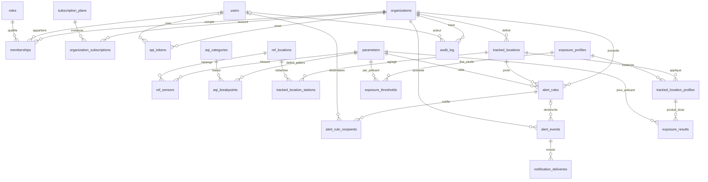

# Modèle de données — Quarity (Jalon 1)

> MCD/MLD du domaine métier (PostgreSQL 16) + schéma analytics (ClickHouse 24.x) + frontière inter-bases.
> DDL exécutable : [`back/migrations/0001_init.sql`](../back/migrations/0001_init.sql) (schéma Postgres, appliqué au boot du back) · [`db/sql/02_seed.sql`](../db/sql/02_seed.sql) ·
> [`db/clickhouse/01_schema.sql`](../db/clickhouse/01_schema.sql) · [`db/clickhouse/02_seed.sql`](../db/clickhouse/02_seed.sql).
> Sert les [user stories](user-stories.md) ; vocabulaire issu du [pitch](pitch.md) et de la [roadmap](../roadmap.md).

---

## 0. Vue d'ensemble

- **PostgreSQL (OLTP, 3NF)** — source de vérité métier : **23 tables**.
- **ClickHouse (analytics columnar)** — source de vérité des mesures : `measurements` (`ReplacingMergeTree`) + 2 rollups (`AggregatingMergeTree`) alimentés par 2 MV.

### Liste des tables Postgres

| # | Table | Domaine | Rôle |
|---|---|---|---|
| 1 | `organizations` | Tenant | Tenant racine (isolation multi-tenant) |
| 2 | `users` | Auth | Comptes (Argon2id, US-14), multi-org via `memberships` |
| 3 | `roles` | RBAC | Référentiel rôles (admin/gestionnaire/lecteur) |
| 4 | `memberships` | RBAC | **n-aire** user × org × role (US-09) |
| 5 | `subscription_plans` | Billing | Catalogue + quotas |
| 6 | `organization_subscriptions` | Billing | Abo (≤ 1 actif, US-12) |
| 7 | `api_tokens` | API | Clés hashées, lecture seule, révocables (US-11) |
| 8 | `parameters` | Réf. air | Polluants + unité (allowlist) |
| 9 | `ref_locations` | Réf. OpenAQ | Stations (surrogate + clé naturelle) |
| 10 | `ref_sensors` | Réf. OpenAQ | Capteurs (1 station × 1 polluant) |
| 11 | `aqi_categories` | AQI | 6 niveaux EPA (couleur↔libellé verrouillés) |
| 12 | `aqi_breakpoints` | AQI | Paliers d'interpolation par polluant |
| 13 | `tracked_locations` | Métier | Lieux suivis (US-01) |
| 14 | `tracked_location_stations` | Métier | **n-n** lieu ↔ stations (US-01) |
| 15 | `alert_rules` | Alerting | Règles de seuil (US-02), `org_id` dénormalisé |
| 16 | `alert_rule_recipients` | Alerting | **n-aire** règle × destinataire (US-15) |
| 17 | `alert_events` | Alerting | **Snapshot figé immuable** (US-03/10) |
| 18 | `notification_deliveries` | Alerting | Traçabilité envois (US-15) |
| 19 | `exposure_profiles` | Exposition | Profils population sensible (US-04) |
| 20 | `exposure_thresholds` | Exposition | Seuils adaptés par profil × polluant |
| 21 | `tracked_location_profiles` | Exposition | **n-aire** lieu × profil + plage horaire |
| 22 | `exposure_results` | Exposition | Cache des doses (US-08) |
| 23 | `audit_log` | Transverse | Audit (trigger Jalon 3, ESG US-10) |

---

## A. MCD — diagramme entité-association

### Cardinalités notables
- **`memberships`** (n-aire user × org × role) — `UNIQUE (org_id, user_id)` ⇒ **un seul rôle par couple** (US-09 c2). `role_id` **hors** clé unique pour interdire deux rôles pour le même couple.
- **`tracked_location_stations`** (n-n lieu ↔ stations) — un lieu agrège plusieurs stations (US-01).
- **`alert_rule_recipients`** (n-aire règle × destinataire) — cible = user **xor** email **xor** webhook (`CHECK num_nonnulls(...) = 1`).
- **`tracked_location_profiles`** (n-aire lieu × profil) — porte la **plage horaire** (`start_time`, `end_time`, `days_mask`, `timezone`).

---

## B. MLD Postgres — points saillants

> **Schéma appliqué via les migrations sqlx** ([`back/migrations/`](../back/migrations/)), exécutées automatiquement au boot du back (`0001_init.sql` = schéma initial gelé ; toute évolution = nouvelle migration). `db/sql/01_schema.sql` est conservé comme simple pointeur.

Conventions : PK `BIGINT GENERATED ALWAYS AS IDENTITY` (référentiels en `INT`) · horodatages `TIMESTAMPTZ` UTC · énums par `CHECK` textuels (sauf RBAC = table `roles`) · `CITEXT` pour emails/slugs.

- **3NF par défaut.** `users` ne porte ni `org_id` ni rôle (multi-org via `memberships`). Le **quota** vit sur `subscription_plans`, jamais copié sur l'abo. L'**unité** vit sur `parameters` : `alert_rules`/`exposure_thresholds` ne dupliquent pas l'unité (dérivée par jointure → évite l'incohérence d'unité signalée en revue).
- **Index partiels stratégiques** :
  - `organization_subscriptions(org_id) WHERE status='active'` → **≤ 1 abo actif/org** (US-12).
  - `alert_rules(tracked_location_id, parameter_id) WHERE status='active'` → seules les règles actives chargées dans Moka (US-02 c4).
  - `alert_events(org_id, fired_at) WHERE is_read=false` → compteur d'alertes non-lues (Jalon 3).
  - `api_tokens(token_hash) WHERE revoked_at IS NULL` → lookup auth des clés vives.
- **AQI 3NF** : `aqi_categories` (6 niveaux EPA, couleur↔libellé) séparée de `aqi_breakpoints` (paliers) → couleur/libellé verrouillés **par construction**, conformes à `identity.md`.
- **`aqi_breakpoints.unit`** : verrouille l'unité des `conc_low/high` (peut différer de l'unité OpenAQ brute → conversion au calcul). Sans cette colonne, l'interpolation comparait des unités différentes (faux AQI silencieux).

---

## C. Schéma ClickHouse — points saillants

- **`measurements`** : `ReplacingMergeTree(ingested_at)`, `ORDER BY (location_id, parameter, measured_at)`, `PARTITION BY toYYYYMM`, `TTL toDateTime(measured_at) + 90 DAY` avec `ttl_only_drop_parts=1` (purge par DROP PARTITION). Le cast `toDateTime()` est requis : ClickHouse 24.x refuse un `DateTime64` dans une expression TTL.
- **`location_id`/`sensor_id` = `UInt64`** (pas `LowCardinality` — décision 2) ; `LowCardinality` réservé à `parameter`/`country`/`unit`. `UInt64` (et non `UInt32`) **élimine tout risque de troncature** vs le `BIGINT` Postgres (correctif de revue).
- **Codecs** : `Gorilla+ZSTD` sur les valeurs flottantes, `DoubleDelta+ZSTD` sur timestamps et IDs triés.
- **Rollups** `measurements_hourly` / `measurements_daily` (`AggregatingMergeTree`) : `avg`/`argMax` en `AggregateFunction` (état binaire), `min`/`max`/`count` en `SimpleAggregateFunction` (additif, lecture directe). `country` retiré des rollups (non déterministe hors `ORDER BY` → se rejoint via `location_id`).
- **⚠ Idempotence des rollups** : une MV se déclenche **avant** la déduplication `ReplacingMergeTree`. La **vérité de comptage** = `measurements` lue en `FINAL`/`argMax(value, ingested_at)` ; les rollups *live* sont une approximation. Après un **backfill**, repeupler les rollups depuis les bruts dédupliqués (`DROP PARTITION` + `INSERT … SELECT … FROM measurements FINAL`). Détail dans le DDL §C.4.

---

## D. Frontière inter-bases

### D.1 Source de vérité (qui possède quoi)
| Donnée | Source de vérité |
|---|---|
| Orgs, users, rôles, memberships, abos, tokens | **Postgres** |
| Lieux suivis, règles, profils, seuils, plages | **Postgres** |
| Référentiel stations/capteurs OpenAQ | **Postgres** (`ref_locations`/`ref_sensors`) |
| Breakpoints AQI EPA | **Postgres** (`aqi_breakpoints`, référence métier) — ⚠️ le **calcul AQI à l'exécution** lit un **miroir verbatim embarqué dans le CTE ClickHouse** (`rolling_regulatory.sql` Q2 / `aqi_snapshot.sql`), pas la table PG ; les deux sont tenus identiques par `ch.rs::aqi_breakpoints_postgres_matches_clickhouse_cte` |
| **Mesures brutes & rollups** | **ClickHouse** |
| **Alertes (faits figés)** | **Postgres** (`alert_events`) |
| Doses d'exposition | **Calcul ClickHouse** + cache `exposure_results` (PG) |
| Sessions / refresh tokens / quota courant | **Redis** (pas de table PG — choix tracé, pitch §3.4) |

### D.2 Dénormalisation contrôlée (≠ violation de 3NF)
ClickHouse n'a **aucune FK** vers Postgres. Il porte par dénormalisation contrôlée les colonnes de filtrage (`location_id`, `parameter`, `country`, `unit`). **La 3NF est un concept relationnel OLTP, pas columnar** — un store columnar est intentionnellement dénormalisé. On ne prétend donc **pas** « zéro duplication » : `parameter`/`country`/`location_id` existent des deux côtés, **par conception**, comme dimensions de jointure logique (résolues applicativement, jamais par FK cross-DB). Côté Postgres, dénormalisations de **confort** assumées : `ref_sensors.last_value` (miroir UI) et les colonnes snapshot d'`alert_events`.

### D.3 Contrat `alert_events` ↔ mesure (snapshot immuable — décision 5)
Au moment du match (boucle Moka, US-03) : le back **copie** la mesure ClickHouse (`location_id`, `parameter`, `value`, `unit`, `measured_at`) dans `alert_events` (+ `ref_location_id`, `openaq_location_id`, `openaq_sensor_id`, `threshold_value`, `comparator`, `severity`). Cet enregistrement **ne référence pas** ClickHouse et n'a **pas de FK** sur les dimensions volatiles ⇒ il **survit à la purge TTL 90 j** (US-03 c3) et reste défendable en audit des mois plus tard. `org_id` est en FK **`ON DELETE RESTRICT`** (jamais `CASCADE`) pour ne pas détruire la trace ; les orgs se suppriment en **soft-delete** (`deleted_at`).

### D.4 Cohérence des types de clé
| Côté | Colonne | Type |
|---|---|---|
| Postgres | `ref_locations.openaq_location_id` | `BIGINT` |
| Postgres | `alert_events.openaq_location_id` | `BIGINT` |
| ClickHouse | `measurements.location_id` | `UInt64` |

La valeur logique commune est l'**`openaq_location_id`** (clé naturelle). Pour lever l'ambiguïté surrogate vs naturelle : côté `alert_events`, `ref_location_id` = `ref_locations.id` (surrogate figé) **et** `openaq_location_id` = clé naturelle (qui matche `measurements.location_id`). `UInt64` ↔ `BIGINT` : même largeur 64 bits, aucune assertion de borne nécessaire.

### D.5 Règle d'agrégation multi-stations
Un lieu peut agréger plusieurs stations mesurant le même polluant (ex. « Centre-ville » = 2 stations PM2.5). **Règle retenue : MAX par polluant** (principe de précaution sanitaire) pour l'alerte (US-03), l'AQI (US-05) et les moyennes glissantes (US-07). `tracked_location_stations.is_primary` désigne une station de référence (au plus une par lieu) pour les usages mono-station.

---

## E. Invariants hors-schéma → triggers & procédures (JALON 3)

> ✅ **Livrés le 2026-06-07** (backlog B1–B3) : T1–T6 dans [`back/migrations/0003_triggers.sql`](../back/migrations/0003_triggers.sql), P1–P3 dans [`back/migrations/0004_procedures.sql`](../back/migrations/0004_procedures.sql) (+ vues B1 dans `0002_business_views.sql`). Tests : `back/tests/db.rs`. Nuances d'implémentation : T4 autorise les transitions **vers NULL** d'`alert_rule_id`/`tracked_location_id` (FK `ON DELETE SET NULL` — le SET NULL référentiel passe par le trigger d'UPDATE) ; P3 est la moitié **transactionnelle** (l'agrégat fenêtré ClickHouse arrive avec B9).
>
> ✅ **B5 livré le 2026-06-07** (volet ClickHouse du Jalon 3) : moyennes glissantes réglementaires + AQI US EPA dans [`db/clickhouse/queries/rolling_regulatory.sql`](../db/clickhouse/queries/rolling_regulatory.sql) — Q1 fenêtres 24 h/8 h/1 h + couverture EPA 75 %, Q2 AQI instantané + polluant dominant (CTE miroir des `aqi_breakpoints` Postgres, conversion ppb figée D4.2 : 25 °C/1 atm, Vm = 24.45), Q3 O₃ max journalier de la moyenne 8 h, Q4 NO₂ moyenne annuelle (**exception documentée** à la règle « jamais les rollups » : lue depuis `measurements_daily`, le TTL 90 j des bruts rendant l'annuel impossible). Tests : `back/tests/ch.rs` (13, autonomes). Nuances : requêtes **mono-station** (l'agrégation multi-stations MAX du §D.5 s'applique au-dessus) ; so2/co exclus de l'AQI (aucun breakpoint seedé).

Règles métier non exprimables par contrainte déclarative (tracées dans `back/migrations/0001_init.sql §8` — fichier gelé, l'implémentation vit dans 0003/0004) :

| # | Objet | Rôle | US |
|---|---|---|---|
| T1 | Trigger `tracked_location_stations` | Refuser la suppression de la **dernière station** d'un lieu actif | US-01 c2/c4 |
| T2 | Trigger `alert_rules` | Forcer `org_id = tracked_locations.org_id` (cohérence isolation) | US-09/16 |
| T3 | Trigger `alert_rule_recipients` | Destinataire ∈ org de la règle (isolation cross-tenant) | US-15 c4 |
| T4 | Trigger `alert_events` `BEFORE UPDATE` | **Immuabilité** des colonnes snapshot (seul `is_read` mutable) | US-03/10 |
| T5 | Trigger audit `alert_rules` | INSERT/UPDATE/activate/deactivate → `audit_log` | roadmap l.130 |
| T6 | Trigger compteur non-lus | Dénormalisation du compteur d'alertes non-lues par org | roadmap l.130 |
| P1 | Procédure `create_tracked_location_with_rules` | Point d'entrée garantissant ≥ 1 station + règles (transaction) | US-01 |
| P2 | Procédure `archive_old_alert_events` | Archivage des events anciens | roadmap l.130 |
| P3 | Procédure `compute_exposure_dose` | Interroge ClickHouse (fenêtre horaire) → `exposure_results` | US-08 |

**Limitations assumées (Jalon 1).** Une seule plage intra-journée par couple (lieu, profil) — plages multiples ou nocturnes (chevauchant minuit) gérées plus tard via N lignes. `created_by`/`invited_by` sont des champs d'audit *best-effort* (intégrité cross-tenant non vérifiée).

---

## F. Traçabilité des décisions de conception

| Décision | Où |
|---|---|
| 1. ClickHouse assumé (pas TimescaleDB) | `db/clickhouse/01_schema.sql` |
| 2. `location_id` entier natif `UInt64` + codec, `LowCardinality` sur parameter/country/unit | §C, §D.4 |
| 3. `ReplacingMergeTree(ingested_at)` + ORDER BY | §C |
| 4. n-n lieu ↔ stations | `tracked_location_stations` |
| 5. Snapshot figé `alert_events` | §D.3, table 17 |
| 6. `aqi_breakpoints` interpolation EPA + `aqi_categories` | tables 11-12 |
| 7. ≤ 1 abo actif (index partiel UNIQUE) | table 6 |
| 8. PK surrogate + clé naturelle OpenAQ UNIQUE | tables 9-10 |
| 9. Frontière inter-bases, dénormalisation contrôlée | §D |
| 10. Plage horaire sur `tracked_location_profiles` + où vit la dose | tables 21-22 |

**Correctifs issus de la revue adversariale** (intégrés) : `org_id` dénormalisé sur `alert_rules` ; `alert_events.org_id` en `RESTRICT` (pas `CASCADE`) ; `aqi_categories` (3NF couleur) ; `aqi_breakpoints.unit` ; `UInt64` (anti-troncature) ; `SimpleAggregateFunction` + `AggregateFunction(count)` corrigé (DDL compilable) ; `country` retiré des rollups ; `ttl_only_drop_parts` ; index uniques partiels explicités ; snapshot de fenêtre dans `exposure_results` ; `openaq_sensor_id` + règle d'agrégation multi-stations.
