# Quarity - Dossier de conception (livrable L2)

> Document source en Markdown du dossier de conception. Il suit strictement le sommaire imposé par le sujet (sections 1 à 11), complété par la charte graphique (livrable L5, section 12) et la déclaration d'usage de l'IA (section 13).
>
> Étapes de finalisation bureautique avant rendu PDF : (1) insérer le logo en page de garde et compléter les champs [A COMPLETER] ; (2) faire générer la table des matières et la table des figures par le traitement de texte ; (3) faire rendre les diagrammes PlantUML en images (sources dans docs/diagrammes/, voir son README ; le MCD Merise reste a produire) et insérer les captures de docs/captures/ aux emplacements référencés ; (4) vérifier la pagination et la numérotation globale des figures/tableaux.

---

## 1. Page de garde

```text
+--------------------------------------------------------------------+
|                                                                    |
|                  [EMPLACEMENT DU LOGO QUARITY]                      |
|                  (insérer ici le logo - cf. docs/identity.md)      |
|                                                                    |
|                                                                    |
|                            QUARITY                                 |
|                                                                    |
|        Plateforme de surveillance et d'alerte temps reel           |
|              sur la qualite de l'air (donnees OpenAQ)              |
|                                                                    |
|                       DOSSIER DE CONCEPTION                         |
|                                                                    |
|                                                                    |
|   AUTEUR : Tristan Pierre-Louis                                    |
|            (projet realise en solo - derogation a la regle         |
|             du groupe de 4 membres actee pour ce projet ;          |
|             assistance d'IA declaree : Claude Code,                |
|             modele Claude Opus)                                    |
|                                                                    |
|   Classe / promotion .......... [A COMPLETER: classe]             |
|   Annee academique ............ [A COMPLETER: annee]             |
|   Enseignant referent ......... [A COMPLETER: enseignant]         |
|   Date de rendu ............... [A COMPLETER: date de rendu]      |
|                                                                    |
+--------------------------------------------------------------------+
```

*Note de production : le logo et la charte chromatique de référence sont définis dans le document d'identité visuelle du projet (app/docs/identity.md). L'auteur assume seul l'ensemble des rôles (conception base de données, développement back-end et front-end, conception UX et documentation), conformément à la dérogation actée pour ce projet solo. L'assistance d'IA est déclarée de manière transparente.*

---

## 2. Table des matières

> [PLACEHOLDER - TABLE DES MATIERES AUTO-GENEREE]
>
> La table des matières de ce document est générée automatiquement par le traitement de texte (champ de sommaire dynamique). Elle doit être mise à jour au moment du rendu final afin de refléter la pagination définitive.
>
> Rappel de couverture : la table des matières doit inclure l'intégralité des sections 1 à 13 du dossier, à savoir :
>
> 1. Page de garde
> 2. Table des matières
> 3. Table des figures
> 4. Introduction / contexte
> 5. Analyse du besoin
> 6. (et suivantes, jusqu'à la section 13 incluse)
>
> Chaque section et sous-section numérotée (niveaux 1 à 3) doit apparaître avec son numéro de page.

---

## 3. Table des figures

> [PLACEHOLDER - TABLE DES FIGURES ET DES TABLEAUX AUTO-GENEREE]
>
> La liste des figures et des tableaux est générée automatiquement par le traitement de texte (champ de table des illustrations / légendes). Elle doit être mise à jour au moment du rendu final.
>
> Convention de numérotation appliquée dans tout le document : chaque figure porte un identifiant local de la forme "Figure X.Y" et chaque tableau un identifiant "Tableau X.Y", où X est le numéro de la section et Y le numéro d'ordre dans cette section. Chaque illustration est accompagnée d'une légende descriptive.
>
> La table des figures doit recenser, pour chaque figure et chaque tableau, son numéro, sa légende et son numéro de page.

---

## 4. Introduction / contexte

La pollution de l'air est le premier facteur de risque environnemental pour la santé humaine, à l'origine de plusieurs millions de décès prématurés par an selon l'Organisation mondiale de la santé. Pour une collectivité territoriale, une autorité sanitaire ou un établissement recevant un public sensible, agir sur des données fiables reste pourtant difficile en pratique.

Trois constats motivent ce projet :

- Les seuils réglementaires (recommandations OMS, directives de l'Union européenne, indices nationaux) sont exprimés en moyennes glissantes - par exemple PM2.5 sur 24 heures, O3 sur 8 heures, NO2 en moyenne annuelle. Ces grandeurs sont pénibles à calculer manuellement et sujettes à erreur.
- La plateforme ouverte OpenAQ agrège librement des centaines de réseaux de capteurs dans le monde, mais son interface de programmation brute reste inexploitable sans compétences techniques et n'offre aucune vue temps réel.
- Les outils existants sont soit des portails institutionnels statiques, soit des applications grand public dépourvues de logique d'alerte métier (seuils par site, par population sensible, par organisation).

QUARITY est une plateforme web qui transforme le flux de mesures OpenAQ en un système d'alerte temps réel filtré sur des seuils déclarés par l'utilisateur. Une organisation définit des lieux suivis (un site, un ou plusieurs polluants surveillés, le rattachement à une ou plusieurs stations OpenAQ, des seuils issus des recommandations en vigueur). À chaque cycle d'ingestion, les nouvelles mesures sont confrontées aux règles d'alerte actives ; tout dépassement génère un événement d'alerte horodaté et figé, et déclenche une notification temps réel vers l'interface web. L'utilisateur dispose en complément d'un tableau de bord (carte des stations, jauge d'indice de qualité de l'air, séries temporelles multi-polluants, moyennes glissantes réglementaires, historique).

Le public visé se décline en plusieurs segments d'usage complémentaires :

- Les collectivités et autorités sanitaires (relation B2G), pour la surveillance d'une commune ou d'une agglomération et le déclenchement de mesures (circulation différenciée, information du public).
- Les établissements recevant des populations sensibles, comme les écoles et les hôpitaux, pour des décisions opérationnelles (maintien ou non d'une activité extérieure, anticipation de l'activité des urgences respiratoires).
- Les grands comptes soumis à des obligations environnementales, sociales et de gouvernance (ESG) ou de qualité-sécurité-environnement (QSE), pour le reporting extra-financier et le suivi de l'exposition de leurs sites.
- Les développeurs d'applications citoyennes, qui consomment l'interface de programmation publique de QUARITY (accès par clé API et quota par plan) plutôt que de ré-ingérer OpenAQ et de réimplémenter le calcul des indices.

Le contexte est donc celui d'un produit en mode service (SaaS) à destination professionnelle et institutionnelle, multi-organisations, où la valeur réside dans la consolidation de données dispersées, le calcul automatique d'indicateurs réglementaires, l'alerte ciblée et le suivi d'exposition adapté aux populations sensibles.

Le problème métier central de ce dossier se résume ainsi : les données de qualité de l'air existent et sont ouvertes, mais elles sont dispersées, brutes, hétérogènes (unités et licences variables selon les sources) et sans dimension temps réel ni logique d'alerte déclarative. Il manque un service intermédiaire capable d'agréger ces données par lieu et par organisation, de calculer les indicateurs réglementaires, d'alerter immédiatement sur les dépassements pertinents et de quantifier l'exposition des populations concernées.

---

## 5. Analyse du besoin

### 5.1 Comment je vais y répondre

La réponse fonctionnelle de QUARITY repose sur six capacités, chacune levant un point de friction de l'introduction.

**Agrégation multi-stations par lieu suivi.** L'unité métier est le lieu suivi : un site nommé (école, quartier, axe routier), rattaché à une ou plusieurs stations OpenAQ et associé à des polluants surveillés parmi PM2.5, NO2 et O3. La relation lieu-stations est plusieurs-à-plusieurs, consolidant plusieurs sources pour une même zone. Un lieu sans station est refusé, garantissant qu'un lieu surveillé reste alimenté.

**Calcul de l'AQI et restitution actionnable.** QUARITY calcule un indice de qualité de l'air par interpolation linéaire par palier, polluant par polluant, à partir des paliers (breakpoints) de référence. L'indice porte un niveau (1 à 6), un libellé français et une couleur, le polluant dominant servant de statut du lieu. Pour l'accessibilité, la couleur est toujours doublée d'un libellé et de la valeur numérique. Les conversions d'unité (par exemple ppb vers microgrammes par mètre cube pour O3 et NO2) sont faites au calcul, non à l'ingestion, afin d'éviter toute valeur faussée silencieusement.

**Carte et séries temporelles.** Le tableau de bord propose une carte des stations (marqueurs colorés selon l'indice), des séries temporelles multi-polluants sur période paramétrable, et les moyennes glissantes réglementaires calculées automatiquement selon la fenêtre propre à chaque polluant (par exemple 24 heures pour PM2.5, 8 heures pour O3), via le moteur analytique pour des réponses paginées et performantes.

**Alertes temps réel.** À chaque batch d'ingestion, et sur vérification immédiate d'une règle, chaque mesure est confrontée aux règles d'alerte actives. Un dépassement génère un événement figeant un instantané immuable (valeur mesurée, unité, horodatage, lieu, polluant, seuil franchi) et déclenche un envoi temps réel vers le client web. Cet instantané survit à la purge des données brutes et permet de justifier un dépassement des mois plus tard.

**Profils d'exposition et calcul de dose.** Au-delà de la concentration affichée, QUARITY associe à un lieu un profil d'exposition adapté à une population sensible (enfants, asthmatiques, personnes âgées, sportifs), avec seuils propres par polluant et par période, plage horaire et jours actifs. Sur cette base, l'outil calcule une dose d'exposition cumulée, exprimée en heures au-dessus du seuil sur une période et une plage données, avec un résultat reproductible et exportable. C'est le différenciateur central du produit et son utilité sociale concrète.

**Interface de programmation publique et quotas.** Les développeurs d'applications citoyennes accèdent en lecture seule aux mesures, à l'AQI et aux séries via une clé API rattachée à leur organisation. La clé est stockée hachée, affichée une seule fois à la création, révocable immédiatement, sa consommation encadrée par un quota défini par le plan d'abonnement, avec réponse normalisée en cas de dépassement.

L'ensemble repose sur une architecture multi-organisations (multi-tenant) avec gestion des utilisateurs et des rôles (administrateur, gestionnaire, lecteur), chaque utilisateur ne voyant que les données de ses propres organisations.

### 5.2 Récapitulatif du besoin

#### 5.2.1 Personas

Le besoin a été formalisé via des personas représentatifs des segments cibles. Deux sont détaillés ci-après ; ils servent de fil conducteur aux exigences.

**Persona 1 - Sophie Marchand, responsable environnement-santé (B2G).**

- *Qui.* Responsable du service environnement et santé d'une collectivité (agglomération d'environ 150 000 habitants), pilotant la qualité de l'air pour les élus, sans équipe data dédiée.
- *Objectifs.* Surveiller en continu plusieurs zones sensibles (centre-ville, axes routiers, écoles) sur PM2.5, NO2 et O3 ; être prévenue immédiatement d'un dépassement pour agir ; disposer des moyennes glissantes réglementaires sans recalcul manuel ; produire un historique défendable devant élus et citoyens.
- *Frustrations actuelles.* L'interface OpenAQ brute est inexploitable sans compétence technique ; les moyennes glissantes sont pénibles à calculer ; aucune alerte temps réel filtrée sur ses seuils et ses sites n'existe ; archiver un dépassement après purge de la donnée brute est difficile.
- *Critère de succès.* Une alerte fiable en moins d'une minute après un dépassement réel, et la possibilité de ressortir l'événement figé (valeur, seuil, horodatage) des mois plus tard pour le justifier.

**Persona 2 - Karim Benali, directeur d'école et coordinateur périscolaire (B2G).**

- *Qui.* Directeur d'un groupe scolaire et coordinateur périscolaire, responsable du bien-être d'enfants (population sensible) sur les temps scolaires et périscolaires, sans compétence data, agissant depuis un téléphone entre deux tâches.
- *Objectifs.* Savoir simplement si l'air est sain pour les enfants sur la plage 8 h-17 h les jours d'école ; recevoir une alerte claire (libellé, couleur AQI, valeur) au franchissement d'un seuil adapté aux enfants ; consulter en un coup d'oeil une jauge AQI et un statut "ok / prudence / à éviter" ; justifier ses décisions auprès des parents et de la hiérarchie.
- *Frustrations actuelles.* Les indices grand public ne sont adaptés ni à une population sensible ni à une plage horaire ; il n'a pas le temps d'interpréter des microgrammes par mètre cube bruts ; il a besoin d'un signal binaire actionnable ; une couleur seule est illisible et inaccessible sans libellé ni valeur.
- *Critère de succès.* Recevoir, avant la récréation, une notification lisible du type "PM2.5 au-dessus du seuil enfants sur 8 h-12 h" qui lui évite de sortir les enfants un jour à risque.

Trois personas complémentaires élargissent la couverture des segments, détaillés dans la documentation produit : le Dr Hélène Faure, gestionnaire hospitalière et référente épidémiologie (B2B), centrée sur la corrélation des pics de pollution avec les admissions respiratoires et le calcul de dose exportable ; Thomas Nguyen, analyste ESG/QSE multi-sites (B2B), centré sur la consolidation et le classement des sites, la gouvernance des accès par rôle et la traçabilité auditable des dépassements ; Léa Dubois, développeuse d'application citoyenne (B2B2C), centrée sur la consommation de l'API en lecture seule avec clé révocable et quota lisible.

*Tableau 5.1 - Synthèse des personas et de leur attente principale.*

| Persona | Segment | Attente principale |
|---|---|---|
| Sophie Marchand | B2G - collectivité | Alerte temps réel filtrée sur ses seuils + événement figé défendable |
| Karim Benali | B2G - établissement scolaire | Signal AQI lisible adapté aux enfants sur une plage horaire |
| Dr Hélène Faure | B2B - hôpital / épidémiologie | Moyennes glissantes et dose d'exposition calculées et exportables |
| Thomas Nguyen | B2B - ESG/QSE multi-sites | Consolidation, classement, rôles et traçabilité auditable |
| Léa Dubois | B2B2C - développeuse | Clé API lecture seule révocable + quota lisible et erreurs propres |

#### 5.2.2 Priorisation des exigences (MoSCoW)

Les besoins ont été traduits en vingt-deux récits utilisateur (user stories), détaillés avec leurs critères d'acceptation en section 6.2 et rattachés aux personas, puis priorisés selon la méthode MoSCoW. La numérotation US-01 à US-22 est celle de référence du dossier (section 6.2). La catégorie Must constitue le noyau bout-en-bout (définir un lieu, matcher les mesures, alerter, consulter) avec authentification et isolation multi-tenant ; Should et Could apportent respectivement la profondeur fonctionnelle et la valeur additionnelle reportable ; Won't délimite le hors-périmètre.

*Tableau 5.2 - Priorisation MoSCoW des exigences (numérotation de la section 6.2).*

| Priorite | Exigences (recits utilisateur) | Contenu fonctionnel |
|---|---|---|
| **Must** | US-01, US-03, US-05, US-06, US-07, US-10, US-20, US-21, US-22 | Connexion sécurisée ; gérer les utilisateurs et les rôles ; définir un lieu suivi ; lister/éditer/supprimer un lieu ; créer une règle d'alerte ; tableau de bord et jauge AQI ; ingestion des mesures OpenAQ ; matching des mesures contre les règles ; diffusion des alertes en temps réel |
| **Should** | US-02, US-04, US-08, US-09, US-11, US-12, US-13, US-14, US-16 | Identité et droits ; gestion de l'organisation ; éditer/basculer/supprimer une règle ; vérification immédiate (force-check) ; carte des lieux ; séries temporelles ; profil d'exposition ; association profil-lieu sur plage horaire ; générer et gérer une clé API |
| **Could** | US-15, US-17, US-18, US-19 | Dose d'exposition cumulée ; interrogation de l'API publique par clé ; quota et rate-limit par plan ; documentation OpenAPI |
| **Won't** | (hors périmètre) | Paiement Stripe réel ; application mobile native ; prévision / IA et détection d'anomalies ; capteurs physiques propres |

#### 5.2.3 Contraintes du commanditaire

Le périmètre est encadré par des contraintes explicites, fonctionnelles, techniques, juridiques et qualitatives.

**Contraintes de périmètre (ce qui est exclu).** Aucun capteur physique propre : le produit consomme exclusivement les données ouvertes OpenAQ. Pas d'application mobile native, le web responsive étant jugé suffisant. Le paiement réel n'est pas implémenté : les plans d'abonnement sont modélisés, mais le flux de paiement reste une perspective d'évolution. Aucune prévision ni intelligence artificielle produit (prévision de pollution, détection d'anomalies) n'est prévue au départ.

**Contraintes techniques et de performance.** L'architecture sépare strictement deux bases : PostgreSQL, source de vérité transactionnelle du métier (utilisateurs, organisations, lieux suivis, règles, profils, abonnements, événements d'alerte), et ClickHouse, moteur analytique des mesures temporelles, sans clé étrangère entre les deux. Objectifs de performance : matching d'une mesure inférieur à 5 millisecondes (cache mémoire en processus) ; ingestion bout-en-bout d'un batch en moins de 60 secondes ; requête de séries sur 30 jours en pas horaire inférieure à 200 millisecondes au 95e centile ; notification temps réel inférieure à 1 seconde après détection ; fraîcheur des données inférieure à 1 heure en médiane ; disponibilité de l'API d'au moins 99,5 % par mois. Déploiement orchestré par Docker Compose pour un démarrage en une commande.

**Contraintes de sécurité.** Mots de passe hachés avec Argon2id ; authentification par jetons JWT de courte durée (environ 15 minutes) complétés par des jetons de rafraîchissement stockés en Redis pour une révocation immédiate. Entrées validées systématiquement, requêtes paramétrées partout (protection contre l'injection SQL et ClickHouse, avec liste blanche stricte des paramètres et intervalles), en-têtes de sécurité et filtrage des origines (CORS strict, CSP, HSTS) appliqués, clés API stockées hachées en portée lecture seule, aucun secret dans le dépôt (tout en variables d'environnement).

**Contraintes juridiques et de conformité.** Quatre angles conditionnent la viabilité d'un produit payant pour des clients en France et dans l'Union européenne : le droit d'usage des données OpenAQ (licence définie par source ; conformité par source incombant à l'éditeur, attribution obligatoire à OpenAQ et aux sources d'origine, exclusion par défaut des sources interdisant l'usage commercial ou imposant le partage à l'identique) ; la conformité au RGPD pour les données personnelles des comptes et destinataires (les mesures environnementales n'en étant pas) ; la responsabilité liée aux alertes sanitaires, encadrée par un avertissement visible précisant le caractère indicatif et non certifié des données et leur non-substitution aux dispositifs réglementaires officiels ; la qualité des données, avec normalisation stricte des unités pour éviter toute valeur faussée silencieusement. Ces points sont des prérequis, non des fonctionnalités.

**Contrainte d'organisation du projet.** Projet réalisé en solo par un unique auteur portant tous les rôles (base de données, développement back-end et front-end, conception UX, documentation), avec assistance d'IA déclarée. Une dérogation à la règle du groupe de quatre membres a été actée. La revue humaine des contributions est remplacée par une intégration continue obligatoire imposant trois contrôles verts avant toute fusion, et les conventions de contribution (commits conventionnels, pull request obligatoire, interdiction de commit direct sur les branches protégées) sont strictement appliquées.

---

## 6. Stratégie

La stratégie repose sur deux piliers : un choix technologique justifié par la nature du domaine - des séries temporelles denses de mesures de capteurs adossées à un métier transactionnel multi-tenant - et une expression des besoins sous forme de user stories priorisées, traçables jusqu'au code livré. Le projet est réalisé par un seul auteur (Tristan Pierre-Louis, à la fois concepteur, développeur back-end, développeur front-end et responsable de la base de données), assisté de l'outil d'IA Claude Code (modèle Claude Opus). La priorisation MoSCoW sert aussi de garde-fou de charge : elle distingue le noyau indispensable (Must) de la profondeur fonctionnelle (Should) et de la valeur additionnelle reportable (Could).

Les sous-sections présentent d'abord le panorama technologique et le rôle de chaque brique, puis le référentiel des user stories et leurs critères d'acceptation vérifiables.

### 6.1 Technologies

Chaque technologie découle d'une contrainte fonctionnelle précise du produit. L'ensemble forme une architecture à deux bases de données spécialisées, orchestrée par un back-end Rust et consommée par un front-end web et une API publique.

**Rust et axum (back-end).** Le coeur applicatif est écrit en Rust avec axum (0.8) et la couche d'accès sqlx. Ce choix répond à l'exigence de performance de la boucle d'alerte : le matching de chaque mesure contre les règles actives doit rester sous 5 ms, ce que la compilation native et l'absence de ramasse-miettes rendent atteignable et prévisible. Le typage fort sert de garde de sécurité par construction : les autorisations sont matérialisées par des extracteurs typés (`AuthUser`, `CanWrite`, `RequireAdmin`, `ApiKeyAuth`) qu'un handler de mutation ne peut oublier sans cesser de compiler. La validation des entrées s'appuie sur serde (désérialisation) et la crate validator (contraintes métier) ; la sécurité HTTP transverse (CORS strict, CSP, X-Frame-Options, HSTS) via les couches tower-http.

**PostgreSQL (base métier OLTP).** Source de vérité transactionnelle du métier B2B/B2G : comptes et organisations, appartenances et rôles (`memberships`), lieux suivis et leurs rattachements aux stations, règles d'alerte, profils d'exposition et seuils, journal des alertes (`alert_events`), clés API, plans et abonnements. Schéma en troisième forme normale, clés étrangères strictes, transactions ACID. Ce socle porte l'isolation multi-tenant (chaque requête filtrée par l'organisation issue du jeton signé) et l'intégrité défendable en audit (un événement d'alerte fige un instantané immuable).

**ClickHouse (base analytique de séries temporelles).** Les mesures OpenAQ et les résultats de dose vivent dans ClickHouse, base columnar analytique. Le profil d'usage - ingestion par lots périodiques puis agrégations sur dimensions arbitraires (date, lieu, polluant, station) - correspond aux forces d'un stockage column-wise : compression élevée (basse cardinalité, codecs spécialisés) et agrégations rapides sans index préalable. La frontière avec PostgreSQL est nette et assumée : aucune clé étrangère ne traverse les deux bases ; une mesure vit dans ClickHouse, une alerte (mesure ayant franchi un seuil) dans PostgreSQL.

**Redis (cache distribué, sessions, quotas et diffusion).** Redis assure ce qu'un cache en processus ne peut pas faire en distribué : stockage des refresh tokens (révocation immédiate au logout), compteurs de rate-limit et de quota par clé API (fenêtre fixe), et la diffusion publish/subscribe reliant la détection d'un dépassement au push WebSocket. Côté matching, un cache en mémoire (Moka) détient l'index compilé des règles actives pour le hot path ; Redis propage l'événement au-delà du processus.

**React, TypeScript et Vite (front-end).** L'interface web est une application React en TypeScript outillée par Vite. Le typage statique fait écho à la rigueur du back-end et sécurise la consommation de l'API. L'application matérialise les rôles (le drapeau `can_write` désactive les mutations pour un lecteur) tout en laissant le back-end seul arbitre des autorisations. Vite fournit un serveur de développement rapide et un build de production optimisé.

**Leaflet (cartographie).** La visualisation géographique des lieux suivis et de leur indice de qualité de l'air repose sur Leaflet, bibliothèque légère adossée aux tuiles OpenStreetMap, affichant des marqueurs colorés par niveau d'AQI sans service cartographique propriétaire.

**Docker Compose (orchestration locale et reproductibilité).** L'ensemble des services - back-end, front-end, PostgreSQL, ClickHouse, Redis, proxy - est décrit et orchestré par Docker Compose : environnement reproductible, démarrage homogène de la pile et séparation claire des responsabilités entre conteneurs, au service de la démonstrabilité et de la livraison.

*Tableau 6.1 - Synthèse des technologies et de leur rôle*

| Technologie | Couche | Rôle principal |
|---|---|---|
| Rust + axum + sqlx | Back-end | API REST/WebSocket, matching d'alertes, sécurité typée |
| PostgreSQL | Données métier (OLTP) | Source de vérité transactionnelle, multi-tenant, alertes figées |
| ClickHouse | Données analytiques | Séries temporelles des mesures, moyennes glissantes, doses |
| Redis | Cache/diffusion | Refresh tokens, quotas/rate-limit, publish/subscribe WebSocket |
| React + TypeScript + Vite | Front-end | Dashboard, CRUD, alertes temps réel, build optimisé |
| Leaflet | Front-end | Carte des lieux et marqueurs AQI (tuiles OpenStreetMap) |
| Docker Compose | Infrastructure | Orchestration et reproductibilité de la pile |

### 6.2 User Stories

Les user stories ci-dessous expriment les besoins par rôle. Les rôles humains sont implémentés via les appartenances (`memberships`) et contrôlés par les extracteurs du back-end : l'administrateur (gestion des comptes et de l'organisation, garde `RequireAdmin`), le gestionnaire (écriture sur lieux et règles, garde `CanWrite` / `can_write = true`), le lecteur (consultation seule, `can_write = false`). S'y ajoutent le consommateur d'API publique (clé `X-API-Key`, portée lecture seule, garde `ApiKeyAuth`) et le système (ingestion, matching de seuils, diffusion des alertes), acteur non humain des processus automatisés.

---

**US-01 - Connexion sécurisée**
En tant qu'utilisateur d'une organisation, je veux me connecter de manière sécurisée, afin d'accéder au tableau de bord de ma collectivité.
- `/api/auth/login` (email + mot de passe valides) renvoie un JWT d'accès court (environ 15 min) et un refresh token en Redis ; mots de passe hachés en Argon2id, jamais en clair ; logout supprime le refresh token (révocation immédiate).
- Mot de passe erroné ou compte inconnu : 401 indistinguable (vérification factice à temps constant).

**US-02 - Consulter mon identité et mes droits**
En tant qu'utilisateur authentifié, je veux connaître mon profil et mes droits, afin que l'interface adapte les actions.
- `/api/auth/me` (jeton valide) renvoie identifiant, organisation, rôle et drapeau `can_write` ; un rôle `lecteur` désactive les mutations côté interface.
- Jeton absent ou invalide sur un endpoint protégé : 401 (`missing_bearer` ou `invalid_token`).

**US-03 - Gérer les utilisateurs et les rôles (administrateur)**
En tant qu'administrateur, je veux gérer les membres de mon organisation et leurs rôles, afin de contrôler qui crée des règles et qui consulte.
- Les mutations sur `/api/users` exigent le rôle `admin` (sinon 403, `admin_required`) ; rattachement via `memberships` (admin, gestionnaire, lecteur), une suppression retirant la membership, jamais le compte global.
- Un admin ne peut ni modifier son propre rôle ni se retirer (garde anti-verrouillage, 400) ; il ne voit que son organisation, un identifiant étranger renvoyant 404 (anti-énumération).

**US-04 - Gérer l'organisation (administrateur)**
En tant qu'administrateur, je veux consulter et mettre à jour mon organisation, afin de tenir son paramétrage à jour.
- Les mutations sur `/api/organizations` exigent le rôle `admin` (sinon 403) ; seules les organisations de rattachement sont visibles (isolation multi-tenant), toute donnée respectant la portée du jeton signé, jamais d'un paramètre client.

**US-05 - Définir un lieu suivi (gestionnaire)**
En tant que gestionnaire, je veux définir un lieu suivi rattaché à une ou plusieurs stations, afin de surveiller une zone sensible de ma commune.
- `POST /api/tracked-locations` (nom, polluants, au moins une station) crée le lieu ; rattachement multi-stations en n-n, lieu valide tant qu'une station est liée ; création sans station refusée (422), rôle `lecteur` : 403 (`read_only_role`).

**US-06 - Lister, éditer et supprimer un lieu suivi (gestionnaire)**
En tant que gestionnaire, je veux lister, filtrer, modifier et supprimer mes lieux suivis, afin de maintenir le périmètre de surveillance.
- `/api/tracked-locations` renvoie une liste paginée, filtrable et triée, limitée à mon organisation ; `PATCH` persiste les changements valides (sinon 422) ; `DELETE` retire le lieu, un identifiant étranger renvoyant 404.

**US-07 - Créer une règle d'alerte (gestionnaire)**
En tant que gestionnaire, je veux définir une règle d'alerte avec un seuil par polluant sur un lieu suivi, afin d'être prévenu des dépassements.
- `POST /api/alert-rules` lie un lieu, un polluant, une valeur seuil et un comparateur ; seuil invalide (non numérique ou unité incohérente) rejeté (422).
- Activation/désactivation par le statut, sans suppression ; seules les règles actives sont évaluées par le moteur de matching.

**US-08 - Éditer, basculer et supprimer une règle d'alerte (gestionnaire)**
En tant que gestionnaire, je veux gérer le cycle de vie de mes règles d'alerte, afin d'ajuster ma configuration de surveillance.
- `/api/alert-rules` filtrable (recherche, lieu, sévérité, statut), scopée à mon organisation ; en édition lieu et polluant immuables, autres champs valides modifiables ; `PATCH` bascule le statut (suivi par le moteur).
- Suppression : règle plus évaluée ; une règle d'une autre organisation renvoie 403/404.

**US-09 - Forcer la vérification immédiate d'une règle (gestionnaire)**
En tant que gestionnaire, je veux forcer la vérification immédiate d'une règle, afin de tester ma configuration sans attendre le lot d'ingestion.
- `POST /api/alert-rules/{id}/run` évalue la règle contre les dernières mesures par le même chemin que le lot, un dépassement créant un `alert_event` comme en mode lot ; règle d'une autre organisation : 403.

**US-10 - Consulter le tableau de bord et la jauge AQI (lecteur)**
En tant que lecteur, je veux voir une jauge AQI claire et un statut actionnable par lieu, afin de décider d'une mesure de protection.
- `/api/aqi` renvoie l'AQI courant des lieux de mon organisation ; couleur toujours doublée d'un libellé et d'une valeur numérique (accessibilité WCAG) ; polluant dominant (AQI le plus élevé) mis en avant comme statut.
- Rôle lecteur : accès autorisé, aucune mutation disponible.

**US-11 - Visualiser les lieux sur une carte (lecteur)**
En tant que lecteur, je veux visualiser mes lieux suivis sur une carte, afin de situer géographiquement les zones à risque.
- Une carte Leaflet affiche un marqueur par lieu, coloré selon son niveau d'AQI ; deux lieux co-localisés sur une même station sont décalés pour rester distinguables ; tuiles OpenStreetMap autorisées par la politique de sécurité de contenu.

**US-12 - Consulter les séries temporelles (lecteur)**
En tant que lecteur, je veux consulter les séries temporelles multi-polluants d'un lieu sur une période, afin de corréler les pics avec des événements.
- `/api/measurements` (polluant + plage) renvoie une réponse JSON paginée issue de ClickHouse ; intervalle, agrégation et polluant validés par allowlist (anti-injection), un paramètre hors allowlist renvoyant 400.
- Une requête de 30 jours au pas horaire reste sous 200 ms au 95e centile.

**US-13 - Gérer un profil d'exposition (gestionnaire)**
En tant que gestionnaire, je veux définir des profils d'exposition avec leurs seuils par polluant, afin d'adapter la surveillance aux populations sensibles.
- `POST /api/exposure-profiles` attache des seuils par polluant via la sous-ressource `thresholds` ; profils système en lecture seule, profils personnalisés créables, modifiables et supprimables ; rôle lecteur en mutation : 403.

**US-14 - Associer un profil à un lieu sur une plage horaire (gestionnaire)**
En tant que gestionnaire, je veux associer un profil d'exposition à un lieu suivi avec une plage horaire et des jours actifs, afin que les seuils soient appliqués au bon moment.
- `POST /api/tracked-location-profiles` précise plage horaire (HH:MM), masque de jours, fuseau et statut actif ; en édition lieu et profil immuables, autres champs modifiables ; plage invalide (fin <= début, ou jours vides) : refusée (422).

**US-15 - Calculer une dose d'exposition (gestionnaire)**
En tant que gestionnaire, je veux calculer une dose d'exposition cumulée pour une association lieu/profil sur une période, afin de quantifier l'impact sanitaire pour une population sensible.
- `POST .../compute-dose` calcule le temps passé au-dessus du seuil, restreint à la plage horaire et aux jours du profil ; `GET .../results` consulte les résultats persistés (polluant, seuil appliqué, période).
- Résultat reproductible (fenêtre figée), calcul appuyé sur ClickHouse avec mise en cache.

**US-16 - Générer et gérer une clé API (administrateur)**
En tant qu'administrateur, je veux générer une clé API en lecture seule, afin de permettre l'intégration externe des données de mon organisation.
- `POST /api/api-keys` affiche le secret une seule fois (seul son hachage SHA-256 est stocké), clé rattachée à mon organisation, portée lecture seule ; `DELETE /api/api-keys/{id}` révoque la clé, toute requête ultérieure renvoyant 401.

**US-17 - Interroger l'API publique par clé (consommateur d'API)**
En tant que consommateur d'API publique, je veux interroger les mesures et l'AQI d'une organisation avec ma clé, afin d'alimenter une application tierce.
- `/api/public/aqi` et `/api/public/measurements` (en-tête `X-API-Key` valide) renvoient les données de l'organisation rattachée à la clé (portée déduite de la clé, jamais d'un paramètre) ; clé manquante, invalide, révoquée ou expirée : 401.
- Station non suivie par l'organisation de la clé : 403 (`location_not_in_org`).

**US-18 - Respecter le quota et le rate-limit de mon plan (consommateur d'API)**
En tant que consommateur d'API publique, je veux connaître et respecter le quota de mon plan, afin que mon application reste fonctionnelle.
- Rate-limit par minute et quota mensuel déterminés par le plan de l'abonnement actif (0 = illimité), compteurs Redis en fenêtre fixe, quota mensuel remis à zéro au changement de mois ; dépassement : 429.
- Toute requête authentifiée est comptée, y compris celles en 4xx (politique conservatrice anti-abus, documentée).

**US-19 - Consulter la documentation OpenAPI (consommateur d'API)**
En tant que consommateur d'API, je veux une documentation OpenAPI à jour et des listings cohérents, afin d'intégrer rapidement et sans surprise.
- `/api/docs` reflète les endpoints réellement exposés ; tous les listings offrent pagination, filtrage et tri, avec des codes HTTP cohérents (200, 400, 401, 403, 404, 429) ; les erreurs de validation renvoient un corps structuré (champ et message).

**US-20 - Ingérer les mesures OpenAQ (système)**
En tant que système d'ingestion, je veux récupérer périodiquement les mesures OpenAQ et les insérer dans ClickHouse, afin d'alimenter le tableau de bord et le moteur d'alerte en données fraîches.
- Le binaire d'ingestion pagine les mesures horaires des N derniers jours, les récupère avec retry/backoff et les insère dans `measurements` ; insertion idempotente (ReplacingMergeTree, déduplication à la lecture), relance sûre après échec partiel ; station liée à l'organisation pour devenir interrogeable depuis le front.
- Une mesure sans unité est ignorée et signalée (aucun défaut silencieux).

**US-21 - Matcher les mesures contre les règles actives (système)**
En tant que système de matching, je veux évaluer chaque nouvelle mesure contre les règles actives, afin de détecter les dépassements de seuil.
- À chaque tick, les règles actives sont compilées en un index mémoire (cache Moka) et chaque mesure évaluée par lookup mémoire pur (objectif < 5 ms) ; un dépassement crée un `alert_event` figeant un instantané immuable (valeur, unité, horodatage, lieu, polluant, seuil), idempotent sur (règle, capteur, horodatage).
- L'organisation de l'événement provient de la règle compilée, jamais d'une entrée externe ; le trigger T7 re-vérifie la cohérence organisation/lieu.

**US-22 - Diffuser les alertes en temps réel (système)**
En tant que système de diffusion, je veux pousser les alertes vers les clients connectés, afin que les utilisateurs soient avertis sans rechargement.
- Un `alert_event` créé est diffusé via Redis publish/subscribe puis poussé sur la WebSocket `/api/ws` aux clients de l'organisation concernée (objectif < 1 s) ; le snapshot figé survit à la purge TTL des séries ClickHouse (l'événement persiste dans PostgreSQL).
- Handshake authentifié par JWT en query string, validé une fois à la connexion, l'organisation provenant des claims signés (pas d'écoute d'une autre organisation) ; jeton invalide ou expiré : 401, paramètre `token` absent : 400.

---

*Tableau 6.2 - Couverture des rôles par les user stories*

| Rôle | User stories |
|---|---|
| Administrateur | US-03, US-04, US-16 |
| Gestionnaire | US-05, US-06, US-07, US-08, US-09, US-13, US-14, US-15 |
| Lecteur | US-10, US-11, US-12 |
| Utilisateur (transverse) | US-01, US-02 |
| Consommateur d'API publique | US-17, US-18, US-19 |
| Système (ingestion / matching / diffusion) | US-20, US-21, US-22 |

---

### 6.3 Organisation du travail

Projet réalisé en solo : un seul étudiant (Tristan Pierre-Louis) porte tous les rôles - cadrage produit, conception base de données, backend Rust, frontend React/TypeScript, ingénierie des bases (PostgreSQL, ClickHouse, Redis), DevOps (Docker Compose, CI GitHub Actions) et rédaction. Une dérogation à la règle des quatre membres a été actée. Conception et développement ont été menés avec l'assistance d'un agent d'IA (Claude Code, modèle Claude Opus), en pair-programming sous validation systématique de l'auteur ; déclarée en transparence, elle ne se substitue ni à la conception ni à la revue.

La progression a suivi des jalons fonctionnels, chacun matérialisé par des pull requests sur la branche `dev` soumises à la CI (trois jobs requis) avant intégration. L'estimation horaire ci-dessous distingue le temps de l'auteur (conception, architecture, revue, tests manuels, rédaction) de la part assistée par IA (ébauches de code, rédaction guidée, exploration), exprimée comme fraction du temps total, l'auteur restant en supervision continue.

| Jalon | Périmètre principal | Sem. | Heures auteur | Part assistée IA (% du total) |
|---|---|---|---|---|
| Socle | Walking skeleton, schémas BDD (PostgreSQL/ClickHouse/Redis), Docker Compose, auth JWT, CI | S1-S2 | 28 | ~40 % |
| B6 | CRUD métier (organisations, lieux, règles, RBAC), validation au boundary | S3 | 22 | ~45 % |
| B7 | Moteur de matching (index mémoire + cache Moka), boucle d'évaluation des règles | S4 | 24 | ~45 % |
| B8 | Alertes temps réel (Redis pub/sub par org, WebSocket `/api/ws`), durcissement B8b | S5 | 22 | ~50 % |
| B9 | Profils d'exposition et seuils, calcul de dose ClickHouse, API publique par clé (quota/rate-limit Redis) | S6-S7 | 30 | ~50 % |
| B10 | Carte AQI (Leaflet/OpenStreetMap), indice normé EPA, marqueurs colorés | S8 | 14 | ~50 % |
| B11 | Front complet (CRUD lieux/règles/profils/expositions, client WebSocket, responsive, infra de test Vitest) | S9-S10 | 34 | ~55 % |
| Finition | Plan de finition v1.0, captures de preuves, benchmarks, durcissement, README, dossier de conception | S11-S12 | 26 | ~45 % |
| **Total** | | **12 sem.** | **~200 h** | **~48 % (moyenne pondérée)** |

*Tableau 6.3.1 - Répartition indicative de l'effort par jalon, auteur unique et part d'assistance IA.*

Lecture du tableau : environ 200 heures de travail effectif sur près de douze semaines, l'assistance IA pesant en moyenne pondérée près de la moitié du temps total, sous revue humaine systématique. La part IA croît sur les jalons à fort code répétitif (B8, B9, B11 : extracteurs, DTO, composants front, services API) et reflue sur les décisions architecturales (socle) ou la rédaction analytique (finition). L'organisation séquentielle a privilégié l'intégration continue (une PR par incrément, CI verte exigée).

### 6.4 Éco-conception

L'éco-conception, objectif transverse, vise à réduire les données transférées, le volume stocké et le coût de calcul, via des mécanismes réels du code.

**Frontend - poids transmis.** La carte Leaflet n'est pas dans le bundle d'entrée : isolée en chargement différé (lazy-loading), elle n'est téléchargée que par ceux qui la consultent (bundle de l'ordre de 750 Ko ; code-split suivi comme reliquat transverse). Pictogrammes et badges s'appuient sur des assets SVG légers (vectoriel, cache navigateur) plutôt que des images matricielles. Le front est servi par nginx (image `nginx-unprivileged`, conteneur `front`), délivrant des actifs statiques compressés et cachables, le proxy `/api` redirigeant vers le back.

**ClickHouse - compression et rétention.** Les séries temporelles (mesures, doses) utilisent des codecs adaptés : Gorilla pour les valeurs flottantes, DoubleDelta pour les timestamps et identifiants monotones, réduisant l'empreinte disque. Des TTL multi-horizons bornent le cycle de vie, évitant la croissance illimitée du volume. Le tri physique (`ORDER BY (location_id, parameter, measured_at)`) et un index de saut de données `minmax(measured_at)` élaguent les lectures par station, polluant et plage temporelle (cf. `app/docs/benchmarks.md`, section 2). Les agrégats (rollups) sont pré-calculés par vues matérialisées AggregatingMergeTree : l'agrégation est payée une fois à l'ingestion, non à chaque lecture.

**Backend - calcul évité, lectures bornées.** Le moteur de matching compile les règles actives dans un index mémoire derrière un cache Moka L1 (cf. `back/src/matching.rs`). La résolution `(station, polluant) -> regles` est en O(1) (37 à 41 ns, indépendamment du nombre de règles, selon `app/docs/benchmarks.md`). Les lectures sont bornées : pagination plafonnée (`page_size` limité à 1000 via validation au boundary) et tri contraint, interdisant les scans non bornés. Côté PostgreSQL, des index partiels (par exemple l'index unique partiel sur `api_tokens.token_hash` filtré sur `revoked_at IS NULL`, cf. `back/src/security.rs`) réduisent la taille des index et le coût des recherches. L'ingestion OpenAQ est cadencée sobrement (un run par heure par défaut, fenêtre d'un jour pour le scheduler, cf. `.env.example`), limitant le trafic sortant et le re-déclenchement des vues matérialisées.

**Infrastructure - sobriété des conteneurs.** Les images Docker reposent sur des variantes Alpine (`postgres:16-alpine`, `redis:7-alpine`, `clickhouse/...-alpine`), plus légères. Des limites mémoire explicites sont posées par service de base (`deploy.resources.limits.memory` : 1 Go PostgreSQL, 4 Go ClickHouse, 512 Mo Redis, cf. `docker-compose.yml`), bornant l'empreinte de la stack.

### 6.5 Sécurité

Sécurité en défense en profondeur, du boundary HTTP jusqu'aux requêtes vers les magasins de données. Les éléments renvoient au code réel.

**Authentification et résistance à l'énumération.** Mots de passe hachés avec Argon2id (paramètres OWASP par défaut, cf. `verify_password`/`hash_password` dans `back/src/security.rs`). Le login résiste à l'énumération temporelle : si l'email est inconnu ou le compte inactif, une vérification Argon2 factice s'exécute sur un hash constant (`dummy_verify_password`, `DUMMY_PHC_HASH`) pour égaliser le temps de réponse, empêchant de distinguer au chronomètre un email inexistant d'un mauvais mot de passe.

**Gestion des secrets.** Aucun secret codé en dur : tous transitent par variables d'environnement (`docker-compose.yml`, `.env.example`), `.env` étant exclu du dépôt. Le back refuse de démarrer si le secret JWT vaut encore le placeholder, avec longueur minimale (>= 32 caractères), interdisant un déploiement avec clé factice (cf. `.env.example`).

**Validation des entrées.** Toute entrée est validée au boundary via les extracteurs `ValidatedJson` / `ValidatedQuery` (crate `validator`, cf. `back/src/validation.rs`). Les allowlists déclaratives miroitent les contraintes CHECK du schéma (codes polluants, comparateurs, sévérités, codes de rôle, segments, slug d'organisation) : la base reste l'autorité. Le parsing strict des dates (`parse_datetime_ish`) bloque les chaînes arbitraires - dont les sosies Unicode (chiffres pleine chasse, tiret cadratin, espace insécable) - qui, avant durcissement, atteignaient ClickHouse et ressortaient en erreur 500.

**Anti-injection (SQL et ClickHouse).** Requêtes 100 % paramétrées, PostgreSQL comme ClickHouse : valeurs liées (`bind`), jamais concaténées (cf. les `sqlx::query_as` de `back/src/security.rs`). Redis n'expose pas de surface d'injection : les clés sont construites à partir d'identifiants numériques déjà valides (par exemple `apikey:rl:{token_id}`, `refresh:{token}`) et les opérations passent par des commandes typées ou des scripts Lua atomiques (cf. `back/src/redis_store.rs`).

**Contrôle d'accès réseau.** CORS strict, par allowlist d'origines (`CORS_ALLOWED_ORIGINS`), sans credentials. Les en-têtes de sécurité sont appliqués (CSP, X-Content-Type-Options, X-Frame-Options, HSTS), la CSP n'autorisant que les sources nécessaires (par exemple les tuiles OpenStreetMap pour la carte et `connect-src ws: wss:` pour la WebSocket d'alertes).

**Anti-brute-force.** Rate-limit en fenêtre fixe sur le login et le refresh (par email et par IP, cf. `RATE_LIMIT_LOGIN_EMAIL_PER_MIN`, `RATE_LIMIT_LOGIN_IP_PER_MIN`, `RATE_LIMIT_REFRESH_IP_PER_MIN`). Il s'exécute via `rate_limit_hit` (`back/src/redis_store.rs`), un INCR + EXPIRE atomique (script Lua, auto-guérison du compteur orphelin), positionné AVANT le calcul Argon2 : impossible de saturer le CPU de hachage par un flot de tentatives. L'IP cliente est résolue en best-effort (`client_ip` : priorité à `X-Real-IP` écrasé par nginx, non falsifiable à travers le proxy).

**Isolation multi-tenant.** L'`org_id` provient exclusivement des claims du JWT signé (`Claims.org_id` dans `back/src/security.rs`), jamais d'un paramètre client. Les gardes d'autorisation sont des types d'argument de handler (`AuthUser`, `CanWrite`, `RequireAdmin`) : un handler de mutation prenant `CanWrite` ne compile pas sans la vérification du droit d'écriture, supprimant le risque d'un contrôle oublié. L'API publique par clé (`ApiKeyAuth`, en-tête `X-API-Key`) dérive aussi l'`org_id` de la clé (lookup par hash SHA-256 sur `api_tokens`, clé vive uniquement) et applique un rate-limit par minute plus un quota mensuel via compteurs Redis selon le plan de l'abonnement actif.

**Rotation atomique des refresh tokens.** Refresh tokens stockés en Redis (`refresh:{token}`, TTL configurable). La rotation utilise `take_refresh` (GETDEL), qui lit et supprime la clé en une commande : un token n'est consommable qu'une fois, même sous requêtes concurrentes (retry réseau, double onglet, rejeu d'un token volé). Le logout utilise `read_refresh` (lecture non consommante) puis vérifie la propriété avant suppression, pour ne pas en faire un oracle de validité des tokens d'autrui (cf. `back/src/redis_store.rs`).

### 6.6 Déploiement

L'application est déployée via Docker Compose (`app/docker-compose.yml`), unité de livraison et d'exécution. `docker compose up -d` lève toute la stack : les trois magasins de données (PostgreSQL, ClickHouse, Redis), le backend Rust/Axum (`back`), le frontend nginx (`front`) et le scheduler d'ingestion OpenAQ (`ingest-scheduler`). Deux services additionnels sont activés à la demande via profils : `seed` (jeu de démonstration PostgreSQL, one-shot) et `ingest` (ingestion ponctuelle).

**Orchestration et ordre de démarrage.** Chaque service de base expose un healthcheck (PostgreSQL via `pg_isready`, ClickHouse via `clickhouse-client SELECT 1`, Redis via `redis-cli ping`, back via `curl /health`, front via `wget --spider`). Les dépendances utilisent `depends_on` avec la condition `service_healthy` : le back attend la santé des trois bases, le front et le scheduler celle du back. Le healthcheck du back ne répond qu'après l'application des migrations sqlx (migration avant `axum::serve`), si bien que sa santé atteste que le schéma est en place.

**Persistance, isolation et limites.** Données persistées dans des volumes nommés (`pgdata`, `clickhouse_data`, `redis_data`). Les ports des bases ne sont publiés que sur la boucle locale (`127.0.0.1:...`), réservant l'accès hôte au développement ; la communication inter-services passe par le réseau interne de Compose (résolution par nom de service). Chaque service de base est borné en mémoire (`deploy.resources.limits.memory`). L'image ClickHouse est épinglée à un patch exact (`24.8.14.39-alpine`) pour garantir la reproductibilité entre CI et démonstration.

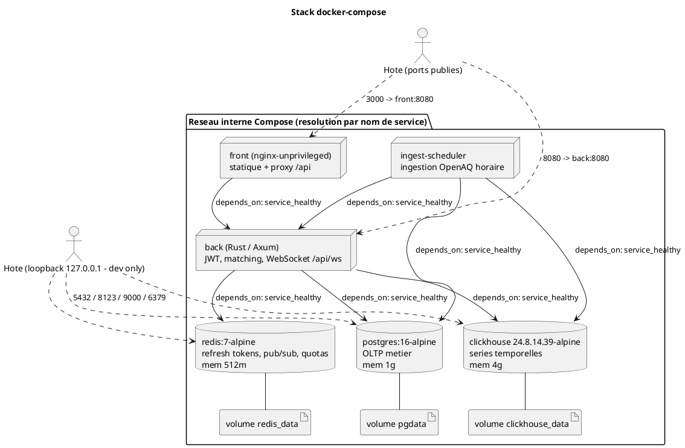

*Figure 6.6.1 - Stack docker-compose : services, dépendances `service_healthy`, volumes nommés et exposition des ports (DB en loopback).*

### 6.7 Outils utilisés

L'outillage privilégie des standards éprouvés et une chaîne d'intégration continue exigeante.

**Gestion de version et collaboration.** Git pour le versionnement, GitHub pour l'hébergement. Le flux repose sur des pull requests vers une branche `dev` protégée, conditionnées à trois status checks requis (voir ci-dessous). GitHub Projects sert de kanban pour le suivi des jalons et des tâches.

**Intégration continue (GitHub Actions).** Le workflow `app/.github/workflows/ci.yml` définit trois jobs requis et deux jobs d'audit advisory :

| Job | Rôle | Statut |
|---|---|---|
| `back` | `cargo fmt --check`, `clippy --all-targets -D warnings`, tests d'intégration sur de vraies bases (PostgreSQL, Redis, ClickHouse en services CI) | requis |
| `front` | `npm ci`, lint, `typecheck`, tests Vitest (`test:run`), build de production | requis |
| `docker` | construction des images Docker `back` et `front` | requis |
| `supply-chain` | `cargo audit` (avis RUSTSEC) | advisory |
| `npm audit` (dans `front`) | audit supply-chain front sur deps de production | advisory |

*Tableau 6.7.1 - Jobs de la CI GitHub Actions et leur caractère bloquant.*

Les noms des trois jobs requis sont figés car ils servent de required status checks de la protection de branche ; les services de base sont lancés en conteneurs éphémères avec healthchecks, et les tests d'intégration s'exécutent contre des bases réelles plutôt que des doublures, rapprochant la CI de la production.

**Conteneurisation.** Docker et Docker Compose constituent l'environnement d'exécution local, de démonstration et de référence pour la CI (images Alpine épinglées, volumes nommés, profils).

**Outillage de développement.** Backend : chaîne Rust stable (cargo, rustfmt, clippy), avec `sqlx` pour PostgreSQL, le driver ClickHouse, le client Redis, et `criterion` pour les micro-benchmarks (`back/benches/matching.rs`). Frontend : Node.js 22, Vite (build), TypeScript, React, Leaflet pour la cartographie, et Vitest avec jsdom et Testing-Library pour les tests. L'assistance IA à la conception et au développement a été fournie par Claude Code (modèle Claude Opus), sous supervision continue de l'auteur.

---

## 7. Diagrammes - UML et conception

Cette section présente la modélisation UML et architecturale de Quarity : 7.1 décrit cas d'utilisation et acteurs ; 7.2 le diagramme de classes des entités métier ; 7.3 le modèle relationnel (PostgreSQL) et le schéma analytique (ClickHouse) ; 7.4 et 7.5 les séquences des scénarios clés (authentification, ingestion-matching-alerte) ; 7.6 l'architecture applicative du backend. Tous les diagrammes sont conformes au code réel (routes axum, schéma de données, règles RBAC) et aux décisions de conception documentées.

> Note sur la réalisation : ce projet a été réalisé par un auteur unique (Tristan Pierre-Louis), assisté par une intelligence artificielle (Claude Code, modèle Claude Opus). Une dérogation à la règle d'organisation en groupe de quatre membres a été actée. Les rôles évoqués dans les diagrammes (Administrateur, Gestionnaire, Lecteur, etc.) sont des acteurs métier du logiciel, non des membres de l'équipe projet.

### 7.1 Diagramme de cas d'utilisation

Le contrôle d'accès est fondé sur les rôles (RBAC), matérialisés dans la table `roles` et la relation n-aire `memberships` (un seul rôle par couple utilisateur x organisation). Le code distingue trois gardes d'authentification : `AuthUser` (jeton JWT valide), `CanWrite` (refus 403 `read_only_role` si le rôle n'a pas le droit d'écriture) et `RequireAdmin` (refus 403 `admin_required`, réservé à l'administration). Une quatrième garde, `ApiKeyAuth`, authentifie l'API publique par clé (`X-API-Key`).

Acteurs retenus :

- **Administrateur** : rôle le plus élevé. Outre les droits du gestionnaire, il gère les utilisateurs, l'organisation et les clés API (émission, listing, révocation).
- **Gestionnaire** : rôle en écriture (`can_write = true`). Il administre lieux suivis, règles d'alerte, profils d'exposition, seuils, associations lieu x profil et déclenche les calculs de dose.
- **Lecteur** : rôle en lecture seule (`can_write = false`). Il consulte les données et reçoit les alertes temps réel ; toute mutation est rejetée en 403.
- **Consommateur d'API publique** : tiers externe authentifié par clé API, en lecture seule, soumis au quota et au rate-limit de l'abonnement de l'organisation.
- **Système** : acteur non humain regroupant les traitements automatiques (ingestion OpenAQ, boucle de matching de seuils, distribution des alertes via Redis pub/sub et WebSocket).

Le diagramme ci-dessous relie acteurs et cas d'utilisation réels. La généralisation traduit le cumul des droits : l'administrateur hérite des cas du gestionnaire, lui-même héritant de ceux du lecteur.

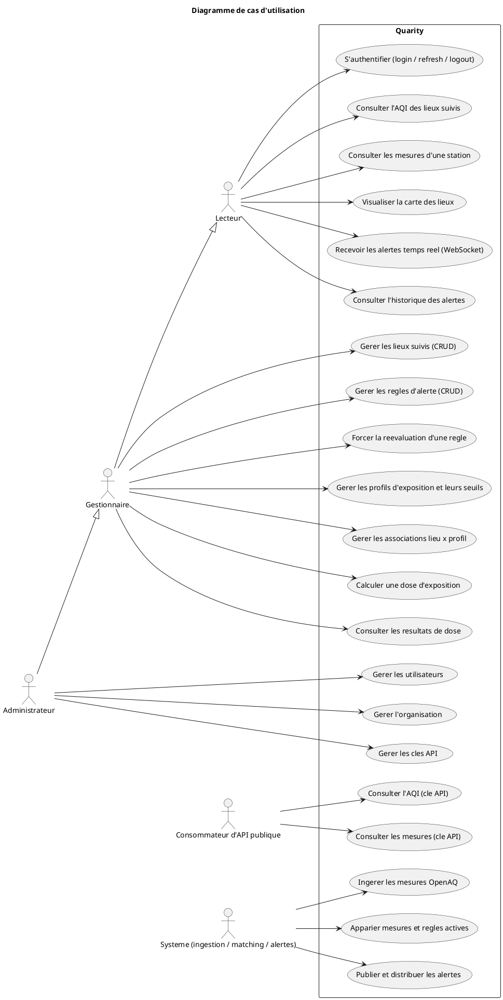

*Figure 7.1 - Diagramme de cas d'utilisation de Quarity (acteurs et cas d'usage par domaine fonctionnel).*

Note : la généralisation entre acteurs (flèches en pointillés) signifie que les cas accessibles à un acteur le sont aussi à ses spécialisations.

### 7.2 Diagramme de classes

Le diagramme ci-dessous modélise les entités métier principales et leurs relations, en fidélité avec les tables PostgreSQL (cf. `docs/data-model.md`) et les DTO exposés par les routes. Seuls les attributs significatifs sont retenus (clés, attributs métier, indicateurs) ; les attributs techniques transverses (`created_at`, `updated_at`) sont omis pour la lisibilité. Les multiplicités reproduisent les cardinalités réelles, y compris la nuance multi-tenant (un profil d'exposition peut être système, donc sans organisation propriétaire).

Conventions de multiplicité : `1` exactement un ; `0..1` optionnel ; `*` plusieurs (zéro ou plus) ; `1..*` au moins un.

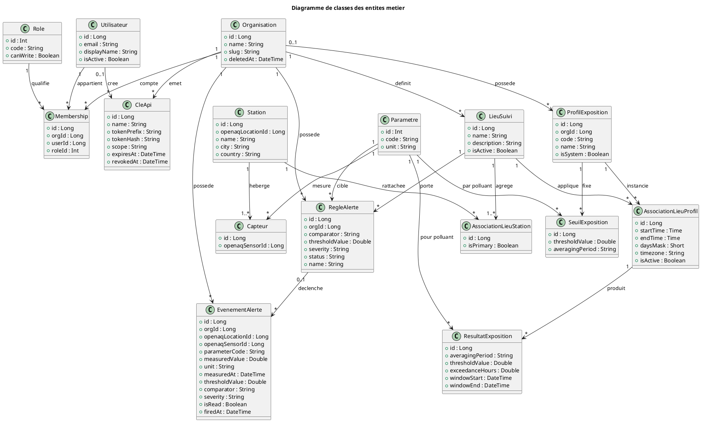

*Figure 7.2 - Diagramme de classes des entités métier de Quarity.*

Points de conception notables, conformes au code :

- **Multi-tenant.** L'`Organisation` est le tenant racine. La relation utilisateur x organisation x rôle passe par la classe d'association `Membership`, qui garantit un seul rôle par couple (contrainte unique `org_id, user_id`).
- **Profil système.** `ProfilExposition.orgId` est optionnel (`0..1`) : un profil système (`isSystem = true`) n'a pas d'organisation propriétaire et est partagé en lecture seule entre tous les tenants.
- **Clé API.** Seul le hash du secret (`tokenHash`, SHA-256) est conservé ; le secret en clair n'est restitué qu'à la création. `tokenPrefix` (8 caractères) sert à reconnaître la clé.
- **Evénement d'alerte immuable.** `EvenementAlerte` est un instantané figé recopiant mesure et règle au moment du dépassement. Il survit à la purge des mesures (TTL 90 jours côté ClickHouse) et conserve `orgId` ainsi que les clés naturelles OpenAQ. Sa relation vers `RegleAlerte` est `0..1` : supprimer une règle met la clé étrangère à NULL sans détruire l'historique.
- **Plage horaire portée par l'association.** `AssociationLieuProfil` porte la plage horaire récurrente (`startTime`, `endTime`, `daysMask` en bitmask jours, `timezone`) ; c'est cette association qu'interroge le calcul de dose pour produire des `ResultatExposition`.

---

### 7.3 Modèle de données relationnel (Merise)

Le coeur transactionnel repose sur PostgreSQL 16, source de vérité métier (organisations, comptes, RBAC, abonnements, lieux suivis, règles d'alerte, profils d'exposition, faits d'alerte figés). Le schéma compte 23 tables OLTP principales (la table d'archive `alert_events_archive` ajoutée par la migration 0004), gelées dans `back/migrations/0001_init.sql` et complétées par les migrations 0002 à 0009. Les séries temporelles de mesures sont stockées à part dans ClickHouse (sections 7.3.1, 7.3.2) ; séparation délibérée documentée dans `app/docs/data-model.md` (frontière inter-bases).

Le modèle suit Merise : un MCD (entités et associations en cardinalités min/max), puis un MLD (clés primaires et étrangères). Les cardinalités sont déduites du schéma réel (FK, `NOT NULL`, `UNIQUE`).

#### (a) MCD au sens Merise

Le MCD est scindé en deux figures (tenant/RBAC/facturation/API ; référentiel air/métier/alerting/exposition). Les associations porteuses de propriétés et les n-aires sont des entités-association `<<association>>` ; cardinalités au format Merise `min,max`.

Figure 7.1 - MCD, sous-domaine Tenant, RBAC, facturation et API.

> **[A PRODUIRE - MCD Merise]** Ce modele conceptuel est a realiser en notation Merise (entites + associations en losanges, cardinalites (0,n)/(1,1)) avec un outil dedie (Looping, JMerise ou draw.io). Sa traduction relationnelle complete figure dans le MLD (section 7.3 (b)). Le schema crow's-foot equivalent est conserve ci-dessous a titre de reference.

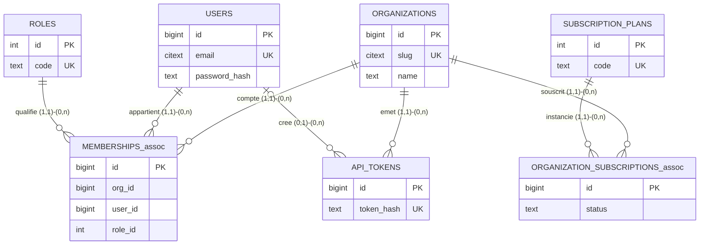

Légende (Figure 7.1) :

- `MEMBERSHIPS_assoc` : ternaire entre `users`, `organizations`, `roles` ; chaque ligne référence exactement une organisation, un utilisateur, un rôle (`org_id`, `user_id`, `role_id` tous `NOT NULL`). `uq_membership_user_org UNIQUE (org_id, user_id)` impose un seul rôle par couple (utilisateur, organisation) ; `role_id` hors de la clé d'unicité interdit deux rôles pour un même couple.
- `ORGANIZATION_SUBSCRIPTIONS_assoc` : porte `status`, associe une organisation à un plan. L'index unique partiel `uq_org_active_subscription ON (org_id) WHERE status = 'active'` garantit au plus un abonnement actif par organisation, tout en conservant les historiques (`canceled`).
- `api_tokens` : rattaché obligatoirement à une organisation (`org_id NOT NULL`, 1,1 côté token), facultativement à l'utilisateur créateur (`created_by` nullable, `ON DELETE SET NULL`, 0,1).

Figure 7.2 - MCD, sous-domaine Référentiel air, métier, alerting et exposition.

> **[A PRODUIRE - MCD Merise]** Ce modele conceptuel est a realiser en notation Merise (entites + associations en losanges, cardinalites (0,n)/(1,1)) avec un outil dedie (Looping, JMerise ou draw.io). Sa traduction relationnelle complete figure dans le MLD (section 7.3 (b)). Le schema crow's-foot equivalent est conserve ci-dessous a titre de reference.

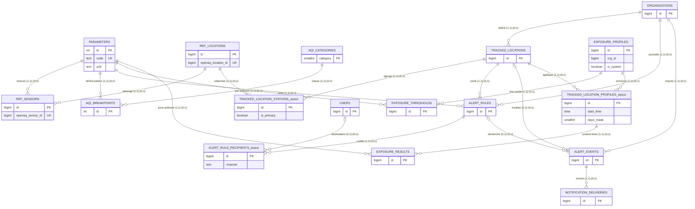

Légende (Figure 7.2) :

- `TRACKED_LOCATION_STATIONS_assoc` : n-n entre un lieu suivi et les stations OpenAQ qu'il agrège. `uq_tls UNIQUE (tracked_location_id, ref_location_id)` interdit le doublon de station dans un lieu. La propriété `is_primary` (booléen) est portée par l'association ; l'index unique partiel `uq_tls_primary ON (tracked_location_id) WHERE is_primary` garantit au plus une station primaire par lieu.
- `ALERT_RULE_RECIPIENTS_assoc` : porte `channel`. La cible est un utilisateur interne (`user_id`), une adresse externe (`email`) ou une URL (`webhook_url`), selon `chk_recipient_one_target CHECK (num_nonnulls(user_id, email, webhook_url) = 1)` : exactement une cible non nulle. La patte vers `users` est donc en 0,1 (destinataire potentiellement externe).
- `TRACKED_LOCATION_PROFILES_assoc` : n-aire lieu x profil portant la plage d'exposition (`start_time`, `end_time`, `days_mask` [bitmask de jours], `timezone`). `uq_tlp UNIQUE (tracked_location_id, exposure_profile_id)` impose une seule plage par couple (lieu, profil).
- `alert_events` : patte vers `alert_rules` en 0,1 (`alert_rule_id` nullable, `ON DELETE SET NULL`), vers `tracked_locations` aussi 0,1, tandis que `org_id` est `NOT NULL` (1,1, `ON DELETE RESTRICT`). Cette asymétrie traduit le fait figé : l'événement survit à la suppression de la règle ou du lieu déclencheur, mais reste rattaché à son organisation.

#### (b) MLD - notation crow's-foot

Le MLD couvre les 23 tables OLTP, leurs PK et FK et les relations effectives. Les tables associatives y figurent comme tables à part entière, portant deux FK (ou plus) et une clé d'unicité composite.

Figure 7.3 - MLD PostgreSQL (notation crow's-foot).

```plantuml
@startuml
title MLD - modele logique de donnees

hide circle
skinparam linetype ortho

entity "organizations" as organizations {
  * id : bigint <<PK>>
  --
  * name : text
  * slug : citext <<UK>>
  segment : text
  deleted_at : timestamptz
  * unread_alert_count : integer
}

entity "users" as users {
  * id : bigint <<PK>>
  --
  * email : citext <<UK>>
  * password_hash : text
  full_name : text
  * is_active : boolean
}

entity "roles" as roles {
  * id : int <<PK>>
  --
  * code : text <<UK>>
  * can_manage_org : boolean
  * can_write : boolean
}

entity "memberships" as memberships {
  * id : bigint <<PK>>
  --
  * org_id : bigint <<FK>>
  * user_id : bigint <<FK>>
  * role_id : int <<FK>>
  invited_by : bigint <<FK>>
}

entity "subscription_plans" as subscription_plans {
  * id : int <<PK>>
  --
  * code : text <<UK>>
  * monthly_request_quota : integer
  * rate_limit_per_min : integer
}

entity "organization_subscriptions" as organization_subscriptions {
  * id : bigint <<PK>>
  --
  * org_id : bigint <<FK>>
  * plan_id : int <<FK>>
  * status : text
}

entity "api_tokens" as api_tokens {
  * id : bigint <<PK>>
  --
  * org_id : bigint <<FK>>
  created_by : bigint <<FK>>
  * token_hash : text <<UK>>
  * scope : text
  revoked_at : timestamptz
}

entity "parameters" as parameters {
  * id : int <<PK>>
  --
  * code : text <<UK>>
  * unit : text
  openaq_parameter_id : integer <<UK>>
}

entity "ref_locations" as ref_locations {
  * id : bigint <<PK>>
  --
  openaq_location_id : bigint <<UK>>
  * country : char
  * latitude : double
  * longitude : double
}

entity "ref_sensors" as ref_sensors {
  * id : bigint <<PK>>
  --
  openaq_sensor_id : bigint <<UK>>
  * ref_location_id : bigint <<FK>>
  * parameter_id : int <<FK>>
  last_value : numeric
}

entity "aqi_categories" as aqi_categories {
  * category : smallint <<PK>>
  --
  * label : text
  * color_hex : char
}

entity "aqi_breakpoints" as aqi_breakpoints {
  * id : int <<PK>>
  --
  * parameter_id : int <<FK>>
  * category : smallint <<FK>>
  * averaging_period : text
  * unit : text
  * conc_low : numeric
  * conc_high : numeric
  * aqi_low : integer
  * aqi_high : integer
}

entity "tracked_locations" as tracked_locations {
  * id : bigint <<PK>>
  --
  * org_id : bigint <<FK>>
  * name : text
  * is_active : boolean
  created_by : bigint <<FK>>
}

entity "tracked_location_stations" as tracked_location_stations {
  * id : bigint <<PK>>
  --
  * tracked_location_id : bigint <<FK>>
  * ref_location_id : bigint <<FK>>
  * is_primary : boolean
}

entity "alert_rules" as alert_rules {
  * id : bigint <<PK>>
  --
  * org_id : bigint <<FK>>
  * tracked_location_id : bigint <<FK>>
  * parameter_id : int <<FK>>
  * comparator : text
  * threshold_value : numeric
  * severity : text
  * status : text
  created_by : bigint <<FK>>
}

entity "alert_rule_recipients" as alert_rule_recipients {
  * id : bigint <<PK>>
  --
  * alert_rule_id : bigint <<FK>>
  * channel : text
  user_id : bigint <<FK>>
  email : citext
  webhook_url : text
}

entity "alert_events" as alert_events {
  * id : bigint <<PK>>
  --
  alert_rule_id : bigint <<FK>>
  * org_id : bigint <<FK>>
  tracked_location_id : bigint <<FK>>
  ref_location_id : bigint
  openaq_location_id : bigint
  openaq_sensor_id : bigint
  * parameter_code : text
  * measured_value : numeric
  * measured_at : timestamptz
  * threshold_value : numeric
  * severity : text
  * is_read : boolean
}

entity "notification_deliveries" as notification_deliveries {
  * id : bigint <<PK>>
  --
  * alert_event_id : bigint <<FK>>
  recipient_id : bigint <<FK>>
  * channel : text
  * status : text
  * attempts : smallint
}

entity "exposure_profiles" as exposure_profiles {
  * id : bigint <<PK>>
  --
  org_id : bigint <<FK>>
  * code : text
  * is_system : boolean
}

entity "exposure_thresholds" as exposure_thresholds {
  * id : bigint <<PK>>
  --
  * exposure_profile_id : bigint <<FK>>
  * parameter_id : int <<FK>>
  * threshold_value : numeric
  * averaging_period : text
}

entity "tracked_location_profiles" as tracked_location_profiles {
  * id : bigint <<PK>>
  --
  * tracked_location_id : bigint <<FK>>
  * exposure_profile_id : bigint <<FK>>
  * start_time : time
  * end_time : time
  * days_mask : smallint
  * timezone : text
  * is_active : boolean
}

entity "exposure_results" as exposure_results {
  * id : bigint <<PK>>
  --
  * tracked_location_profile_id : bigint <<FK>>
  * parameter_id : int <<FK>>
  * averaging_period : text
  * period_start : date
  * period_end : date
  * hours_over_threshold : numeric
  * sample_count : integer
}

entity "audit_log" as audit_log {
  * id : bigint <<PK>>
  --
  org_id : bigint <<FK>>
  actor_user_id : bigint <<FK>>
  * entity_type : text
  entity_id : bigint
  * action : text
  diff : jsonb
}

organizations ||--o{ memberships : ""
users         ||--o{ memberships : ""
roles         ||--o{ memberships : ""
users         |o--o{ memberships : "invited_by"
organizations ||--o{ organization_subscriptions : ""
subscription_plans ||--o{ organization_subscriptions : ""
organizations ||--o{ api_tokens : ""
users         |o--o{ api_tokens : "created_by"

ref_locations ||--o{ ref_sensors : ""
parameters    ||--o{ ref_sensors : ""
parameters    ||--o{ aqi_breakpoints : ""
aqi_categories ||--o{ aqi_breakpoints : ""

organizations ||--o{ tracked_locations : ""
users         |o--o{ tracked_locations : "created_by"
tracked_locations ||--o{ tracked_location_stations : ""
ref_locations ||--o{ tracked_location_stations : ""

organizations ||--o{ alert_rules : ""
tracked_locations ||--o{ alert_rules : ""
parameters    ||--o{ alert_rules : ""
users         |o--o{ alert_rules : "created_by"
alert_rules   ||--o{ alert_rule_recipients : ""
users         |o--o{ alert_rule_recipients : "user_id"

alert_rules   |o--o{ alert_events : ""
organizations ||--o{ alert_events : ""
tracked_locations |o--o{ alert_events : ""
alert_events  ||--o{ notification_deliveries : ""
alert_rule_recipients |o--o{ notification_deliveries : "recipient_id"

organizations |o--o{ exposure_profiles : ""
exposure_profiles ||--o{ exposure_thresholds : ""
parameters    ||--o{ exposure_thresholds : ""
tracked_locations ||--o{ tracked_location_profiles : ""
exposure_profiles ||--o{ tracked_location_profiles : ""
tracked_location_profiles ||--o{ exposure_results : ""
parameters    ||--o{ exposure_results : ""

organizations |o--o{ audit_log : ""
users         |o--o{ audit_log : "actor_user_id"

@enduml
```

Note : `alert_events_archive` (migration 0004, procédure P2) n'est pas représentée dans le MLD. Table d'archive délibérément sans FK, ses colonnes répliquent celles d'`alert_events` mais elle conserve l'`id` d'origine en PK et ne référence aucune dimension, afin que le fait reste défendable en audit même après disparition de tout référent.

#### (c) Normalisation jusqu'à la 3NF

Le schéma vise systématiquement la 3NF : aucun attribut non clé ne dépend d'un autre attribut non clé (pas de dépendance fonctionnelle transitive), une fois la 1NF (valeurs atomiques) et la 2NF (dépendance de la clé entière) acquises. Trois tables clés l'illustrent.

Tableau 7.1 - Démonstration de l'absence de dépendance transitive sur trois tables.

| Table | Clé | DF directes (clé vers attribut) | Dépendance transitive évitée |
|---|---|---|---|
| `users` | `id` | `id` vers `email`, `password_hash`, `full_name`, `is_active` | Aucune organisation ni rôle n'est stocké sur `users`. Le rattachement multi-organisation transite par `memberships`. Stocker `org_id` ou `role` sur `users` aurait créé une dépendance `id` vers `org_id` vers (attributs de l'organisation), transitive, et aurait interdit le multi-tenant d'un même compte. |
| `organization_subscriptions` | `id` | `id` vers `org_id`, `plan_id`, `status`, `current_period_end` | Le quota mensuel et le rate-limit ne sont pas copiés sur l'abonnement : ils vivent uniquement sur `subscription_plans` (`monthly_request_quota`, `rate_limit_per_min`). Les dupliquer aurait introduit `id` vers `plan_id` vers `monthly_request_quota`, transitive, et un risque d'incohérence quota/plan. La valeur est dérivée par jointure. |
| `alert_rules` | `id` | `id` vers `tracked_location_id`, `parameter_id`, `comparator`, `threshold_value`, `severity` | L'unité physique du seuil n'est pas stockée sur la règle : elle se dérive de `parameters.unit` via `parameter_id`. Conserver une colonne `unit` redondante aurait créé `id` vers `parameter_id` vers `unit`, transitive, donc le risque d'unité incohérente signalé en revue. |

Cas de l'AQI : le référentiel des seuils est scindé en `aqi_categories` (6 niveaux EPA, avec couleur et libellé) et `aqi_breakpoints` (paliers d'interpolation). Sans ce découpage, chaque palier aurait reporté la couleur et le libellé de sa catégorie, soit la dépendance transitive `id` (palier) vers `category` vers (`color_hex`, `label`). La FK `aqi_breakpoints.category` vers `aqi_categories.category` verrouille le triplet catégorie-couleur-libellé et restaure la 3NF.

#### (d) Dénormalisations délibérées

Certaines redondances sont introduites à dessein, pour la performance, l'isolation multi-tenant ou la défendabilité en audit. Non des violations accidentelles de la 3NF : leur cohérence est garantie par un trigger ou par le caractère immuable du fait stocké. Le Tableau 7.2 les recense.

Tableau 7.2 - Dénormalisations assumées et mécanisme de cohérence.

| Dénormalisation | Source de vérité | Justification | Garantie de cohérence |
|---|---|---|---|
| `ref_sensors.last_value` (et `last_measured_at`) | ClickHouse (`measurements`) | Confort d'affichage : éviter une requête ClickHouse à chaque rendu de liste de capteurs. | Miroir de confort assumé ; la vérité reste ClickHouse, la colonne est rafraîchie à l'ingestion. Non critique : un décalage transitoire est toléré. |
| `alert_rules.org_id` | `tracked_locations.org_id` (par `tracked_location_id`) | Redondance de chemin : permet le filtrage d'isolation multi-tenant et le ranking US-10 sans jointure sur le lieu (index `idx_alert_rules_org`). | Trigger T2 (`trg_alert_rules_org_coherence`, migration 0003) : tout `INSERT`/`UPDATE` où `org_id` diffère de l'organisation du lieu lève `QRT_T2` (`check_violation`). Verrou `FOR SHARE` anti-TOCTOU. |
| Colonnes snapshot d'`alert_events` (`ref_location_id`, `openaq_location_id`, `openaq_sensor_id`, `parameter_code`, `measured_value`, `unit`, `measured_at`, `threshold_value`, `comparator`, `severity`) | Mesure ClickHouse + règle au moment du déclenchement | Le fait d'alerte doit survivre à la purge TTL 90 j de ClickHouse et à la modification/suppression de la règle ou de la station. Aucune FK vers les dimensions volatiles. | Trigger T4 (`trg_alert_events_immutable`, BEFORE UPDATE) : toute mutation d'une colonne snapshot lève `QRT_T4`. Seul `is_read` reste mutable ; `alert_rule_id`/`tracked_location_id` ne peuvent évoluer que vers NULL (cascade `SET NULL`). Trigger T7 (migration 0005) verrouille en plus la cohérence d'organisation à l'insertion. |
| `organizations.unread_alert_count` | `alert_events` (count des non-lus) | Compteur dénormalisé pour servir les dashboards sans agrégation à chaque requête. | Trigger T6 (`trg_alert_events_unread_counter`, AFTER) maintient le compteur à chaque INSERT/UPDATE de `is_read`/DELETE. Contrainte `chk_org_unread_nonneg CHECK (>= 0)`. Fonction `recompute_unread_alert_counts()` pour resynchronisation après opération hors trigger (TRUNCATE, restore, COPY massif). |

Cas analogue : `exposure_results` matérialise des doses calculées côté ClickHouse et fige le snapshot de la fenêtre (`window_start_time`, `window_end_time`, `window_days_mask`, `timezone`, `threshold_value`). Cache recalculable et reproductible, dont la vérité du calcul reste ClickHouse (procédure P3, requête `exposure_dose.sql`).

#### (e) Héritage, para-héritage et associations n-aires réduites

Héritage des profils d'exposition. `exposure_profiles` implémente un para-héritage entre profils système et personnalisés sans table séparée, par trois mécanismes combinés :

- `is_system BOOLEAN` discrimine le type de profil ;
- `org_id BIGINT` nullable distingue le profil global (`org_id IS NULL`, partagé par tous les tenants) du profil propre à une organisation (`org_id` non nul) ;
- `uq_exposure_profile_org_code UNIQUE NULLS NOT DISTINCT (org_id, code)` (PostgreSQL 15+) traite deux `org_id` NULL comme égaux, empêchant deux profils système de même `code`. Sans `NULLS NOT DISTINCT`, la sémantique SQL standard tiendrait les NULL pour distincts et l'unicité des profils système ne serait pas garantie.

L'isolation est verrouillée en base par le trigger T8 (`trg_tracked_location_profile_org_coherence`, migration 0008) : l'association d'un lieu à un profil n'est acceptée que si le profil est système (`org_id NULL`) ou appartient à la même organisation que le lieu, sous peine de `QRT_T8`.

Associations n-aires réduites en tables associatives. Les associations ternaires et n-n du MCD sont matérialisées par des tables à clé composite, unicité et, le cas échéant, contrainte `CHECK`. Le Tableau 7.3 les synthétise.

Tableau 7.3 - Réduction des associations n-aires en tables associatives.

| Table associative | Cardinalité logique | Clé d'unicité | Contrainte additionnelle |
|---|---|---|---|
| `memberships` | ternaire user x org x role | `uq_membership_user_org UNIQUE (org_id, user_id)` | `role_id` hors clé pour interdire deux rôles par couple. |
| `tracked_location_stations` | n-n lieu x station | `uq_tls UNIQUE (tracked_location_id, ref_location_id)` | Index unique partiel `uq_tls_primary ... WHERE is_primary` (une station primaire max). Invariant "au moins une station" garanti hors schéma par le trigger T1 et la procédure P1. |
| `alert_rule_recipients` | n-aire règle x destinataire | Trois index uniques partiels par cible (`uq_arr_user`, `uq_arr_email`, `uq_arr_webhook`, chacun `WHERE ... IS NOT NULL`) | `chk_recipient_one_target CHECK (num_nonnulls(user_id, email, webhook_url) = 1)` : exactement une cible. |
| `tracked_location_profiles` | n-aire lieu x profil + plage | `uq_tlp UNIQUE (tracked_location_id, exposure_profile_id)` | `chk_tlp_time_window CHECK (end_time > start_time)` ; `days_mask CHECK BETWEEN 1 AND 127` (bitmask jamais vide). |

Les index uniques partiels de `alert_rule_recipients` répondent à un piège classique : un index unique ordinaire sur une colonne nullable laisse passer les doublons, les NULL étant distincts. Restreindre chaque index à `WHERE <colonne> IS NOT NULL` rétablit l'anti-doublon par cible.

---

### 7.3.1 SQL avancé

Inventaire factuel et localisé des constructions SQL avancées, chaque élément étant rattaché à son fichier de migration ou de requête.

Vues métier (2), dans `back/migrations/0002_business_views.sql` en `CREATE OR REPLACE VIEW` (idempotentes) :

- `org_active_zones_view` : par lieu suivi actif d'une organisation, expose des compteurs (nombre de stations, nom de la station primaire, nombre de pays, de règles actives, de profils d'exposition actifs) et la date de dernière alerte. Elle privilégie des sous-requêtes scalaires corrélées plutôt que des jointures agrégées, pour éviter l'explosion combinatoire stations x règles x événements.
- `org_alert_stats_view` : statistiques d'alerte par organisation (total d'événements, non-lus, critiques, warning, sur 30 jours, dernière alerte, ratio de lecture). Le `LEFT JOIN alert_events` garantit qu'une organisation sans alerte apparaît avec des compteurs à 0, condition nécessaire au ranking US-10.

Triggers (8). Le Tableau 7.4 détaille le rôle de chacun (migrations 0003, 0005, 0008).

Tableau 7.4 - Inventaire des triggers et de leur rôle.

| Trigger | Table | Evénement | Rôle | Fichier |
|---|---|---|---|---|
| T1 | `tracked_location_stations` | BEFORE DELETE OR UPDATE OF `tracked_location_id` | Refuser le retrait de la dernière station d'un lieu actif (verrou `FOR UPDATE`). | 0003 |
| T2 | `alert_rules` | BEFORE INSERT OR UPDATE OF `org_id`, `tracked_location_id` | Forcer `org_id = tracked_locations.org_id` (isolation), verrou `FOR SHARE`. | 0003 |
| T3 | `alert_rule_recipients` | BEFORE INSERT OR UPDATE OF `user_id`, `alert_rule_id` | Un destinataire interne doit être membre de l'organisation de la règle. | 0003 |
| T4 | `alert_events` | BEFORE UPDATE | Immuabilité du snapshot (comparaison `to_jsonb` hors colonnes mutables ; seul `is_read` libre). | 0003 |
| T5 | `alert_rules` | AFTER INSERT OR UPDATE OR DELETE | Audit automatique vers `audit_log` (create/update/activate/deactivate/delete), diff JSONB des champs modifiés. | 0003 |
| T6 | `alert_events` | AFTER INSERT OR UPDATE OF `is_read` OR DELETE | Maintien du compteur dénormalisé `organizations.unread_alert_count`. | 0003 |
| T7 | `alert_events` | BEFORE INSERT | Cohérence d'organisation à l'insertion (par rapport au lieu et à la règle), verrou `FOR SHARE`. | 0005 |
| T8 | `tracked_location_profiles` | BEFORE INSERT OR UPDATE | Cohérence d'isolation lieu x profil (profil système ou de la même organisation). | 0008 |

Les violations métier suivent une convention uniforme : `RAISE EXCEPTION` au message préfixé `QRT_Tn:` et `ERRCODE = 'check_violation'` (SQLSTATE 23514), que le backend mappe vers HTTP 422 ou 409.

Procédures stockées (3), dans `back/migrations/0004_procedures.sql` (P3 mise à jour par 0007) :

- `create_tracked_location_with_rules` (P1) : point d'entrée transactionnel créant un lieu, ses stations (la première du tableau devenant primaire) et ses règles d'alerte en un geste atomique. Elle garantit l'invariant "au moins une station" à la création (T1 ne protégeant que le retrait ultérieur) et refuse le tableau de stations vide et les doublons (`QRT_P1`), produisant un 422 plutôt qu'un 500 trompeur sur violation de contrainte unique.
- `archive_old_alert_events` (P2) : déplace, via une CTE `WITH moved AS (DELETE ... RETURNING ...)`, les événements lus de plus de N jours vers `alert_events_archive`. Les non-lus ne sont jamais archivés ; aucune suppression sèche.
- `compute_exposure_dose` (P3) : moitié transactionnelle du calcul de dose. Elle reçoit l'agrégat fenêtre calculé côté ClickHouse, fige le seuil applicable et le snapshot de la fenêtre (reproductibilité), puis effectue un upsert (`ON CONFLICT ON CONSTRAINT uq_exposure_result DO UPDATE`) du cache `exposure_results`. La migration 0007 a corrigé un défaut en ajoutant `averaging_period` à la clé d'unicité, faute de quoi deux doses du même polluant sur fenêtres différentes (1h, 24h) s'écrasaient silencieusement.

Requête métier complexe. `db/sql/queries/complex_business_query.sql` répond à "Top 10 des organisations par volume d'alertes critiques sur le dernier trimestre, avec leur plan d'abonnement et le ratio lu/non-lu". Une seule requête en lecture seule combine :

- une CTE `recent_critical` isolant les alertes critiques du trimestre glissant ;
- quatre jointures (organisations, abonnements actifs, plans, et un `LEFT JOIN` sur les lieux ayant pu être supprimés) ;
- un `GROUP BY` par organisation et plan ;
- un `HAVING count(rc.id) >= 1` excluant les organisations sans alerte critique ;
- des agrégats dont `count(*) FILTER (WHERE rc.is_read IS FALSE)` (clause `FILTER` SQL standard) et `round(avg((rc.is_read)::int), 2)` pour le ratio de lecture.

La clause `FILTER` sert aussi dans `org_alert_stats_view` (quatre agrégats filtrés par état et sévérité), second emploi non trivial de cet opérateur.

Transaction explicite et test de ROLLBACK. Le seed `db/sql/02_seed.sql` est encapsulé dans un `BEGIN ... COMMIT` explicite : tout l'amorçage (3 organisations, comptes, référentiels, données métier) est atomique, donc tout échec laisse la base intacte. Le rollback est testable de deux manières. D'une part, les procédures lèvent des exceptions métier (`QRT_Pn`) : appelées dans une transaction, elles annulent la totalité de leurs effets (une station OpenAQ inconnue dans `create_tracked_location_with_rules` annule la création du lieu et des stations déjà insérées). D'autre part, les triggers d'isolation (T2, T7, T8) levant `check_violation` interrompent la transaction et la font basculer en rollback. La suite `back/tests/db.rs` exerce ces chemins.

Index, dont partiels. Outre les index simples (par exemple `idx_alert_events_org_fired` sur `(org_id, fired_at DESC)`), le schéma emploie plusieurs index partiels stratégiques :

- `uq_org_active_subscription ON organization_subscriptions (org_id) WHERE status = 'active'` (au plus un abonnement actif) ;
- `idx_api_tokens_active ON api_tokens (token_hash) WHERE revoked_at IS NULL` (lookup des clés vives) ;
- `idx_alert_rules_active ON alert_rules (tracked_location_id, parameter_id) WHERE status = 'active'` (seules règles actives) ;
- `idx_alert_events_unread ON alert_events (org_id, fired_at) WHERE is_read = false` (compteur de non-lus) ;
- `uq_tls_primary ON tracked_location_stations (tracked_location_id) WHERE is_primary` ;
- les trois index uniques partiels par cible de `alert_rule_recipients` ;
- `uq_alert_events_dedup ON alert_events (alert_rule_id, openaq_sensor_id, measured_at) WHERE alert_rule_id IS NOT NULL` (migration 0006), garantissant l'idempotence du matching : un triplet (règle, capteur, horodatage) ne produit qu'un événement, cible d'un `ON CONFLICT DO NOTHING` ;
- `idx_exposure_results_tlp_period ON exposure_results (tracked_location_profile_id, period_end DESC)` (migration 0009), couvrant filtre et tri "période la plus récente d'abord".

Scripts d'init reproductibles. Le schéma est appliqué au démarrage par `sqlx::migrate!` ; les migrations sont idempotentes (`IF NOT EXISTS` pour le DDL, `CREATE OR REPLACE` pour vues, fonctions et procédures, `DROP TRIGGER IF EXISTS` avant chaque `CREATE TRIGGER`). Le seed de démonstration est rejouable : il débute par un `TRUNCATE ... RESTART IDENTITY CASCADE` sur toutes les tables, remettant les séquences à zéro et propageant la troncature en cascade ; les clés étrangères y sont résolues par sous-requête sur des clés naturelles (slug, email, code) plutôt que par identifiants en dur.

---

### 7.3.2 Bases NoSQL - justification du choix

Quarity emploie deux moteurs NoSQL aux côtés de PostgreSQL, chacun pour une charge que le relationnel sert mal : Redis (clé-valeur) et ClickHouse (orienté colonnes). Ce choix, plutôt que documentaire ou graphe, découle de la nature des données.

Redis - clé-valeur. Magasin clé-valeur en mémoire, indiscutablement NoSQL, exploité au-delà du `get`/`set` (`back/src/redis_store.rs`) :

- TTL via `SET ... EX` : refresh tokens sous `refresh:{token}` à expiration native (`set_ex`), Redis éviçant les sessions expirées.
- `GETDEL` atomique : `take_refresh` lit et supprime un token en une commande, garantissant un usage unique du token de rotation sous concurrence. Redis étant mono-thread, un seul appelant reçoit la valeur.
- `INCR` + `EXPIRE` pour le rate-limit à fenêtre fixe, en script Lua : `INCR`, puis re-armement d'`EXPIRE` seulement si la clé n'a pas de TTL (`TTL < 0`), auto-guérissant une clé orpheline laissée par un crash entre les deux opérations. Lua s'exécute atomiquement.
- Pub/sub : bus de diffusion des alertes temps réel (PSUBSCRIBE côté consommateur WebSocket).

Aucune table PostgreSQL ne porte sessions, refresh tokens ou quotas (`docs/data-model.md`, D.1) : ces données éphémères, à forte volumétrie d'écriture et expiration native, conviennent à un magasin clé-valeur en mémoire avec TTL, là où une table imposerait nettoyage périodique et charge d'écriture inutile sur l'OLTP.

ClickHouse - orienté colonnes. Stocke les séries temporelles de mesures (`db/clickhouse/01_schema.sql`), via des fonctions propres au modèle colonne :

- Vues matérialisées sur `AggregatingMergeTree` : `mv_measurements_hourly` et `mv_measurements_daily` alimentent deux rollups, agrégats additifs (`min`, `max`, `sum`) en `SimpleAggregateFunction`, agrégats à état (`avg`, `argMax`) en `AggregateFunction` (lu via `avgMerge`/`argMaxMerge`).
- `argMax(value, ingested_at)` : lecture de vérité déduplicant les ré-ingestions (la dernière gagne), clé de voûte du `ReplacingMergeTree`.
- Fenêtres `RANGE` : `rolling_regulatory.sql` calcule les moyennes réglementaires EPA via `RANGE BETWEEN N PRECEDING AND CURRENT ROW` en secondes (86399 pour 24 h, 28799 pour 8 h).
- TTL multi-horizons : 90 jours sur le brut (`measurements`), 2 ans sur le rollup horaire, 5 ans sur le journalier, avec `ttl_only_drop_parts = 1` (purge par DROP PARTITION).
- Partitionnement mensuel (`PARTITION BY toYYYYMM`), data-skipping (`minmax` sur la date, `bloom_filter` sur `location_id`, `set` sur `parameter`) et codecs par type (`Gorilla` sur flottants lisses, `DoubleDelta` sur timestamps et identifiants triés, `ZSTD`).

Pourquoi colonnes et clé-valeur, pas documentaire ni graphe. Le cœur analytique agrège un grand nombre de mesures homogènes sur peu de colonnes (concentration, horodatage, station, polluant), avec fenêtres et moyennes. Un moteur colonnes ne lit que les colonnes utiles, compresse fortement l'homogène et excelle sur les agrégations à grande échelle : adéquation exacte. Le documentaire (JSON par enregistrement) pénaliserait : chaque mesure est un tuple plat, régulier, sans imbrication variable, et les requêtes sont analytiques (scan-agrégation), non des accès par document. Le graphe est hors sujet : les relations métier sont peu profondes (lieu vers station, règle vers destinataire), bien traitées en jointures PostgreSQL ; aucun parcours arbitraire ni proximité à N sauts ne le justifie. Pour l'éphémère (sessions, quotas, bus d'alertes), c'est la simplicité clé-valeur avec TTL et primitives atomiques qui prime, non un modèle riche.

Objection "ClickHouse parle SQL". Le dialecte SQL ne le range pas dans le relationnel transactionnel. Stockage column-wise (par colonne) ; cohérence BASE, non ACID ; la déduplication par `ReplacingMergeTree` est asynchrone (fusion des parts en arrière-plan), donc cohérence à terme (eventual consistency) imposant la lecture via `FINAL` ou `argMax(value, ingested_at)` pour la vérité. Au regard de CAP, il se positionne côté AP (disponibilité et tolérance au partitionnement, au prix de la cohérence immédiate). SQL est donc orthogonal au modèle de données et de cohérence : un moteur NoSQL analytique.

Cohérence inter-bases. Aucune clé étrangère entre PostgreSQL et ClickHouse ; la corrélation passe par la clé naturelle OpenAQ (`openaq_location_id` côté PG = `location_id` côté CH). Conséquence assumée : les paliers AQI EPA existent des deux côtés. PostgreSQL (`aqi_breakpoints`, alimenté par le seed) est la référence métier, mais le calcul à l'exécution se fait dans le CTE `breakpoints` de `rolling_regulatory.sql` (ClickHouse ne pouvant joindre PostgreSQL), miroir verbatim. Contre toute dérive silencieuse, un test croise les deux sources : `back/tests/ch.rs::aqi_breakpoints_postgres_matches_clickhouse_cte` extrait les 24 paliers (6 catégories x 4 polluants) du seed et du CTE, les trie et exige l'égalité stricte ; toute modification d'un seul côté casse la CI. Le même dispositif protège les requêtes embarquées dans le crate Rust (`embedded_aqi_sql_matches_canonical_q2`, `embedded_exposure_dose_sql_matches_canonical`), tenues synchrones de leurs fichiers canoniques.

---

### 7.4 Diagrammes de séquence et d'objets (cas d'utilisation 1 à 4)

Cette section détaille la dynamique de quatre cas d'utilisation représentatifs. Chacun fournit un diagramme d'objets PRE-séquence (instances et état avant exécution), un diagramme de séquence des échanges entre composants réels, puis un diagramme d'objets POST-séquence (état résultant). Les composants correspondent à l'implémentation : navigateur (front React), API axum, PostgreSQL (données métier), Redis (refresh tokens, compteurs de rate-limit, pub/sub), ClickHouse (séries de mesures), boucle de matching et session WebSocket. Le projet étant porté par un auteur unique assisté d'IA (dérogation de groupe actée), les acteurs désignent des rôles applicatifs (`admin` / `can_write` / `lecteur`) et non des personnes distinctes.

#### 7.4.1 UC1 - Authentification (POST /api/auth/login)

L'utilisateur soumet ses identifiants. L'API applique un rate-limit Redis (par email puis par IP) avant tout travail coûteux, récupère le contexte en PostgreSQL, vérifie le mot de passe avec Argon2id, émet un JWT d'accès HS256 et crée un refresh token opaque en Redis avec TTL.

Diagramme 7.4.1-a - Objets PRE-séquence (UC1)

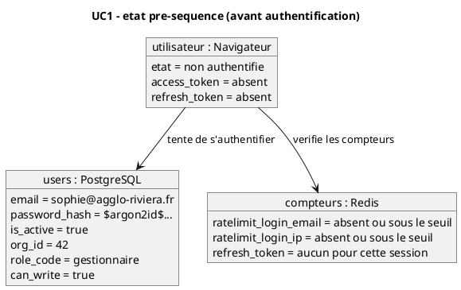

Diagramme 7.4.1-b - Séquence (UC1)

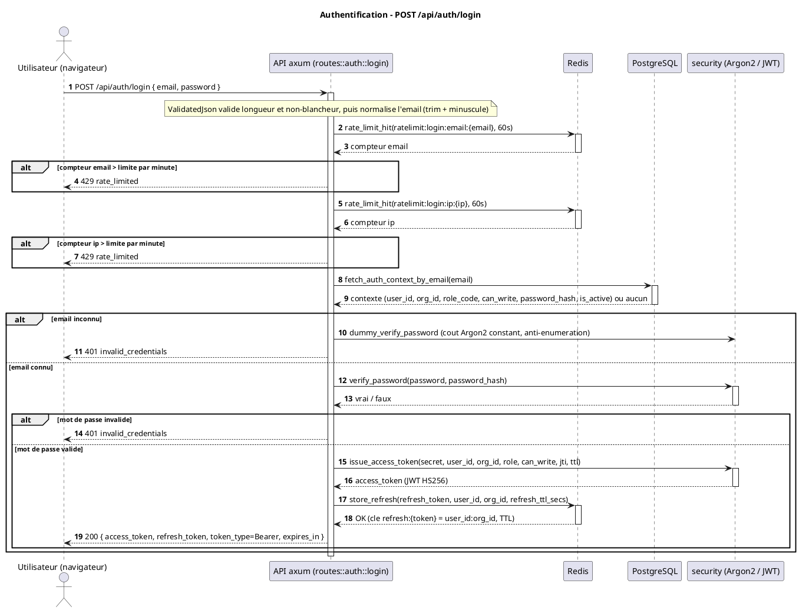

Diagramme 7.4.1-c - Objets POST-séquence (UC1)

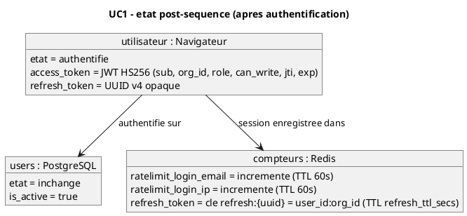

Note : le refresh token est indépendant du `jti` du JWT (durcissement S4) ; généré comme UUID v4 distinct, il est stocké sous la clé `refresh:{token}` (valeur `user_id:org_id`). La rotation (POST /api/auth/refresh) le consomme atomiquement via GETDEL (`take_refresh`).

#### 7.4.2 UC2 - Création d'un lieu suivi (POST /api/tracked-locations)

Un utilisateur disposant du droit d'écriture crée un lieu suivi en fournissant un nom et une liste d'identifiants de stations OpenAQ (la première devenant primaire), éventuellement assortie de règles d'alerte. L'API délègue à la procédure stockée atomique `create_tracked_location_with_rules` (P1), qui résout chaque station contre le référentiel `ref_locations` et la rattache via `tracked_location_stations`. Une station inconnue ou en double provoque un rejet métier 422 (`QRT_P1`).

Diagramme 7.4.2-a - Objets PRE-séquence (UC2)

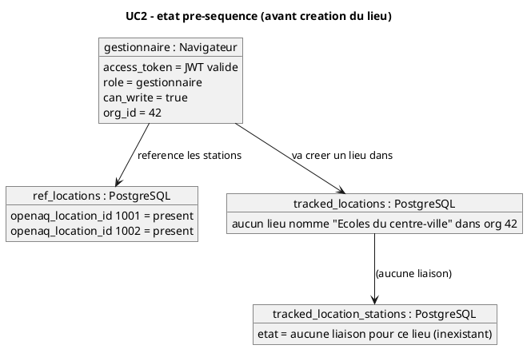

Diagramme 7.4.2-b - Séquence (UC2)

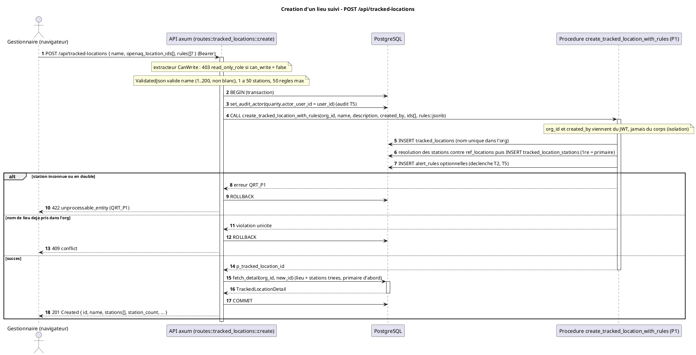

Diagramme 7.4.2-c - Objets POST-séquence (UC2)

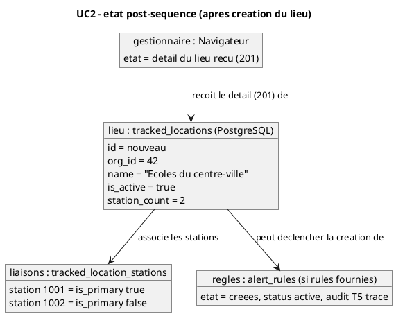

#### 7.4.3 UC3 - Création / édition d'une règle d'alerte (POST et PATCH /api/alert-rules)

Un utilisateur disposant du droit d'écriture crée une règle de seuil liée à un lieu suivi : polluant, comparateur (`>` ou `>=`), valeur et sévérité (`info` / `warning` / `critical`). A la création, l'API vérifie d'abord que le lieu appartient à l'organisation du JWT (404 sinon, anti-énumération), puis insère via `INSERT ... SELECT FROM parameters` où le référentiel des polluants fait foi. En édition (PATCH), lieu et polluant sont immuables ; seuls comparateur, seuil, sévérité, statut et libellé sont modifiables, la bascule de statut étant auditée `activate` / `deactivate` (T5).

Diagramme 7.4.3-a - Objets PRE-séquence (UC3)

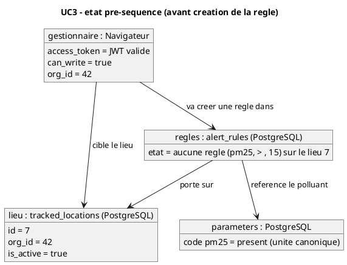

Diagramme 7.4.3-b - Séquence (UC3 - création puis édition)

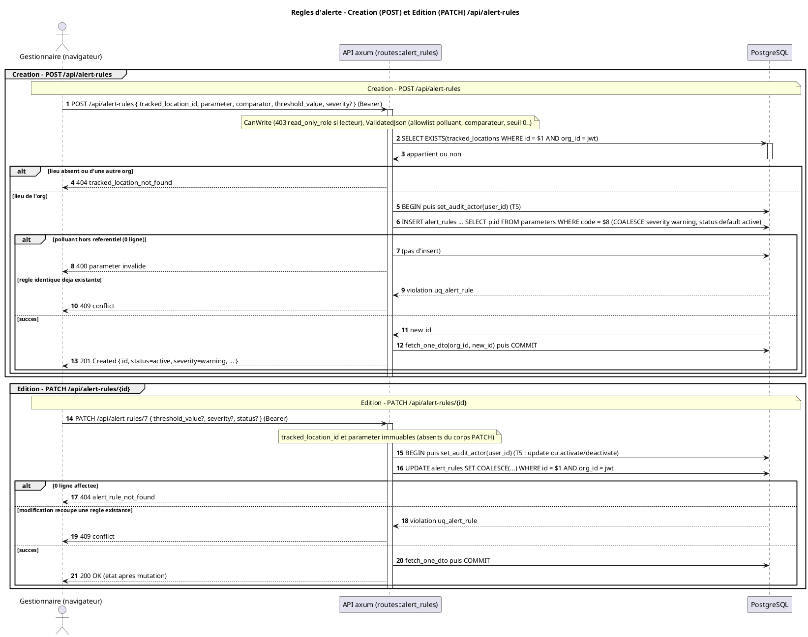

Diagramme 7.4.3-c - Objets POST-séquence (UC3)

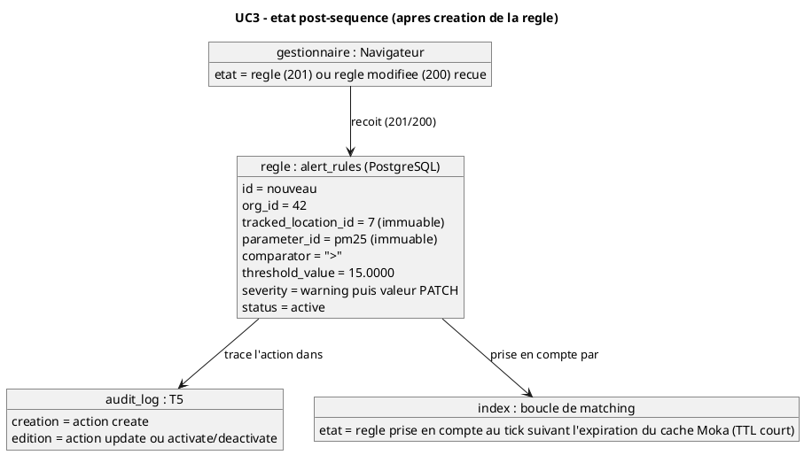

#### 7.4.4 UC4 - Déclenchement d'une alerte temps réel

La boucle de matching relit périodiquement les mesures récemment arrivées dans ClickHouse (curseur sur `ingested_at`), les évalue contre l'index des règles compilé en mémoire (cache Moka L1), insère les dépassements dans `alert_events` de façon idempotente (`ON CONFLICT DO NOTHING`) et publie les seuls événements créés sur le canal Redis `quarity:alerts:org:{org_id}`. L'abonné pub/sub (un par instance) route chaque message vers les clients de l'organisation via l'`AlertHub` in-process, qui pousse le payload sur la session WebSocket. Le front affiche l'alerte sans rechargement.

Diagramme 7.4.4-a - Objets PRE-séquence (UC4)

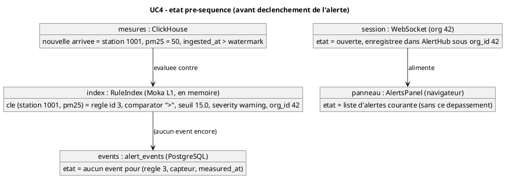

Diagramme 7.4.4-b - Séquence (UC4)

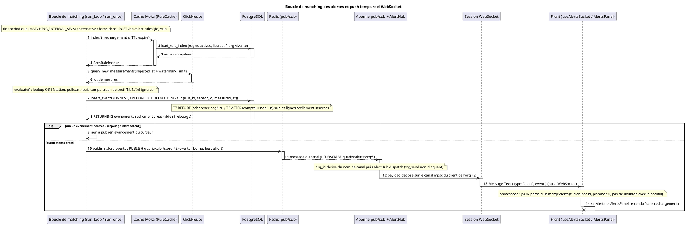

Diagramme 7.4.4-c - Objets POST-séquence (UC4)

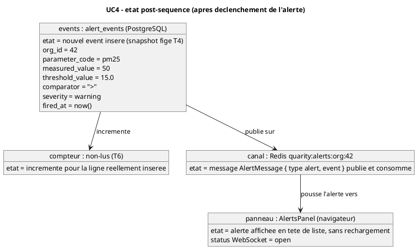

Remarques de fidélité au code. Le push est strictement limité aux événements réellement insérés : un dépassement déjà alerté (rejoué à chaque fenêtre ou via force-check) n'est pas republié, grâce au `ON CONFLICT DO NOTHING` et au `RETURNING`. La publication Redis et la diffusion WebSocket sont best-effort - l'événement persistant en base est le fait de référence ; un client lent ou fermé voit son message déposé via `try_send`, sans attente bloquante. L'isolation multi-tenant repose sur l'`org_id` issu des claims JWT signés (au handshake comme dans le canal Redis), jamais d'un paramètre client. Côté front, le hook `useAlertsSocket` complète le flux par un backfill au montage (`GET /api/alert-events`), fusionné par identifiant via `mergeAlerts` afin qu'un push antérieur à la réponse ne soit pas écrasé.

---

### 7.5 Diagrammes de séquence et d'objets (cas d'utilisation 5 à 8)

Comme en 7.4, chaque cas d'utilisation 5 à 8 reçoit un diagramme d'objets PRE-séquence (état avant), un diagramme de SEQUENCE des échanges, puis un diagramme d'objets POST-séquence (état résultant). Les diagrammes reflètent le code vérifié : backend Rust (axum / sqlx), requêtes ClickHouse embarquées et frontend React. Composants nommés comme en 7.4 : Front (React / Vite), API (axum), PG (PostgreSQL, métier), CH (ClickHouse, séries temporelles), Redis (jetons et compteurs) et, le cas échéant, services externes (OpenStreetMap, OpenAQ).

---

#### 7.5.1 UC5 - Consultation de l'AQI et de la carte

Un utilisateur authentifié consulte le tableau de bord ; le front appelle `GET /api/aqi`. Pour chaque lieu suivi actif de son organisation, le serveur récupère ses stations OpenAQ (PG, isolé par `org_id`), puis interroge CH station par station avec `aqi_snapshot` (US EPA), en parallélisme borné (16 requêtes au plus). Il agrège par lieu (MAX par polluant, AQI global = MAX, polluant dominant selon l'EPA) et renvoie une vue d'ensemble. Le front affiche la carte Leaflet, marqueur coloré par niveau AQI sur fond OpenStreetMap.

PRE-séquence (Figure 7.5.1a) - client authentifié ; lieux et stations en base ; CH contient des mesures récentes ; aucun résultat AQI chargé côté front.

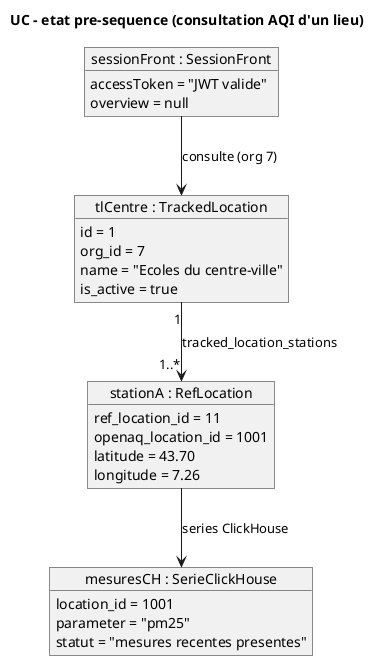

Figure 7.5.1a - Diagramme d'objets avant la consultation AQI.

Séquence (Figure 7.5.1b).

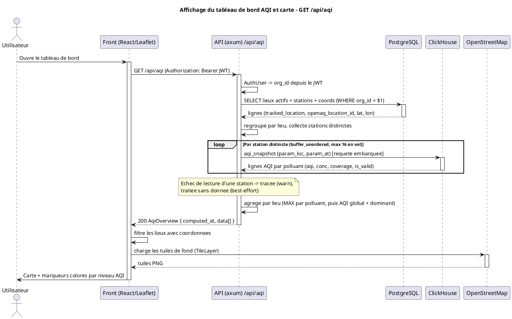

Figure 7.5.1b - Séquence de consultation de l'AQI et rendu de la carte.

POST-séquence (Figure 7.5.1c) - vue d'ensemble chargée ; chaque lieu localisé porte un marqueur coloré.

```plantuml
@startuml
title UC - etat post-sequence (overview AQI chargee et carte rendue)

object "sessionFront : SessionFront" as sessionFront {
  accessToken = "JWT valide"
  overview = "chargee"
}

object "overviewAqi : AqiOverview" as overviewAqi {
  computed_at = "2026-06-20T10:00:00Z"
  nbLieux = 1
}

object "locationAqi : LocationAqi" as locationAqi {
  tracked_location_id = 1
  name = "Ecoles du centre-ville"
  overall_aqi = 71
  dominant_parameter = "pm25"
  valid = true
  has_data = true
}

object "marqueurCarte : MarqueurCarte" as marqueurCarte {
  center = "43.70, 7.26"
  couleur = "orange (niveau 3)"
}

sessionFront --> overviewAqi : detient
overviewAqi "1" --> "0..*" locationAqi : data
locationAqi --> marqueurCarte : rendu Leaflet

@enduml
```

Figure 7.5.1c - Diagramme d'objets après la consultation AQI.

Conception : aucun calcul d'AQI côté Rust ou JavaScript ; la source de vérité est `aqi_snapshot` (EPA), règle multi-stations MAX par polluant (précaution sanitaire). Un lieu sans donnée récente est renvoyé avec `has_data = false` et `overall_aqi = null`, distinguant absence de mesure et AQI faible.

---

#### 7.5.2 UC6 - Calcul d'une dose d'exposition

Un utilisateur disposant du droit d'écriture déclenche le calcul de dose pour une association lieu x profil via `POST /api/tracked-location-profiles/{id}/compute-dose` avec une période (`period_start`, `period_end`). Le serveur valide les dates, borne la période (366 jours maximum), vérifie l'appartenance de l'association à son organisation (sinon 404), puis lit plage horaire locale, masque de jours, fuseau, stations du lieu et seuils du profil. Pour chaque seuil 1h / 8h / 24h (`annual` ignorée), il interroge CH (`exposure_dose.sql` : moyenne glissante MAX multi-stations, filtrée par date locale, plage horaire et masque de jours), fige le résultat via la procédure stockée `compute_exposure_dose` (écriture dans `exposure_results`), relit le cache et le renvoie.

PRE-séquence (Figure 7.5.2a) - l'association et ses seuils existent ; aucun résultat de dose pour la période demandée.

```plantuml
@startuml
title UC - etat pre-sequence (calcul de dose : aucun resultat)

object "tlpAssoc : TrackedLocationProfile" as tlpAssoc {
  id = 5
  tracked_location_id = 1
  exposure_profile_id = 3
  start_time = "08:00"
  end_time = "18:00"
  days_mask = 31
  timezone = "Europe/Paris"
}

object "profil : ExposureProfile" as profil {
  id = 3
  nom = "Enfants - ecole"
}

object "seuilPm25 : ExposureThreshold" as seuilPm25 {
  parameter = "pm25"
  threshold_value = 15.0
  averaging_period = "24h"
}

object "stationA : RefLocation" as stationA {
  openaq_location_id = 1001
}

object "resultatsDose : ExposureResults" as resultatsDose {
  statut = "aucun resultat pour 2026-05-01..2026-05-31"
}

tlpAssoc --> profil : reference
profil "1" --> "1..*" seuilPm25 : exposure_thresholds
tlpAssoc --> stationA : via tracked_location_stations
tlpAssoc --> resultatsDose : exposure_results (vide)

@enduml
```

Figure 7.5.2a - Diagramme d'objets avant le calcul de dose.

Séquence (Figure 7.5.2b).

```plantuml
@startuml
title Calcul de dose d'exposition - POST /api/tracked-location-profiles/{id}/compute-dose

actor "Utilisateur (droit ecriture)" as U
participant "Front (React)" as Front
participant "API (axum) compute-dose" as API
participant "PostgreSQL" as PG
participant "ClickHouse" as CH

U -> Front : Lance le calcul de dose (periode)
activate Front
Front -> API : POST /api/tracked-location-profiles/5/compute-dose?period_start&period_end
activate API
API -> API : CanWrite (sinon 403) + validation des dates
API -> API : borne la periode (max 366 jours, sinon 400)
API -> PG : SELECT association (id=5 ET org du JWT) -> plage, days_mask, tz
activate PG
PG --> API : TlpRow (ou aucune -> 404)
deactivate PG
API -> PG : SELECT stations du lieu
activate PG
PG --> API : openaq_location_id[]
deactivate PG
API -> PG : SELECT seuils du profil
activate PG
PG --> API : (parameter, threshold_value, averaging_period)[]
deactivate PG

loop Par seuil 1h/8h/24h (buffer_unordered, max 8 en vol)
    API -> CH : exposure_dose.sql (locs, param, avg_hours, threshold, from/to, plage, days_mask, tz)
    activate CH
    CH --> API : DoseRow { hours_over_threshold, sample_count }
    deactivate CH
end

loop Par dose calculee (sequentiel)
    API -> PG : CALL compute_exposure_dose(...) -> fige dans exposure_results
    activate PG
    PG --> API : result_id
    deactivate PG
end

API -> PG : SELECT exposure_results de la periode
activate PG
PG --> API : ExposureResultDto[]
deactivate PG
API --> Front : 200 [ExposureResultDto]
deactivate API
Front -> U : Affiche les doses (heures de depassement par seuil)
deactivate Front

@enduml
```

Figure 7.5.2b - Séquence de calcul et de figement de la dose d'exposition.

POST-séquence (Figure 7.5.2c) - un résultat est figé par seuil pour la période, avec snapshot de la plage horaire et du seuil appliqué.

```plantuml
@startuml
title UC - etat post-sequence (calcul de dose : resultat fige)

object "tlpAssoc : TrackedLocationProfile" as tlpAssoc {
  id = 5
  tracked_location_id = 1
  exposure_profile_id = 3
}

object "resultatDose : ExposureResult" as resultatDose {
  tracked_location_profile_id = 5
  parameter = "pm25"
  averaging_period = "24h"
  threshold_value = 15.0
  period_start = "2026-05-01"
  period_end = "2026-05-31"
  hours_over_threshold = 12.0
  sample_count = 744
  computed_at = "2026-06-20T10:05:00Z"
}

tlpAssoc "1" --> "1..*" resultatDose : exposure_results (figes)

@enduml
```

Figure 7.5.2c - Diagramme d'objets après le calcul de dose.

Conception : `annual` est hors périmètre. `compute_exposure_dose` re-résout le seuil depuis le triplet (profil, polluant, fenêtre de moyennage) et fige plage horaire et seuil, assurant la reproductibilité. La requête CH déduplique les mesures (argMax sur `ingested_at`) avant la moyenne horaire et élargit la fenêtre amont de `avg_hours` pour que la moyenne glissante du premier jour soit complète.

---

#### 7.5.3 UC7 - Accès à l'API publique par clé

Un client externe appelle un endpoint public en lecture seule, par exemple `GET /api/public/aqi`, via l'en-tête `X-API-Key`. L'extracteur `ApiKeyAuth` calcule le hash SHA-256 du secret, recherche la clé en base (non révoquée, non expirée), en déduit l'organisation, puis vérifie quota mensuel et rate-limit par minute via Redis (INCR + EXPIRE atomiques, script Lua). Clé invalide : 401 ; dépassement : 429. Sinon la requête est traitée comme son équivalent JWT, scopée à l'organisation de la clé (l'AQI réutilise `overview_for_org`). Ce contrat (`ApiKeyAuth`, primitive `rate_limit_hit`, codes 401 / 429) est exposé par `public_api.rs` et `redis_store.rs`.

PRE-séquence (Figure 7.5.3a) - une clé API active existe (seul son hash est stocké) ; les compteurs Redis de la fenêtre courante sont sous les limites.

```plantuml
@startuml
title UC - etat pre-sequence (API publique par cle : sous les limites)

object "cleApi : ApiKey" as cleApi {
  id = 42
  org_id = 7
  token_prefix = "qrt_a1b2"
  token_hash = "sha256(...)"
  scope = "read"
  revoked_at = null
  expires_at = null
}

object "quotaRedis : QuotaRedis" as quotaRedis {
  cle = "compteur minute / mois"
  valeur = "sous les limites"
}

object "lieuxOrg : LieuxOrg" as lieuxOrg {
  org_id = 7
  statut = "lieux suivis actifs"
}

cleApi --> lieuxOrg : autorise (org 7)
cleApi --> quotaRedis : compteurs d'usage

@enduml
```

Figure 7.5.3a - Diagramme d'objets avant l'appel à l'API publique.

Séquence (Figure 7.5.3b).

```plantuml
@startuml
title API publique par cle - GET /api/public/aqi

actor "Client externe" as C
participant "API (axum) /api/public/aqi" as API
participant "PostgreSQL (api_tokens)" as PG
participant "Redis (quota / rate-limit)" as Redis
participant "ClickHouse" as CH

C -> API : GET /api/public/aqi (X-API-Key: qrt_...)
activate API
API -> API : ApiKeyAuth -> hash SHA-256 du secret
API -> PG : lookup api_tokens par token_hash (non revoquee, non expiree)
activate PG
alt Cle absente / revoquee / expiree
    PG --> API : aucune correspondance
    API --> C : 401 (cle invalide)
else Cle valide
    PG --> API : org_id = 7, scope = read
    deactivate PG
    API -> Redis : rate_limit_hit (compteur minute) [INCR + EXPIRE atomique]
    activate Redis
    Redis --> API : compteur courant
    deactivate Redis
    API -> Redis : compteur quota mensuel
    activate Redis
    Redis --> API : compteur courant
    deactivate Redis
    alt Rate-limit ou quota depasse
        API --> C : 429 (rate_limited)
    else Sous les limites
        API -> API : overview_for_org(org_id = 7)  [logique partagee]
        API -> PG : lieux actifs + stations (WHERE org_id = 7)
        activate PG
        PG --> API : lignes
        deactivate PG
        API -> CH : aqi_snapshot par station
        activate CH
        CH --> API : lignes AQI
        deactivate CH
        API --> C : 200 AqiOverview
    end
end
deactivate API

@enduml
```

Figure 7.5.3b - Séquence d'accès à l'API publique par clé.

POST-séquence (Figure 7.5.3c) - après un appel autorisé, les compteurs Redis sont incrémentés et la date de dernière utilisation de la clé est mise à jour.

```plantuml
@startuml
title UC - etat post-sequence (API publique par cle : compteurs incrementes)

object "cleApi : ApiKey" as cleApi {
  id = 42
  org_id = 7
  scope = "read"
  last_used_at = "2026-06-20T10:10:00Z"
}

object "quotaRedis : QuotaRedis" as quotaRedis {
  compteurMinute = "+1"
  compteurMois = "+1"
  statut = "sous les limites"
}

object "reponse : ReponseHttp" as reponse {
  status = 200
  corps = "AqiOverview de l'org 7"
}

cleApi --> quotaRedis : compteurs incrementes
cleApi --> reponse : a produit

@enduml
```

Figure 7.5.3c - Diagramme d'objets après l'appel à l'API publique.

Conception : le secret en clair n'est jamais stocké (seul le hash SHA-256, US-16) et n'est renvoyé qu'une fois, à la création. La révocation est immédiate (`revoked_at = now()`, suppression logique) et bloque toute authentification ultérieure. L'isolation multi-organisations est garantie : l'`org_id` provient toujours de la clé authentifiée, jamais du corps de la requête.

---

#### 7.5.4 UC8 - Ingestion OpenAQ

Le binaire `quarity-ingest` récupère une station OpenAQ v3 et ses mesures horaires des N derniers jours. Pour chaque capteur dont le polluant est dans l'allowlist (pm25, pm10, no2, o3, so2, co), il pagine l'API (retry et backoff exponentiel, pause de politesse entre capteurs), normalise les heures en lignes CH (une mesure sans unité est ignorée et comptée, décision D4.2 ; aucune unité par défaut), puis insère en lot dans `quarity.measurements` (ReplacingMergeTree, idempotente). Il met à jour PG par upsert (organisation, `ref_locations`, `ref_sensors`, `tracked_locations`, `tracked_location_stations`) pour rendre la station interrogeable. Il fonctionne en one-shot ou en scheduler selon `INGEST_INTERVAL_SECS`.

PRE-séquence (Figure 7.5.4a) - l'organisation cible est seedée ; la station n'est pas encore liée et ses mesures sont absentes.

```plantuml
@startuml
title UC - etat pre-sequence (ingestion OpenAQ : liaison a creer)

object "stationOpenAQ : StationOpenAQ" as stationOpenAQ {
  location_id = 4085
  name = "NICE PROMENADE"
  country = "FR"
  capteurs = "pm25, no2, o3, ..."
}

object "orgCible : Organisation" as orgCible {
  slug = "agglo-riviera"
  statut = "presente (seed)"
}

object "refLocation : RefLocation" as refLocation {
  statut = "absente"
}

object "mesuresCH : SerieClickHouse" as mesuresCH {
  location_id = 4085
  statut = "aucune mesure ingeree"
}

stationOpenAQ --> mesuresCH : a ingerer
orgCible --> refLocation : liaison a creer

@enduml
```

Figure 7.5.4a - Diagramme d'objets avant l'ingestion OpenAQ.

Séquence (Figure 7.5.4b).

```plantuml
@startuml
title Ingestion OpenAQ -> ClickHouse / PostgreSQL (quarity-ingest)

participant "quarity-ingest" as Ing
participant "OpenAQ API v3" as OAQ
participant "ClickHouse" as CH
participant "PostgreSQL" as PG

Ing -> OAQ : GET /v3/locations/{id}  (X-API-Key)
activate OAQ
OAQ --> Ing : station + liste des capteurs
deactivate OAQ

loop Par capteur (polluant dans l'allowlist)
    Ing -> OAQ : GET /v3/sensors/{id}/hours (pagination, retry/backoff)
    activate OAQ
    OAQ --> Ing : mesures horaires
    deactivate OAQ
    Ing -> Ing : normalisation (value/datetime manquants ignores;\nunite manquante ignoree + comptee, D4.2)
    Ing -> Ing : pause de politesse entre capteurs
end

alt Aucune mesure dans la fenetre
    Ing -> Ing : rien a inserer -> fin du run
else Mesures presentes
    Ing -> CH : INSERT batch quarity.measurements (FORMAT JSONEachRow, idempotent)
    activate CH
    CH --> Ing : OK
    deactivate CH
    Ing -> PG : upsert organizations/ref_locations (ON CONFLICT)
    activate PG
    PG --> Ing : ref_location_id
    deactivate PG
    loop Par capteur
        Ing -> PG : upsert ref_sensors (ON CONFLICT DO NOTHING)
        activate PG
        PG --> Ing : OK
        deactivate PG
    end
    Ing -> PG : upsert tracked_locations + tracked_location_stations
    activate PG
    PG --> Ing : tracked_location_id
    deactivate PG
    Ing -> Ing : resume du run (mesures inserees, ignorees sans unite)
end

@enduml
```

Figure 7.5.4b - Séquence d'ingestion d'une station OpenAQ.

POST-séquence (Figure 7.5.4c) - mesures insérées dans CH et station liée à l'organisation, donc visible depuis le front.

```plantuml
@startuml
title UC - etat post-sequence (ingestion OpenAQ : mesures inserees)

object "refLocation : RefLocation" as refLocation {
  openaq_location_id = 4085
  name = "NICE PROMENADE"
  country = "FR"
  last_seen_at = "2026-06-20T10:15:00Z"
}

object "refSensor : RefSensor" as refSensor {
  openaq_sensor_id = 5001
  parameter = "pm25"
}

object "trackedLocation : TrackedLocation" as trackedLocation {
  org_id = 7
  name = "NICE PROMENADE (OpenAQ)"
}

object "mesuresCH : SerieClickHouse" as mesuresCH {
  location_id = 4085
  statut = "mesures inserees (ReplacingMergeTree)"
}

trackedLocation "1" --> "1..*" refLocation : tracked_location_stations
refLocation "1" --> "1..*" refSensor : ref_sensors
refLocation --> mesuresCH : series ClickHouse

@enduml
```

Figure 7.5.4c - Diagramme d'objets après l'ingestion OpenAQ.

Conception : l'idempotence est centrale à la reprise sur erreur. L'insertion CH repose sur une `ReplacingMergeTree(ingested_at)` dédupliquée à la lecture par `argMax`, les écritures PG sont des upserts (`ON CONFLICT`). Relancer le binaire après un échec partiel réécrit les mêmes lignes sans doublon, rendant le scheduler sûr (chaque run en échec est retenté au tick suivant, sans crash, arrêt propre sur Ctrl-C et, sous Unix, SIGTERM).

### 7.6 Architecture applicative

Le backend repose sur deux binaires Rust partageant la bibliothèque `quarity_back` : le serveur HTTP/WebSocket (`main.rs`) et le binaire d'ingestion (`bin/ingest.rs`). Le serveur s'appuie sur un état applicatif partagé et clonable (`AppState`), injecté dans tous les gestionnaires de routes, qui regroupe les connexions PostgreSQL (`PgPool`), Redis (`ConnectionManager`), ClickHouse (`ClickhouseClient`), le registre des clients WebSocket (`AlertHub`) et un jeton d'arrêt gracieux (`CancellationToken`).

Au démarrage, `main.rs` applique les migrations PostgreSQL embarquées, démarre l'abonné Redis pub/sub dès la construction de l'`AppState`, puis lance (si l'intervalle est positif) la boucle de matching en tâche de fond. Le serveur axum monte les routes (authentification, CRUD métier, AQI, API publique, WebSocket) derrière des couches transverses (CORS, en-têtes de sécurité, tracing), avec des gardes RBAC par extracteur.

La distribution des alertes temps réel suit un chemin précis : la boucle de matching écrit les dépassements dans `alert_events` (PostgreSQL, fait persistant et idempotent), puis publie les événements réellement insérés sur le canal Redis de l'organisation (`quarity:alerts:org:{org_id}`). L'abonné Redis de chaque instance route ces messages en mémoire, via l'`AlertHub`, vers les sessions WebSocket des clients concernés. Cette indirection autorise le fan-out entre plusieurs réplicas.

```plantuml
@startuml
title Architecture applicative

package "Clients" {
  component "Front React / TypeScript" as Front
  component "Client WebSocket (panneau d'alertes)" as WsClient
  component "Consommateur d'API publique (X-API-Key)" as ApiTiers
}

package "Binaire serveur (main.rs)" {
  component "Serveur axum + routeur" as Router
  component "Couches transverses (CORS, en-tetes securite, tracing)" as Layers
  component "Routes auth (login / refresh / logout / me)" as AuthRoutes
  component "Routes CRUD metier (lieux, regles, profils, seuils, associations, cles API, users, orgs)" as CrudRoutes
  component "Routes AQI / mesures / evenements d'alerte" as AqiRoutes
  component "Routes API publique (ApiKeyAuth)" as PublicRoutes
  component "Route WebSocket /api/ws" as WsRoute
  component "Boucle de matching (tache de fond)" as Matching
  component "Cache de regles (Moka L1, TTL)" as RuleCache
  component "Abonne Redis pub/sub (PSUBSCRIBE)" as Subscriber
  component "AlertHub (registre clients WS par org)" as Hub
  component "Sessions WebSocket" as WsSessions
}

package "Binaire ingestion (bin/ingest.rs)" {
  component "Ingestion OpenAQ (one-shot ou scheduler)" as Ingest
}

package "Sources et stockages" {
  database "API OpenAQ v3" as OpenAQ
  database "PostgreSQL - donnees metier" as PG
  database "ClickHouse - mesures / AQI / doses" as CH
  database "Redis - tokens, pub/sub, quotas" as Redis
}

Front --> Layers
ApiTiers --> Layers
WsClient --> WsRoute : ws + token
Layers --> Router
Router --> AuthRoutes
Router --> CrudRoutes
Router --> AqiRoutes
Router --> PublicRoutes
Router --> WsRoute

AuthRoutes --> PG
AuthRoutes --> Redis
CrudRoutes --> PG
AqiRoutes --> CH
AqiRoutes --> PG
PublicRoutes --> Redis
PublicRoutes --> CH
PublicRoutes --> PG

Matching --> RuleCache
RuleCache --> PG
Matching --> CH : lit les arrivees
Matching --> PG : ecrit les evenements
Matching --> Redis : PUBLISH alertes

Redis --> Subscriber : messages canal org
Subscriber --> Hub
Hub --> WsSessions
WsRoute --> Hub
WsSessions --> WsClient : push alertes

Ingest --> OpenAQ : GET mesures
Ingest --> CH : INSERT mesures
Ingest --> PG : liaison station / org

@enduml
```

*Figure 7.6 - Architecture applicative du backend Quarity (composants logiques et flux de données).*

Éléments clés :

- **Séparation des binaires.** L'ingestion est un processus distinct du serveur, exécutable en mode unique (one-shot) ou en planificateur périodique. Elle écrit les mesures dans ClickHouse et la liaison station/organisation dans PostgreSQL ; le serveur ne réalise jamais l'ingestion.
- **Boucle de matching.** Tâche de fond périodique propre au binaire serveur, elle relit les nouvelles mesures dans ClickHouse (par curseur sur l'horodatage d'ingestion), les évalue contre un index de règles compilé en mémoire (alimenté par le cache Moka L1) et insère les dépassements de manière idempotente dans PostgreSQL.
- **Distribution des alertes.** Le couplage Redis pub/sub plus registre in-process (`AlertHub`) découple la production des alertes de leur livraison et autorise le multi-instances : une seule instance insère et publie (idempotence), Redis diffuse à toutes, chacune ne poussant qu'à ses propres clients WebSocket.
- **Sessions WebSocket.** Chaque session est authentifiée au handshake par un jeton JWT passé en paramètre de requête (l'API navigateur n'autorisant pas d'en-tête `Authorization`). L'`org_id`, dérivé des claims signés, garantit l'isolation entre tenants ; le registre borne le nombre de connexions par organisation.
- **Stockages spécialisés.** PostgreSQL est la source de vérité métier (organisations, utilisateurs, lieux, règles, profils, événements d'alerte) ; ClickHouse celle des séries temporelles (mesures, AQI, doses) ; Redis porte les jetons de rafraîchissement, le canal pub/sub et les compteurs de quota et de rate-limit.
- **Arrêt gracieux.** Le `CancellationToken` partagé arrête proprement la boucle de matching, l'abonné Redis et les sessions WebSocket à l'extinction du serveur.

---

## 8. Diagrammes - UI/UX

Cette section documente l'interface de Quarity selon trois niveaux de détail croissant : le zoning (grandes zones de chaque écran), les wireframes basse-fidélité (structure des écrans CRUD et des modales), puis les maquettes haute-fidélité. L'application étant entièrement implémentée, les maquettes de la 8.3 ne sont pas des esquisses mais les captures réelles de l'application en fonctionnement.

Toutes les pages protégées partagent une coquille de navigation commune (composant `AppShell`) : barre supérieure fixe (marque + navigation principale + zone de session) sous laquelle chaque page injecte son contenu. Seul l'écran de connexion fait exception.

### 8.1 Zoning

Le zoning décrit l'organisation macroscopique de chaque écran en zones fonctionnelles : barre supérieure (header), navigation (nav), zone de contenu et modales superposées. Les écrans correspondent aux routes réelles : `/login`, `/dashboard`, `/locations`, `/rules`, `/profiles`, `/exposures`.

#### 8.1.1 Coquille commune (AppShell)

Toutes les pages authentifiées sont rendues dans cette coquille. La barre supérieure regroupe la marque (anneau + nom Quarity), la navigation principale (5 liens) et la zone de session (email, rôle, déconnexion). Le contenu de chaque page est rendu dans la zone centrale via un point d'insertion (`<Outlet/>`).

```
+----------------------------------------------------------------------+
|  HEADER (topbar)                                                      |
|  +----------------------------+   +-------------------------------+   |
|  | (o) Quarity                |   |  utilisateur@org.fr - role    |   |
|  |  [Tableau de bord]         |   |              [ Deconnexion ]  |   |
|  |  [Lieux suivis]            |   +-------------------------------+   |
|  |  [Regles d'alerte]         |                                       |
|  |  [Profils d'exposition]    |   <- NAV principale (5 liens)         |
|  |  [Expositions]             |                                       |
|  +----------------------------+                                       |
+----------------------------------------------------------------------+
|                                                                      |
|  ZONE DE CONTENU  (<Outlet/> : page courante)                        |
|                                                                      |
+----------------------------------------------------------------------+
```

Figure 8.1 - Zoning de la coquille commune AppShell (header + navigation + zone de contenu)

#### 8.1.2 Écran de connexion (/login)

Écran à deux colonnes, hors coquille AppShell : un panneau de marque à gauche (anneau-logo, nom, accroche) et un panneau de formulaire à droite (carte de connexion centrée).

```
+-------------------------------+--------------------------------------+
|  ZONE MARQUE (aside)          |  ZONE FORMULAIRE (panel)             |
|                               |                                      |
|       (o)                     |     +----------------------------+   |
|     Quarity                   |     |  CARTE Connexion           |   |
|                               |     |  [ alerte erreur ? ]       |   |
|   Surveillance et alerte      |     |  Email      [__________]   |   |
|   temps reel sur la           |     |  Mot de passe [________]   |   |
|   qualite de l'air mondiale.  |     |  [   Se connecter   ]      |   |
|                               |     |  Demo : compte . mdp       |   |
|                               |     +----------------------------+   |
+-------------------------------+--------------------------------------+
```

Figure 8.2 - Zoning de l'écran de connexion (panneau marque + carte de connexion)

#### 8.1.3 Tableau de bord (/dashboard)

Écran le plus dense. Sous la barre supérieure, le contenu empile verticalement : panneau d'alertes temps réel (WebSocket), vue d'ensemble AQI (carte Leaflet + grille de cartes par lieu), puis exploration d'une station (filtre, statistiques de synthèse, graphique, table de mesures).

```
+----------------------------------------------------------------------+
|  HEADER (topbar)  +  NAV principale          [ session ]             |
+----------------------------------------------------------------------+
|  PANNEAU ALERTES TEMPS REEL                                          |
|  Alertes temps reel                       (o) En direct              |
|  [ liste des dernieres alertes / message "en ecoute" ]              |
+----------------------------------------------------------------------+
|  VUE D'ENSEMBLE AQI                                                  |
|  Qualite de l'air - Calcule a HH:MM                                 |
|  +--------------------------------------------------------------+    |
|  |  CARTE (Leaflet + OSM) - marqueurs colores par AQI           |    |
|  +--------------------------------------------------------------+    |
|  +------------+  +------------+  +------------+   <- grille de       |
|  | Carte lieu |  | Carte lieu |  | Carte lieu |      cartes AQI      |
|  | AQI/badge  |  | AQI/badge  |  | AQI/badge  |      par lieu        |
|  +------------+  +------------+  +------------+                       |
+----------------------------------------------------------------------+
|  EXPLORER UNE STATION                                                |
|  [ Station ][ Parametre ][ Du ][ Au ]      [ Afficher ]             |
|  [ Points ][ Min ][ Moyenne ][ Max ]       <- stats de synthese     |
|  +--------------------------------------------------------------+    |
|  |  GRAPHIQUE (serie temporelle)                                |    |
|  +--------------------------------------------------------------+    |
|  |  TABLE des mesures (horodatage, capteur, valeur, unite)      |    |
|  +--------------------------------------------------------------+    |
+----------------------------------------------------------------------+
```

Figure 8.3 - Zoning du tableau de bord (alertes temps réel + vue d'ensemble AQI + exploration de station)

#### 8.1.4 Écrans CRUD (Lieux, Règles, Profils, Expositions)

Les quatre écrans de gestion partagent un même zoning : en-tête (titre + sous-titre + bouton d'action principal), bandeau de filtres, zone de liste (table paginée ou états vide/chargement/erreur), pagination, et modales pour créer/éditer/supprimer ou consulter des données rattachées (seuils, dose).

```
+----------------------------------------------------------------------+
|  HEADER (topbar)  +  NAV principale          [ session ]             |
+----------------------------------------------------------------------+
|  EN-TETE DE PAGE                                                     |
|  Titre + sous-titre (compte total)         [ Bouton primaire ]      |
|  [ bandeau "lecture seule" si can_write = false ]                   |
+----------------------------------------------------------------------+
|  FILTRES                                                             |
|  [ recherche ] [ selects ? ] [ segmente : Tous / Actifs / ... ]    |
+----------------------------------------------------------------------+
|  ZONE DE LISTE                                                       |
|  +--------------------------------------------------------------+    |
|  |  TABLE (en-tetes + lignes + colonne Actions)                 |    |
|  |  (ou StateBox : chargement / vide / erreur)                  |    |
|  +--------------------------------------------------------------+    |
|  PAGINATION   [ Precedent ]   Page X / N   [ Suivant ]             |
+----------------------------------------------------------------------+

      .....................................................
      :  MODALE (superposee, <dialog> natif + backdrop)   :
      :  Titre                                      [ x ]  :
      :  [ corps : formulaire / confirmation / sous-table]:
      :  ........................................  FOOTER  :
      :  [ Annuler ]                  [ Action principale ]:
      .....................................................
```

Figure 8.4 - Zoning générique des écrans CRUD (en-tête + filtres + liste paginée + modale superposée)

Les variations par écran portent uniquement sur le contenu des zones, pas sur leur agencement :

| Ecran | Filtres | Colonnes de la table | Modales |
|---|---|---|---|
| Lieux suivis (/locations) | recherche par nom ; segmente Tous / Actifs / En pause | Nom, Stations, Regles actives, Etat, Actions | Creer/Editer, Supprimer |
| Regles d'alerte (/rules) | recherche ; select lieu ; select severite ; segmente Toutes / Actives / Inactives | Regle/Lieu, Condition, Severite, Statut, Actions | Creer/Editer, Supprimer (+ actions en ligne Tester, Activer/Desactiver) |
| Profils d'exposition (/profiles) | recherche (nom ou code) ; segmente Tous / Systeme / Personnalises | Profil, Type, Description, Actions | Creer/Editer, Supprimer, Seuils |
| Expositions (/exposures) | select lieu ; select profil ; segmente Toutes / Actives / Inactives | Lieu, Profil, Plage horaire, Jours, Statut, Actions | Creer/Editer, Supprimer, Dose |

Tableau 8.1 - Déclinaison du zoning CRUD par écran (filtres, colonnes, modales réels)

### 8.2 Wireframes

Les wireframes détaillent la structure interne des écrans CRUD (table filtrable paginée) et des modales (créer/éditer, confirmation de suppression, sous-tables seuils et dose). Basse-fidélité, ils représentent la disposition et les champs réels, sans la mise en forme finale (couleurs, typographie).

#### 8.2.1 Table filtrable paginée (Lieux suivis)

```
+----------------------------------------------------------------------+
|  Lieux suivis                                       [ Nouveau lieu ] |
|  Les lieux de votre organisation et leurs stations OpenAQ. 12 total. |
+----------------------------------------------------------------------+
|  [ Rechercher par nom...        ]   ( Tous )( Actifs )( En pause )   |
+----------------------------------------------------------------------+
|  Nom               | Stations | Regles actives | Etat   | Actions    |
|--------------------+----------+----------------+--------+------------|
|  Ecoles centre     |    2     |       3        | *Actif | Edit  Supp |
|   desc. optionnelle |          |                |        |            |
|  Zone industrielle |    1     |       0        | Pause  | Edit  Supp |
|  ...                |   ...    |      ...       |  ...   |    ...     |
+----------------------------------------------------------------------+
|            [ Precedent ]     Page 1 / 3     [ Suivant ]             |
+----------------------------------------------------------------------+
```

Figure 8.5 - Wireframe de la table filtrable paginée (écran Lieux suivis)

Note : si la liste est vide, en chargement ou en erreur, la table est remplacée par une boîte d'état (StateBox) portant respectivement un message d'invite, un spinner ou un encart d'erreur avec bouton "Reessayer".

#### 8.2.2 Modale - Formulaire créer/éditer (Lieu)

A la création, le champ "Stations OpenAQ" est saisi (identifiants séparés par des virgules) ; en édition, les stations sont immuables et remplacées par une case "Surveillance active".

```
.........................................................
:  Nouveau lieu suivi                             [ x ] :
:.......................................................:
:  [ alerte erreur de formulaire ? ]                    :
:                                                       :
:  Nom                                                  :
:  [_________________________________________]         :
:                                                       :
:  Description (optionnel)                              :
:  [_________________________________________]         :
:                                                       :
:  Stations OpenAQ          (creation uniquement)       :
:  [ 1001, 1002 ____________________________ ]          :
:  Identifiants OpenAQ separes par des virgules (1-50). :
:.......................................................:
:  [ Annuler ]                       [ Creer le lieu ]  :
.........................................................
```

Figure 8.6 - Wireframe de la modale formulaire créer/éditer (écran Lieux suivis)

#### 8.2.3 Modale - Formulaire créer/éditer (Règle d'alerte)

A l'édition, le lieu et le polluant sont immuables (affichés en lecture seule "non modifiable") et un champ "Statut" apparaît.

```
.........................................................
:  Nouvelle regle d'alerte                        [ x ] :
:.......................................................:
:  Lieu suivi      [ Ecoles centre              v ]     :
:  Polluant        [ PM2.5                      v ]     :
:  +-------------------------+-------------------------+ :
:  | Condition [ > v ]       | Seuil [ 50 ____ ]       | :
:  +-------------------------+-------------------------+ :
:  Severite        [ Avertissement              v ]     :
:  Nom (optionnel) [ Pic de PM2.5 - ecole ______ ]      :
:.......................................................:
:  [ Annuler ]                      [ Creer la regle ]  :
.........................................................
```

Figure 8.7 - Wireframe de la modale formulaire créer/éditer (écran Règles d'alerte)

#### 8.2.4 Modale - Formulaire créer/éditer (Exposition)

La plage horaire (début/fin), les 7 jours en cases à cocher (`days_mask`), le fuseau horaire et l'état actif. A l'édition, le lieu et le profil sont immuables.

```
.........................................................
:  Nouvelle exposition                            [ x ] :
:.......................................................:
:  Lieu suivi          [ Ecoles centre          v ]     :
:  Profil d'exposition [ Enfants                v ]     :
:  +-------------------------+-------------------------+ :
:  | Debut [ 08:00 ]         | Fin [ 18:00 ]           | :
:  +-------------------------+-------------------------+ :
:  Jours actifs                                         :
:  [x]Lu [x]Ma [x]Me [x]Je [x]Ve [ ]Sa [ ]Di           :
:  Fuseau horaire      [ Europe/Paris           v ]     :
:  [x] Exposition active (prise en compte dose)         :
:.......................................................:
:  [ Annuler ]                            [ Creer ]     :
.........................................................
```

Figure 8.8 - Wireframe de la modale formulaire créer/éditer (écran Expositions)

#### 8.2.5 Modale - Confirmation de suppression (générique)

Schéma commun aux quatre écrans : titre, message rappelant l'objet et les effets en cascade, action de confirmation en variante "danger".

```
.........................................................
:  Supprimer le lieu                              [ x ] :
:.......................................................:
:  [ alerte erreur ? ]                                  :
:  Supprimer definitivement <Nom> ? Ses stations        :
:  liees et ses regles d'alerte seront aussi            :
:  supprimees (cascade). Action irreversible.           :
:.......................................................:
:  [ Annuler ]                          [ Supprimer ]   :
.........................................................
```

Figure 8.9 - Wireframe de la modale de confirmation de suppression (commune aux écrans CRUD)

#### 8.2.6 Modale - Sous-tables rattachées (Seuils et Dose)

L'écran Profils ouvre une modale "Seuils" (sous-table polluant / seuil / période + formulaire d'ajout en pied si éditable). L'écran Expositions ouvre une modale "Dose" (formulaire de calcul sur une période + sous-table des résultats).

```
.....................................          .....................................
:  Seuils - <Profil>          [ x ] :          :  Dose - <Lieu> x <Profil>   [ x ] :
:...................................:          :...................................:
:  Polluant | Seuil   | Periode | . :          :  Calculer la dose sur periode     :
:  PM2.5    | 25 ug.. | 24h     |Ret:          :  [ Du ___ ][ Au ___ ][ Calculer ] :
:  O3       | 100 ..  | 8h      |Ret:          :  Heures ou la conc. > seuil...     :
:  ................................. :          :...................................:
:  Ajouter un seuil                 :          :  Polluant|Seuil|Periode|Heures|Cov:
:  [ Polluant v ][ Seuil ][ Per. v ]:          :  PM2.5(24h)| 25 | a->b  |  6   |30h:
:                        [ Ajouter ]:          :  .................................:
:...................................:          :...................................:
:                       [ Fermer ]  :          :                       [ Fermer ]  :
.....................................          .....................................
```

Figure 8.10 - Wireframes des modales à sous-table : gestion des seuils (Profils) et calcul de dose (Expositions)

### 8.3 Maquettes haute-fidélité

L'application étant fonctionnelle, les maquettes haute-fidélité sont les captures réelles de l'interface en production, archivées dans `app/docs/captures/` et prises sur la pile réelle (Docker Compose, base peuplée, ingestion OpenAQ). Les chemins ci-dessous sont relatifs à `app/docs/`. Toutes ces vues, hormis la connexion, partagent la navigation commune `AppShell` décrite en 8.1.1.

| Reference | Chemin (relatif a app/docs/) | Ecran represente |
|---|---|---|
| HF-1 | docs/captures/2026-06-07__app-login.png | Ecran de connexion : panneau de marque + carte de connexion (cf. zoning 8.1.2). |
| HF-2 | docs/captures/2026-06-07__app-dashboard.png | Tableau de bord - section d'exploration d'une station : formulaire de filtre, statistiques de synthèse, graphique de série temporelle et table de mesures. |
| HF-3 | docs/captures/2026-06-07__app-dashboard-nice-4085.png | Tableau de bord - série temporelle d'une station réelle (station OpenAQ 4085), variante peuplée de la vue d'exploration. |
| HF-4 | docs/captures/2026-06-11__map-qualite-de-l-air.png | Tableau de bord - vue d'ensemble AQI : carte Leaflet + OpenStreetMap avec marqueurs colorés selon l'indice US EPA, et grille de cartes par lieu suivi. |
| HF-5 | docs/captures/2026-06-12__alerte.png | Tableau de bord - panneau d'alertes temps réel : réception en direct d'un dépassement de seuil via WebSocket, sans rechargement. |
| HF-6 | docs/captures/2026-06-12__lieux-suivis.png | Ecran Lieux suivis (CRUD) : en-tête, filtres (recherche + segmenté), table paginée Nom / Stations / Regles actives / Etat / Actions. |
| HF-7 | docs/captures/2026-06-12__regles-alerte.png | Ecran Regles d'alerte (CRUD) : filtres (recherche, lieu, sévérité, statut), table Regle/Lieu / Condition / Severite / Statut, actions en ligne (Tester, Activer/Désactiver, Editer, Supprimer). |
| HF-8 | docs/captures/2026-06-12__profils-exposition.png | Ecran Profils d'exposition (CRUD) : profils système (lecture seule) et personnalisés, accès à la modale de gestion des seuils par polluant et période. |
| HF-9 | docs/captures/2026-06-12__expositions.png | Ecran Expositions (CRUD) : associations lieu x profil avec plage horaire, jours actifs et statut, accès à la modale de calcul de dose. |
| HF-10 | docs/captures/2026-06-12__mobile.png | Vue responsive (< 768 px) : compactage des tables CRUD, navigation et formulaires adaptés au mobile. |

Tableau 8.2 - Maquettes haute-fidélité (captures réelles de l'application) et écrans correspondants

Remarques sur le responsive et la navigation partagée :

- Responsive : la capture HF-10 (`docs/captures/2026-06-12__mobile.png`) illustre le comportement sous 768 px. Les tables CRUD sont compactées et passent en défilement horizontal ; connexion (une colonne), formulaires, filtres et barre supérieure étaient déjà adaptatifs. Évolution possible (non bloquante) : passage des tables en cartes empilées sur mobile.
- Navigation partagée (AppShell) : toutes les vues authentifiées (HF-2 à HF-9) sont rendues dans la coquille commune ; la connexion (HF-1) est le seul écran hors coquille.

D'autres captures du dossier `app/docs/captures/` documentent le fonctionnement technique (SGBD PostgreSQL/ClickHouse/Redis, requêtes SQL et NoSQL, tests d'API et codes 4xx, OpenAPI/Swagger, graphe Git, board Kanban) ; preuves de fonctionnement plutôt que maquettes d'interface, elles ne figurent pas au tableau 8.2.

---

## 9. Diagrammes - Organisation du travail

Cette section documente la conduite du projet Quarity : chronologie des jalons et sprints, outil de suivi (board Kanban), synthèse du travail livré sprint par sprint et répartition des rôles. Les dates et le périmètre rapportés sont établis à partir des artefacts réels du dépôt (roadmap produit, backlog d'avancement et historique Git des pull requests).

### 9.1 Diagramme de Gantt - Jalons et sprints

Le projet est structuré en jalons B0 à B11 puis une phase de finition v1.0 (Jalon 4). L'échelle ci-dessous est calée sur les dates réelles des pull requests fusionnées (du 2026-06-04 au 2026-06-18). Les durées sont volontairement courtes : le projet étant mené par un auteur unique assisté d'IA, la cadence est d'une à plusieurs tranches livrées par jour, chaque tranche correspondant à une PR distincte sur la branche protégée `dev` après CI verte.

```plantuml
@startgantt
title Figure 9.1 - Chronologie du projet Quarity (jalons B0-B11 + finition v1.0)

-- Cadrage et modelisation --
[Jalon 0 - Cadrage (repo, board, charte)] lasts 3 days
[Jalon 1 - Modelisation (MCD/MLD, ClickHouse)] lasts 1 days

-- Walking skeleton (Jalon 2) --
[Skeleton bout-en-bout (auth, mesures, front)] lasts 2 days
[Skeleton bout-en-bout (auth, mesures, front)] starts at [Jalon 1 - Modelisation (MCD/MLD, ClickHouse)]'s end
[Durcissement socle (auth, ingestion, sqlx)] lasts 3 days
[Durcissement socle (auth, ingestion, sqlx)] starts at [Skeleton bout-en-bout (auth, mesures, front)]'s end

-- Jalon 3 - BDD --
[B1-B4 vues, triggers, procedures, requete] lasts 1 days
[B1-B4 vues, triggers, procedures, requete] starts at [Durcissement socle (auth, ingestion, sqlx)]'s end
[B5 ClickHouse moyennes glissantes + AQI] lasts 2 days
[B5 ClickHouse moyennes glissantes + AQI] starts at [B1-B4 vues, triggers, procedures, requete]'s end

-- Jalon 3 - Back --
[B6 CRUD 20 endpoints] lasts 1 days
[B6 CRUD 20 endpoints] starts at [B5 ClickHouse moyennes glissantes + AQI]'s end
[B7 Boucle de matching (Moka L1)] lasts 1 days
[B7 Boucle de matching (Moka L1)] starts at [B6 CRUD 20 endpoints]'s end
[B8 Pub/sub Redis -> WebSocket] lasts 1 days
[B8 Pub/sub Redis -> WebSocket] starts at [B7 Boucle de matching (Moka L1)]'s end
[B8b Durcissement WebSocket] lasts 1 days
[B8b Durcissement WebSocket] starts at [B8 Pub/sub Redis -> WebSocket]'s end
[B9a Profils exposition + calcul de dose] lasts 1 days
[B9a Profils exposition + calcul de dose] starts at [B8b Durcissement WebSocket]'s end
[B9b API publique par cle + quotas] lasts 1 days
[B9b API publique par cle + quotas] starts at [B9a Profils exposition + calcul de dose]'s end

-- Jalon 3 - Front --
[B10 Vue d'ensemble AQI (jauges)] lasts 1 days
[B10 Vue d'ensemble AQI (jauges)] starts at [B6 CRUD 20 endpoints]'s end
[B10b Carte Leaflet/OSM] lasts 1 days
[B10b Carte Leaflet/OSM] starts at [B10 Vue d'ensemble AQI (jauges)]'s end
[B11a Client WebSocket alertes] lasts 2 days
[B11a Client WebSocket alertes] starts at [B10b Carte Leaflet/OSM]'s end
[B11b CRUD lieux + regles] lasts 1 days
[B11b CRUD lieux + regles] starts at [B11a Client WebSocket alertes]'s end
[B11c Profils, expositions, responsive, tests] lasts 1 days
[B11c Profils, expositions, responsive, tests] starts at [B11b CRUD lieux + regles]'s end

-- Jalon 4 - Finition v1.0 --
[Durcissement post-audit (correctness, infra)] lasts 1 days
[Durcissement post-audit (correctness, infra)] starts at [B11c Profils, expositions, responsive, tests]'s end
[Vagues finition (perf, refactor, tokens)] lasts 1 days
[Vagues finition (perf, refactor, tokens)] starts at [Durcissement post-audit (correctness, infra)]'s end
[Recette, benchmarks, CI supply-chain] lasts 1 days
[Recette, benchmarks, CI supply-chain] starts at [Vagues finition (perf, refactor, tokens)]'s end
[Backfill alertes + captures preuves L4] lasts 1 days
[Backfill alertes + captures preuves L4] starts at [Recette, benchmarks, CI supply-chain]'s end

@endgantt
```

Lecture du diagramme : les jalons 0 et 1 (cadrage et modélisation) sont fusionnés sur la fenêtre du 2026-06-04, conformément au premier commit de modélisation. Le walking skeleton (Jalon 2) est traité en priorité absolue (tuyau de bout en bout avant toute feature riche). Le Jalon 3 est découpé en trois axes parallèles (BDD, back, front) mais exécutés en série par l'auteur unique. La finition v1.0 (Jalon 4) regroupe le durcissement issu des audits internes (06-10 et 06-12), les vagues de qualité et de performance, puis la recette, les benchmarks et les preuves documentaires.

### 9.2 Board Kanban (GitHub Projects)

Le suivi des tâches est assuré par un board GitHub Projects (https://github.com/users/TristanPLS/projects/1), ouvert au Jalon 0 puis peuplé à partir du backlog (28 items au démarrage). Le board respecte les colonnes imposées suivantes :

| Colonne | Role dans le flux |
|---|---|
| Backlog | Réservoir de toutes les missions identifiées, non encore planifiées pour le sprint courant. |
| A faire | Taches sélectionnées pour le sprint, prêtes à être prises. |
| En cours | Tache active (une PR en préparation sur une branche `feature/*`, `fix/*`, `chore/*` ou `docs/*`). |
| A valider | PR ouverte, en attente de validation par la CI (process solo : la CI verte tient lieu de revue). |
| Probleme | Tache bloquée ou anomalie détectée à ré-instruire (ex. défaut relevé en revue adversariale ou audit). |
| Termine | PR fusionnée sur `dev` après CI verte. |

La capture `docs/captures/2026-06-07__board-github.png` atteste de l'état du board peuplé le 2026-06-07 (28 items). Le flux standard d'une tâche est : Backlog -> A faire -> En cours (branche dédiée) -> A valider (PR + CI) -> Termine (merge), la colonne Probleme servant de dérivation lorsqu'un blocage ou un défaut est identifié.

Particularité du process solo : les branches `dev` et `master` sont protégées, le merge direct est interdit, et chaque tâche passe obligatoirement par une pull request avec CI verte. La CI (format, clippy, tests back sur vraies bases, tests Vitest front, build, build Docker, puis ESLint et audits supply-chain ajoutés en finition) remplace la revue humaine par les pairs, non applicable à un projet à un seul contributeur.

Figure 9.2 - Le board Kanban et ses six colonnes (capture `docs/captures/2026-06-07__board-github.png`).

### 9.3 Synthese sprint par sprint

Chaque sprint correspond à un jalon fonctionnel livré par une ou plusieurs pull requests numérotées. Le tableau ci-dessous synthétise le périmètre réellement livré, établi à partir du backlog d'avancement et de l'historique Git.

| Sprint | Periode | Perimetre livre | PR cles |
|---|---|---|---|
| Jalon 0 - Cadrage | 2026-06-04 a 06-06 | Repo Git, branches protégées (`master`/`dev`), conventions de commit, board GitHub Projects, charte agents (`AGENTS.md`), pitch et identité. | #11, #12 |
| Jalon 1 - Modelisation | 2026-06-04 | 5 personas, 16 user stories MoSCoW, MCD/MLD 3NF (23 tables Postgres), schéma ClickHouse (`measurements` + rollups + TTL), frontière inter-bases documentée. | #1 (initial) |
| Jalon 2 - Walking skeleton | 2026-06-04 a 06-08 | Tuyau bout-en-bout : `docker-compose` 5 services, auth JWT (Argon2id + refresh Redis), `GET /api/measurements` (ClickHouse, isolation multi-tenant), front login + série temporelle, ingestion OpenAQ. Durcissement : auth, ingestion robuste, migrations sqlx, doc OpenAPI, validation des inputs, scheduler d'ingestion. | #3, #4, #14, #15, #16, #23, #24, #28 |
| B5 - BDD avancee | 2026-06-07 a 06-08 | Postgres : 2 vues métier, triggers T1-T8, 3 procédures stockées, transaction avec ROLLBACK testé, requête complexe (CTE + 4 jointures + GROUP BY + HAVING). ClickHouse : moyennes glissantes réglementaires, calcul AQI US EPA via breakpoints. | #26, #27, #30 |
| B6 - CRUD | 2026-06-10 | 20 endpoints REST (5 opérations sur users, organizations, tracked_locations, alert_rules), codes HTTP corrects, pagination/tri/filtre uniformes, isolation multi-tenant et RBAC dans les signatures. | #34 |
| B7 - Boucle de matching | 2026-06-10 | Moteur de matching de seuils, règles compilées en index mémoire (cache Moka L1, lookup HashMap), curseur d'arrivée, idempotence en base (migration 0006), endpoint force-check `POST /api/alert-rules/{id}/run`. | #35 |
| B8 - Alertes pub/sub + WebSocket | 2026-06-10 a 06-11 | Publication Redis pub/sub par org (`quarity:alerts:org:{org_id}`) à l'insertion réelle d'un événement, endpoint `GET /api/ws?token=` authentifié, registre in-process org -> clients. B8b : cap connexions par org, arrêt gracieux, timeout d'envoi, publish parallèle, métriques. | #38, #40 |
| B9 - Profils d'exposition + API publique | 2026-06-11 | B9a : CRUD profils + seuils, association lieu x profil (plage horaire, days_mask, fuseau), calcul de dose ClickHouse (fenêtre glissante MAX multi-stations) + procédure `compute_exposure_dose`. B9b : gestion des clés API (secret hashe SHA-256), API publique `X-API-Key` + quota/rate-limit Redis par abonnement. | #42, #43, #44, #45, #46 |
| B10 - Carte AQI | 2026-06-10 a 06-11 | Vue d'ensemble AQI (jauges, endpoint `GET /api/aqi`, agrégation multi-stations MAX, polluant dominant) puis carte Leaflet + tuiles OpenStreetMap (marqueurs colorés par niveau AQI), CSP étendue aux tuiles OSM. | #39, #47, #48 |
| B11 - Front complet | 2026-06-11 a 06-12 | B11a : client WebSocket d'alertes (hook `useAlertsSocket`, reconnexion backoff, `AlertsPanel`) consommant enfin le push B8/B8b. B11b : CRUD front lieux et règles (force-check, bascule active/inactive), nav partagée `AppShell`, modale accessible. B11c : profils d'exposition, expositions (dose), responsive < 768px, première infra de test front (Vitest, 14 tests). | #49, #51, #52, #55, #56, #57 |
| Finition v1.0 (Jalon 4) | 2026-06-13 a 06-18 | Durcissement post-audit (collision dose multi-fenêtres, front non-root, CI Vitest, intégrité AQI PG/CH, trigger T8, borne et parallélisation compute-dose), vagues de qualité/perf (ESLint, code-split Leaflet, index, refactors front, métriques Moka), recette fonctionnelle, benchmarks criterion, audits supply-chain, backfill des alertes au montage, captures de preuves L4. | #58 a #82 |

Récapitulatif quantitatif : le projet totalise environ 82 pull requests fusionnées sur la fenêtre du 2026-06-04 au 2026-06-18, une suite de tests back d'environ 170 tests (e2e, base de données, ClickHouse, unitaires) plus une suite front Vitest, et 18 captures versionnées dans `docs/captures/`. Le tag de release candidate `rc.1` est posé à l'issue des vagues de finition.

### 9.4 Repartition des roles

#### 9.4.1 Note sur la composition de l'equipe

Le projet Quarity a été réalisé en mode **solo** par un seul étudiant, Tristan Pierre-Louis, avec l'**assistance déclarée d'une IA** (Claude Code, modèle Claude Opus). Une dérogation à la règle de constitution d'un groupe de quatre membres a été actée. En conséquence, les rôles habituellement répartis entre plusieurs personnes (lead BDD, lead back-end, lead front-end, lead conception) sont **tous portés par l'auteur unique**, qui change de casquette selon la phase. Cette section ne fabrique aucun membre fictif : la répartition décrite est une répartition par **casquette** assumée par une seule personne, et non par individu.

L'assistance IA intervient sous supervision humaine systématique : les agents préparent et signalent, mais n'effectuent aucune action Git (commit, push, merge), conformément à la charte `AGENTS.md`. Toutes les décisions de conception, de fusion et de validation relèvent de l'auteur unique. Le process est documenté : chaque mission est tracée dans `logs/` et chaque livraison passe par une PR avec CI verte.

#### 9.4.2 Roles, casquettes et perimetre

| Casquette | Titulaire | Perimetre principal |
|---|---|---|
| Lead conception / coordination | Tristan Pierre-Louis | Cadrage (Jalon 0), modélisation (personas, user stories MoSCoW, MCD/MLD), roadmap, board Kanban, fondations juridiques/RGPD, documentation et dossier de conception, décisions d'architecture polyglotte. |
| Lead BDD | Tristan Pierre-Louis | Schéma Postgres 3NF (23 tables), vues, triggers T1-T8, procédures stockées, requête complexe, schéma ClickHouse (rollups, TTL, moyennes glissantes, AQI EPA), frontière inter-bases. |
| Lead back-end | Tristan Pierre-Louis | Back Rust/Axum : auth JWT, 20 endpoints CRUD, boucle de matching (Moka), pub/sub Redis + WebSocket, profils d'exposition et dose, API publique par clé, sécurité (CORS, CSP, rate-limit, validation). |
| Lead front-end | Tristan Pierre-Louis | Front React/Vite : login, dashboard AQI (jauges + carte Leaflet), CRUD lieux/règles/profils/expositions, client WebSocket d'alertes, responsive, infra de test Vitest. |
| Assistance IA (declaree) | Claude Code (Claude Opus) | Aide à la rédaction de code, tests, documentation et revues adversariales, sous supervision humaine ; aucune action Git autonome (cf. `AGENTS.md`). |

Tableau 9.1 - Roles, casquettes et perimetre (auteur unique + assistance IA declaree).

#### 9.4.3 Matrice roles x livrables et charge estimee

Le tableau suivant croise chaque casquette avec ses livrables produits et une estimation de la charge. Les heures sont **estimées** (le projet n'ayant pas fait l'objet d'un suivi de temps formel) et réparties au prorata du volume de pull requests et de l'ampleur des livrables par axe. Le total est donné à titre indicatif.

| Casquette | Livrables produits | Heures estimees |
|---|---|---|
| Lead conception / coordination | Repo et board, conventions, personas + user stories, MCD/MLD, roadmap et backlog, fondations (OpenAQ, RGPD, responsabilité, qualité des données), recette fonctionnelle, dossier de conception. | ~30 h |
| Lead BDD | Migrations Postgres (vues, triggers T1-T8, procédures, requête complexe, index), schéma et requêtes ClickHouse (moyennes glissantes, AQI EPA), tests db et ch, intégrité AQI PG/CH. | ~35 h |
| Lead back-end | Auth JWT, 20 endpoints CRUD, matching Moka, pub/sub + WebSocket, profils/dose, API publique par clé, sécurité, benchmarks criterion, ~170 tests back. | ~55 h |
| Lead front-end | Login, dashboard AQI (jauges + carte), CRUD lieux/règles/profils/expositions, client WebSocket, responsive, infra et tests Vitest. | ~35 h |
| Coordination IA et revues | Pilotage des agents (préparation, revues adversariales, logs), intégration et validation des PR. | ~15 h |
| Total indicatif | | ~170 h |

Tableau 9.2 - Matrice roles x livrables et charge estimee.

Note de transparence : la charge ci-dessus est une estimation a posteriori, fondée sur le volume de livraisons tracé dans l'historique Git et le backlog ; elle ne résulte pas d'un pointage horaire. L'assistance IA a sensiblement augmenté la cadence (plusieurs tranches par jour), ce qui explique une durée calendaire courte (deux semaines) pour un périmètre fonctionnel large ; elle n'a jamais dispensé l'auteur unique de la conception, de la validation et de la responsabilité finale de chaque livraison.

---

## 10. Analyse technique

Cette section décrit les choix techniques de Quarity : librairies, justification des technologies (dont le couplage relationnel + NoSQL), contraintes non fonctionnelles et inventaire fonctionnel exhaustif.

### 10.1 Librairies

Les tableaux ci-dessous recensent les librairies déclarées dans `app/back/Cargo.toml` et `app/front/package.json`, aux versions épinglées.

Tableau 10.1 - Librairies du backend (Rust)

| Librairie | Où utilisée | Pourquoi |
|---|---|---|
| `axum` (0.8, feature `ws`) | Couche HTTP de toute l'API ; routeur, extracteurs, endpoint WebSocket | Framework web asynchrone idiomatique de l'écosystème Tokio ; la feature `ws` fournit l'endpoint `GET /api/ws` des alertes temps réel |
| `tokio` (1, feature `full`) | Runtime asynchrone du serveur et des tâches de fond | Exécuteur async de référence ; supporte le multiplexage des I/O réseau et bases de données |
| `tokio-util` | Arrêt gracieux des tâches de fond (boucle de matching, abonné Redis, sessions WebSocket) | Fournit `CancellationToken` pour propager un signal d'arrêt propre |
| `tower-http` (features `cors`, `trace`, `set-header`) | Couches transverses du routeur (CORS, traçage HTTP, en-têtes de sécurité) | Middlewares standardisés ; pose CORS, CSP, HSTS, `X-Frame-Options`, `X-Content-Type-Options`, `Referrer-Policy` |
| `futures-util` | Consommation du flux Redis pub/sub des alertes ; parallélisme borné (`buffer_unordered`) des requêtes ClickHouse AQI et dose | Combinateurs de flux/`Future` (`StreamExt`) nécessaires au fan-out et au bornage de concurrence |
| `sqlx` (0.8, runtime Tokio, TLS rustls, `postgres`, `macros`, `migrate`, `chrono`) | Tout l'accès PostgreSQL (CRUD métier, isolation multi-tenant, migrations embarquées) | Accès SQL asynchrone, requêtes paramétrées (anti-injection), migrations appliquées au démarrage, `FromRow` pour les DTO |
| `redis` (0.27, `tokio-comp`, `connection-manager`) | Refresh tokens, rate-limit et quotas, pub/sub des alertes | Client Redis async ; sessions, compteurs « fenêtre fixe » et bus de diffusion temps réel |
| `reqwest` (0.12, `json`, `rustls-tls`) | Accès ClickHouse via son interface HTTP ; appels à l'API OpenAQ (binaire d'ingestion) | Client HTTP async ; ClickHouse n'est pas attaqué par un driver SQL dédié mais via HTTP |
| `chrono` (0.4, `clock`, `serde`) | Horodatages des DTO (`TIMESTAMPTZ`), calculs de période de dose, ingestion | Manipulation des dates/heures et sérialisation des `DateTime<Utc>` |
| `moka` (0.12, `future`) | Cache L1 in-process des règles d'alerte (boucle de matching) | Cache mémoire concurrent pour un lookup sans réseau dans le hot path de matching |
| `argon2` (0.5) | Hachage et vérification des mots de passe ; vérification factice anti-énumération | Argon2id, état de l'art pour le stockage de mots de passe |
| `jsonwebtoken` (9) | Émission/validation des access tokens JWT (HS256) | Encodage/décodage des claims signés (isolation `org_id`, rôle, `can_write`) |
| `uuid` (1, `v4`) | Génération des `jti` JWT et des refresh tokens opaques | Identifiants aléatoires indépendants du payload JWT |
| `sha2` (0.10) | Hachage SHA-256 des clés API (lookup déterministe `token_hash`) | Hash rapide adapté à un secret de haute entropie ; le secret n'est jamais stocké en clair |
| `serde` / `serde_json` (1) | Sérialisation/désérialisation de tous les DTO et réponses JSON | Socle de sérialisation de l'écosystème Rust |
| `validator` (0.20, `derive`) | Validation des entrées au boundary (longueurs, plages, dates, allowlists) | Validation déclarative des corps et query strings avant tout traitement |
| `utoipa` (5) + `utoipa-swagger-ui` (9, `vendored`) | Génération de la spécification OpenAPI et de Swagger UI sur `/api/docs` | Documentation d'API dérivée du code ; assets Swagger embarqués (build hors réseau) |
| `tracing` / `tracing-subscriber` (0.1 / 0.3, `env-filter`) | Journalisation structurée et observabilité | Traçage configurable par variable d'environnement |
| `anyhow` / `thiserror` (1) | Gestion d'erreurs internes et types d'erreurs métier | Propagation d'erreurs et mapping vers les codes HTTP |
| `criterion` (0.5, `html_reports`, dev) | Benchmark de la boucle de matching (`benches/matching`) | Mesure de performance du hot path serveur |
| `tokio-tungstenite` (0.24, dev) | Client WebSocket des tests end-to-end des alertes | Validation automatisée du flux temps réel |

Tableau 10.2 - Librairies du frontend (TypeScript/React)

| Librairie | Où utilisée | Pourquoi |
|---|---|---|
| `react` / `react-dom` (18.3) | Socle de l'interface (composants, hooks, rendu) | Bibliothèque UI de référence du projet |
| `react-router` (7.9) | Routage applicatif (pages, routes protégées, `AppShell` + `Outlet`) | Navigation côté client et gardes d'authentification |
| `leaflet` (1.9) + `react-leaflet` (4.2) + `@types/leaflet` | Carte de la qualité de l'air (composant `AqiMap`, marqueurs colorés par AQI) | Cartographie OpenStreetMap sans dépendance propriétaire |
| `recharts` (2.15) | Séries temporelles multi-polluants du tableau de bord | Graphiques déclaratifs basés sur React |
| `@fontsource-variable/inter`, `@fontsource-variable/jetbrains-mono` | Polices de l'interface (sans-serif et monospace) | Polices auto-hébergées (aucun appel à un CDN tiers) |
| `vite` (6) | Bundler et serveur de développement (build de production, proxy `/api`) | Outil de build rapide et moderne |
| `@vitejs/plugin-react` (4.3) | Intégration React dans Vite (HMR, JSX) | Plugin officiel React pour Vite |
| `vitest` (2.1) + `jsdom` (29) | Tests unitaires (helpers, composants `Badge`/`AqiBadge`, dédup d'alertes) | Runner de test aligné sur Vite, environnement DOM simulé |
| `@testing-library/react`, `@testing-library/dom`, `@testing-library/jest-dom` | Tests de composants orientés comportement | Tests centrés sur l'usage réel du DOM |
| `typescript` (5.6) | Typage statique de tout le code front | Sûreté de typage et auto-complétion |
| `eslint` (10), `typescript-eslint` (8.61), `eslint-plugin-react-hooks`, `eslint-plugin-react-refresh`, `@eslint/js`, `globals` | Analyse statique et qualité du code | Détection de défauts et application des règles des hooks React |

### 10.2 Technologies retenues et justification

La plateforme repose sur quatre briques de stockage et traitement (PostgreSQL, ClickHouse, Redis et le cache mémoire Moka), un backend Rust et un frontend React. Les choix suivent l'adéquation au profil de charge - OLTP métier, séries temporelles denses analytiques, coordination distribuée - et non la familiarité.

Tableau 10.3 - Technologies et justification

| Brique | Rôle | Justification du choix |
|---|---|---|
| PostgreSQL | Source de vérité OLTP du métier (utilisateurs, organisations, lieux suivis, règles, profils d'exposition, événements d'alerte, abonnements, clés API) | Choisi face à MySQL/MariaDB pour : un support natif riche des types (`NUMERIC` exact pour les seuils, `TIMESTAMPTZ`, `TIME`), des contraintes d'intégrité avancées (CHECK, FK strictes, index partiels uniques utilisés sur les clés API), des fonctions/procédures stockées (`compute_exposure_dose`, `create_tracked_location_with_rules`) et des triggers d'intégrité et d'audit qui ancrent les invariants au plus près des données. MySQL/MariaDB offrent un support plus limité de ces mécanismes et un contrôle moins fin des transactions, ce qui aurait reporté de la logique d'intégrité dans le code applicatif |
| ClickHouse | Source de vérité analytique des mesures (table `measurements`), calcul des snapshots AQI et des doses d'exposition | Couche NoSQL de type orienté colonnes. Le pattern de requêtes est l'agrégation sur dimensions arbitraires (date x station x polluant) sur des séries temporelles denses. Le stockage column-wise (MergeTree append-only, un fichier par colonne), la compression spécialisée et le moteur de déduplication (`ReplacingMergeTree`, lecture via `argMax`) correspondent exactement à ce profil batch + analytics. Garanties BASE et positionnement CAP-AP : SQL n'y est qu'une interface |
| Redis | Refresh tokens, rate-limit et quotas (clés API, login, refresh), pub/sub des alertes temps réel | Couche NoSQL de type clé-valeur. Sa rotation atomique de refresh token (`GETDEL`), ses compteurs « fenêtre fixe » à expiration et son bus pub/sub (un dépassement publié sur un channel, diffusé aux clients WebSocket connectés) couvrent des besoins de coordination distribuée qu'aucune base de stockage durable ne sert aussi simplement |
| Moka | Cache L1 in-process des règles d'alerte compilées (boucle de matching) | Complète Redis sans le remplacer : la boucle de matching doit évaluer chaque mesure sous une cible de 5 ms, ce qui exclut un aller-retour réseau. Moka fournit un lookup mémoire pur ; Redis assure ce que Moka ne peut pas (diffusion inter-process, persistance des sessions) |
| Rust + axum | Backend (API, ingestion, tâches de fond) | Sûreté mémoire sans ramasse-miettes, performances natives adaptées au hot path de matching, et un écosystème async mature (Tokio, sqlx, axum). Le typage fort sert l'isolation multi-tenant : les gardes `CanWrite`/`RequireAdmin`/`ApiKeyAuth` sont des types d'extracteurs qui ne compilent pas si la vérification est omise |
| React + TypeScript (Vite) | Frontend (tableau de bord, CRUD, carte, alertes temps réel) | Écosystème dominant pour une application web riche ; TypeScript apporte le typage statique de bout en bout. Vite fournit un build rapide et un proxy de développement vers l'API |

Justification de la couche NoSQL. Le sujet impose une composante NoSQL ; Quarity en retient deux types complémentaires, justifiés par opposition aux autres paradigmes :

- Orienté colonnes (ClickHouse) pour les mesures : séries temporelles denses, interrogées par agrégation sur dimensions variables, à forte compression columnar.
- Clé-valeur (Redis) pour sessions, compteurs et pub/sub : données éphémères, accédées par clé, sans durabilité relationnelle.
- Documentaire écarté : le JSON est inadapté aux séries temporelles denses (ni compression columnar, agrégations coûteuses).
- Graphe écarté : les relations entre mesures ne forment pas un graphe à parcourir.

Le découpage - relationnel pour le métier, colonnes pour les mesures, clé-valeur pour la coordination - est donc motivé par les patterns d'accès réels.

### 10.3 Contraintes

Les contraintes non fonctionnelles ont guidé le frontend et les chemins critiques du backend.

Style et charte graphique. Design-system maison, sans framework UI tiers (ni composants, ni CSS utilitaire). Les jetons de conception (couleurs de marque, rôles sémantiques, échelle AQI EPA séparée, typographie, espacements, rayons, ombres) sont centralisés en variables CSS dans `front/src/styles/tokens.css`. Une règle explicite sépare couleurs de marque, couleurs d'état et échelle AQI (un jeton `--aqi-*` ne sert jamais de couleur d'UI générique, et inversement). Composants en CSS Modules locaux ; polices (Inter, JetBrains Mono) auto-hébergées via `@fontsource-variable`, sans CDN.

Responsive (mobile et desktop). L'interface est adaptative via des media queries dans la feuille de base et la plupart des modules de pages. Sous 768 px, les tables CRUD sont compactées (défilement horizontal) ; connexion, formulaires, filtres et barre supérieure étaient déjà en colonne unique. Carte Leaflet et graphiques tiennent dans des conteneurs fluides.

Accessibilité. La modale partagée repose sur l'élément natif `<dialog>` (`front/src/components/Modal.tsx`) : le navigateur gère piège de focus, touche Échap (vers `onClose`) et backdrop ; à l'ouverture, le focus va au premier champ, le titre est lié via `aria-labelledby` et le bouton de fermeture porte un `aria-label`. L'application emploie plus largement attributs ARIA, rôles, associations label/contrôle et `:focus-visible`. Niveaux d'alerte (info/warning/critical) et échelle AQI restent lisibles par des contrastes adaptés, y compris sur le fond sombre du panneau d'alertes (jeton `--c-warning-on-dark`).

Performance. Les cibles produit structurent les chemins critiques :

- Matching mesure vers alerte sous 5 ms, par lookup mémoire pur (cache Moka) sans aller-retour réseau.
- Diffusion d'une alerte au client en moins d'une seconde via le pub/sub Redis et le WebSocket.
- Anti-amplification : requêtes ClickHouse des vues AQI et dose parallélisées mais bornées (`buffer_unordered` : au plus 16 en vol pour l'AQI, 8 pour la dose).
- Bornes anti-DoS : tailles de corps limitées (8 Kio à l'authentification, 64 Kio au CRUD), validation avant tout travail coûteux, rate-limit avant Argon2/SQL, plage maximale de 366 jours sur la dose.
- Stockage : partitionnement mensuel et compression columnar de ClickHouse soutiennent les séries temporelles.

### 10.4 Liste fonctionnelle exhaustive

Le tableau recense les fonctionnalités exposées, rattachées aux bases impactées et aux endpoints réels (extraits de `app/back/src/routes/mod.rs` et des annotations OpenAPI). `{id}` est un paramètre de chemin. « fait » = implémentée et exposée ; « partiel » = opérationnelle avec une limite documentée et assumée.

Tableau 10.4 - Liste fonctionnelle exhaustive

| ID | Intitulé | Description courte | BDD impactée(s) | Endpoint(s) associé(s) | Statut |
|---|---|---|---|---|---|
| F01 | Authentification (login) | Émission d'un couple access/refresh token après vérification Argon2, avec rate-limit par email et par IP | SQL (PostgreSQL : `users`, rôles) + NoSQL (Redis : refresh token, compteurs) | `POST /api/auth/login` | Fait |
| F02 | Rafraîchissement de session | Rotation atomique du refresh token et émission d'un nouvel access token, revalidation du compte | SQL (revalidation compte actif) + NoSQL (Redis : rotation `GETDEL`) | `POST /api/auth/refresh` | Fait |
| F03 | Déconnexion | Révocation du refresh token de l'appelant (anti-oracle, refus silencieux pour un token tiers) | NoSQL (Redis) | `POST /api/auth/logout` | Fait |
| F04 | Identité de l'appelant | Restitution de l'identité (claims JWT + profil) : email, organisation, rôle, droit d'écriture | SQL (PostgreSQL : `users`) | `GET /api/auth/me` | Fait |
| F05 | Contrôle d'accès par rôle (RBAC) | Gardes d'autorisation : lecture seule vs écriture (`can_write`), rôle admin requis pour certaines ressources | SQL (rôle issu du JWT, re-résolu si besoin) | Transverse (gardes `CanWrite`, `RequireAdmin`) sur les endpoints de mutation et d'administration | Fait |
| F06 | Isolation multi-tenant | Toute ressource est scopée à l'organisation issue du JWT (signée) ; 404 anti-énumération sur ressource étrangère | SQL (filtre `org_id` systématique) | Transverse à tous les endpoints authentifiés | Fait |
| F07 | CRUD des lieux suivis | Création (procédure atomique lieu + stations + règles optionnelles), listing paginé/filtré, lecture, mise à jour, suppression | SQL (PostgreSQL : `tracked_locations`, `tracked_location_stations`, `ref_locations`) | `GET/POST /api/tracked-locations` ; `GET/PATCH/DELETE /api/tracked-locations/{id}` | Fait |
| F08 | CRUD des règles d'alerte | Création/édition (lieu et polluant immuables), listing filtré, suppression ; mutations auditées (T5) | SQL (PostgreSQL : `alert_rules`, `audit_log`) | `GET/POST /api/alert-rules` ; `GET/PATCH/DELETE /api/alert-rules/{id}` | Fait |
| F09 | Force-check d'une règle | Réévaluation immédiate d'une règle (hot path matching), bilan retourné | SQL (PostgreSQL : règle, écriture `alert_events`) + NoSQL (Redis : publication alerte ; Moka : index de matching) | `POST /api/alert-rules/{id}/run` | Fait |
| F10 | Historique des alertes (backfill) | Liste paginée des événements d'alerte de l'organisation (lecture seule), pour amorcer le panneau temps réel | SQL (PostgreSQL : `alert_events`) | `GET /api/alert-events` | Fait |
| F11 | Alertes temps réel (WebSocket) | Diffusion des dépassements à un client connecté, scopée à l'organisation (jeton en query string), ping/keep-alive, plafond de connexions par organisation | NoSQL (Redis : pub/sub) | `GET /api/ws?token=...` | Partiel (le jeton ne se renouvelle pas en vol ; le client rouvre après refresh) |
| F12 | CRUD des profils d'exposition | Profils système (lecture seule) + profils personnalisés par organisation : création, listing, lecture, mise à jour, suppression | SQL (PostgreSQL : `exposure_profiles`) | `GET/POST /api/exposure-profiles` ; `GET/PATCH/DELETE /api/exposure-profiles/{id}` | Fait |
| F13 | Gestion des seuils d'un profil | Listing, ajout et suppression des seuils adaptés (polluant x période de moyennage) d'un profil | SQL (PostgreSQL : `exposure_thresholds`, `parameters`) | `GET/POST /api/exposure-profiles/{id}/thresholds` ; `DELETE /api/exposure-profiles/{id}/thresholds/{threshold_id}` | Fait |
| F14 | Association lieu x profil | Rattachement d'un profil à un lieu suivi avec plage horaire, masque de jours, fuseau et statut actif (lieu/profil immuables en édition) | SQL (PostgreSQL : `tracked_location_profiles`) | `GET/POST /api/tracked-location-profiles` ; `GET/PATCH/DELETE /api/tracked-location-profiles/{id}` | Fait |
| F15 | Calcul de dose d'exposition | Calcul des heures de dépassement par seuil 1h/8h/24h sur une période (moyenne glissante MAX multi-stations), figé en cache via procédure stockée | Les deux (ClickHouse : calcul ; PostgreSQL : `exposure_results` via `compute_exposure_dose`) | `POST /api/tracked-location-profiles/{id}/compute-dose` | Partiel (période `annual` hors périmètre, pas de scheduler de dose) |
| F16 | Consultation des doses calculées | Relecture du cache des doses figées d'une association (lecture seule) | SQL (PostgreSQL : `exposure_results`) | `GET /api/tracked-location-profiles/{id}/results` | Fait |
| F17 | Consultation des mesures | Page de mesures dédupliquées d'une station suivie, plage temporelle et polluant filtrés, isolation par organisation | Les deux (ClickHouse : `measurements` ; PostgreSQL : vérification que la station est suivie) | `GET /api/measurements` | Fait |
| F18 | Vue d'ensemble AQI | AQI US EPA courant par lieu suivi actif (MAX multi-stations, polluant dominant), coordonnées pour la carte | Les deux (ClickHouse : snapshots AQI ; PostgreSQL : lieux/stations) | `GET /api/aqi` | Fait |
| F19 | Carte de la qualité de l'air | Carte OpenStreetMap (Leaflet) avec marqueurs colorés par AQI, décalage des lieux co-localisés | Les deux (consomme `GET /api/aqi`) | Front (composant `AqiMap`), consomme `GET /api/aqi` | Fait |
| F20 | Séries temporelles multi-polluants | Graphiques temporels par polluant sur le tableau de bord (Recharts) | Les deux (consomme `GET /api/measurements`) | Front (tableau de bord), consomme `GET /api/measurements` | Fait |
| F21 | Ingestion OpenAQ | Récupération des mesures horaires d'une station OpenAQ (pagination, retry/backoff, unités strictes), insertion idempotente et liaison à une organisation ; mode one-shot ou scheduler | Les deux (ClickHouse : `measurements` ; PostgreSQL : `ref_locations`, `ref_sensors`, lieux/stations) | Binaire `quarity-ingest` (hors API HTTP), source externe api.openaq.org | Fait |
| F22 | Gestion des clés API | Émission (secret affiché une seule fois, stocké haché SHA-256), listing des métadonnées, révocation (soft) ; réservé au rôle admin | SQL (PostgreSQL : `api_tokens`) | `GET/POST /api/api-keys` ; `DELETE /api/api-keys/{id}` | Fait |
| F23 | API publique - AQI | AQI courant des lieux de l'organisation de la clé, authentifié par `X-API-Key`, lecture seule | Les deux (ClickHouse : snapshots ; PostgreSQL : clé/lieux) + NoSQL (Redis : quotas) | `GET /api/public/aqi` | Fait |
| F24 | API publique - mesures | Mesures d'une station suivie par l'organisation de la clé, authentifié par `X-API-Key`, lecture seule | Les deux (ClickHouse : mesures ; PostgreSQL : clé/station) + NoSQL (Redis : quotas) | `GET /api/public/measurements` | Fait |
| F25 | Quota et rate-limit par clé API | Limite par minute et quota mensuel selon le plan d'abonnement actif (0 = illimité), compteurs Redis | SQL (PostgreSQL : `organization_subscriptions`, `subscription_plans`) + NoSQL (Redis : compteurs) | Transverse aux endpoints `/api/public/*` (extracteur `ApiKeyAuth`) | Partiel (politique conservatrice assumée : les réponses 4xx comptent dans le quota) |
| F26 | CRUD des membres | Gestion des utilisateurs de l'organisation : création, listing, lecture, mise à jour, suppression ; réservé au rôle admin | SQL (PostgreSQL : `users`, memberships, rôles) | `GET/POST /api/users` ; `GET/PATCH/DELETE /api/users/{id}` | Fait |
| F27 | CRUD des organisations | Gestion des organisations de l'appelant (rôle re-résolu par organisation, soft-delete) | SQL (PostgreSQL : `organizations`, memberships) | `GET/POST /api/organizations` ; `GET/PATCH/DELETE /api/organizations/{id}` | Fait |
| F28 | Santé du service | Liveness/readiness des trois dépendances (PostgreSQL, ClickHouse, Redis) ; `ok`/`degraded` | Les trois (ping PostgreSQL + ClickHouse + Redis) | `GET /health` | Fait |
| F29 | Documentation d'API (OpenAPI/Swagger) | Spécification OpenAPI et interface Swagger UI embarquée, avec schémas de sécurité Bearer JWT et clé API | Sans objet (métadonnées) | `GET /api/docs`, `GET /api/docs/openapi.json` | Fait |
| F30 | En-têtes de sécurité HTTP | CSP, HSTS, `X-Frame-Options`, `X-Content-Type-Options`, `Referrer-Policy` ; CORS strict par allowlist d'origines | Sans objet (couche middleware) | Transverse à toutes les réponses HTTP | Fait |

Remarque sur les métriques. Un endpoint `/metrics` et le rate-limit du handshake WebSocket figurent parmi les reliquats (lot B8c), non exposés à ce stade ; ils n'apparaissent donc pas dans le tableau, qui ne recense que les fonctionnalités présentes dans le code.

---

## 11. Conclusion

Cette conclusion dresse un bilan factuel du logiciel livré : ce qui a été recetté (11.1), les axes d'évolution (11.2), les reliquats connus non bloquants (11.3) et une mise en perspective (11.4). Le périmètre v1.0 correspond aux jalons 0 à 4, sans complaisance sur les éléments reportés.

### 11.1 Ce qui a été fait - Recette exhaustive

La recette rejoue de bout en bout les scénarios fonctionnels critiques, confrontant résultat attendu et résultat obtenu. La chaîne testée est `OpenAQ -> ingestion -> ClickHouse + PostgreSQL -> backend (JWT, isolation multi-tenant, RBAC) -> proxy nginx -> frontend`. Chaque scénario est adossé à une capture de preuve ou à la couverture automatisée (environ 170 tests d'intégration backend sur de vraies bases PostgreSQL, ClickHouse et Redis en intégration continue, plus 20 tests frontend Vitest), avec un gestionnaire de l'organisation A (écriture) et un lecteur (lecture seule). Toute limite réelle est mentionnée explicitement, et le verdict "Conforme avec réserve" signale un comportement correct assorti d'une restriction assumée et documentée.

Tableau 11.1 - Recette fonctionnelle scénario par scénario

| # | Scénario | Étapes | Résultat attendu | Résultat obtenu | Verdict |
|---|----------|--------|------------------|-----------------|---------|
| 1 | Connexion réussie | POST /api/auth/login avec email + mot de passe valides | 200, JWT d'accès court (~15 min) + refresh token stocké en Redis ; hash Argon2id | 200 + jetons émis ; refresh présent en Redis | Conforme |
| 2 | Connexion échouée | POST /api/auth/login avec mauvais mot de passe ou compte inconnu | 401 générique, sans divulguer si l'email existe (anti-énumération, vérification factice à temps constant) | 401 générique identique dans les deux cas | Conforme |
| 3 | Accès refusé à un lecteur en écriture | Lecteur (rôle lecture seule) tente une création ou une modification | 403 `read_only_role` | 403, mutation rejetée | Conforme |
| 4 | CRUD lieux suivis | Créer un lieu (nom + au moins une station OpenAQ), lister, éditer, supprimer | 201 à la création, 200 à la mise à jour, 204 à la suppression, lieu visible dans le listing | Cycle complet observé ; création sans station rejetée en 422 (au moins une station requise) | Conforme |
| 5 | CRUD règles d'alerte | Créer une règle (lieu, polluant, seuil, comparateur), éditer, supprimer | 201, lieu et polluant immuables en édition, suppression effective | Cycle complet ; lieu et polluant verrouillés en édition comme prévu | Conforme |
| 6 | Déclenchement forcé d'une vérification | POST /api/alert-rules/{id}/run | 200 + bilan `{evaluated, breaches, events_created}` ; évaluation immédiate via le cache Moka (chemin chaud) ; idempotent au re-run | 200 + bilan retourné ; re-run idempotent | Conforme |
| 7 | Alerte temps réel via WebSocket sans rechargement | Insérer une mesure supérieure au seuil puis forcer la vérification ; un client connecté à /api/ws | `alert_event` créé en moins d'une seconde après le match, poussé via Redis pub/sub et affiché sans rechargement de page | Alerte affichée en direct sans rechargement (capture `2026-06-12__alerte.png`) | Conforme |
| 8 | Backfill de l'historique des alertes au montage | Rechargement complet (hard refresh) du panneau d'alertes | Le panneau se repeuple via GET /api/alert-events au montage, puis fusionne le flux WebSocket sans doublon | GET /api/alert-events livré (endpoint créé au point 4b, PR #81), backfill au montage et déduplication par identifiant opérationnels. Note : avant ce correctif, un hard refresh laissait le panneau vide jusqu'au prochain push - limite désormais levée | Conforme |
| 9 | Consultation AQI + carte | Ouvrir le tableau de bord et la carte des lieux | Indice AQI niveau 1 à 6 avec libellé français et couleur EPA exacte (couleur toujours doublée d'un libellé et d'une valeur pour l'accessibilité WCAG), polluant dominant ; marqueurs Leaflet/OSM colorés par AQI, gris si pas de donnée | AQI et carte affichés conformément (captures `2026-06-10__overview.png`, `2026-06-11__map-qualite-de-l-air.png`) | Conforme |
| 10 | Calcul de dose d'exposition | POST .../{id}/compute-dose sur une association lieu x profil | Comptage des heures au-dessus du seuil sur la plage horaire et les jours du profil, par fenêtre (1 h / 8 h / 24 h) ; relecture via GET .../{id}/results | 200 + dose calculée et figée au snapshot ; relecture reproductible ; deux fenêtres d'un même polluant donnent deux lignes distinctes | Conforme avec réserve : la fenêtre `annual` (moyenne annuelle réglementaire) est ignorée à ce stade (reporté en v1.1, cf. 11.3) |
| 11 | API publique - clé valide | GET /api/public/aqi (ou /api/public/measurements) avec en-tête `X-API-Key` valide | 200, données scopées à l'organisation de la clé | 200, isolation par organisation respectée | Conforme |
| 12 | API publique - clé invalide | Même appel avec clé manquante, invalide ou révoquée | 401 | 401 dans les trois cas | Conforme |
| 13 | API publique - dépassement de quota | Répéter les appels au-delà du quota du plan d'abonnement | 429 (token bucket Redis par plan) | 429 au dépassement (séquence 30 -> 429 vérifiée) | Conforme avec réserve : politique conservatrice assumée - les réponses 4xx sont comptées dans le quota (choix documenté, pas de correctif) |
| 14 | Pagination et tri | Lister une ressource avec page, page_size, tri et filtre | Enveloppe `{page, page_size, count, total, data}` ; codes cohérents | Pagination et tri uniformes sur les quatre listings (capture `2026-06-10__listing-pagination.png`) | Conforme |
| 15 | Isolation multi-tenant | Accéder à une ressource appartenant à une autre organisation | 404 générique (anti-énumération ; le 403 est réservé aux rôles, pas à l'isolation) | 404 générique (captures `2026-06-10__404-cross-tenant.png` / `200-cross-tenant.png`) ; isolation également vérifiée sur la boucle de matching et le push WebSocket | Conforme |
| 16 | Conflit 409 | Créer un lieu avec un nom déjà utilisé dans l'organisation | 409 `conflict` ; idem pour un seuil en doublon (profil, polluant, période) | 409 retourné dans les deux cas | Conforme |
| 17 | Validation 422 | Soumettre une entrée invalide (lieu sans station ; plage horaire dont la fin précède le début) | 422 avec message explicite | 422 retourné avec message ; `days_mask` hors plage 1..=127 rejeté en 400 | Conforme |
| 18 | Validation des bornes de pagination des mesures | GET /api/measurements avec page_size ou plage from/to hors borne | 400 (validation explicite, plutôt qu'un clamp silencieux ou une erreur 500) | 400 retourné | Conforme |
| 19 | Santé et exploitation | GET /health ; healthchecks Docker Compose | 200 ; les cinq services (PostgreSQL, ClickHouse, Redis, backend, frontend) atteignent l'état `service_healthy` ; frontend exécuté en non-root (nginx-unprivileged) | 200 ; healthchecks au vert ; frontend non-root | Conforme |

Synthèse : tous les scénarios critiques sont conformes. Les deux seules réserves portent sur des périmètres explicitement reportés en v1.1 (fenêtre de dose annuelle) ou sur une décision de politique documentée (comptage des 4xx dans le quota de l'API publique). Aucun scénario ne masque un dysfonctionnement non assumé.

Note de transparence sur ClickHouse comme base NoSQL. Le projet revendique ClickHouse au titre de la famille NoSQL columnar. L'argumentaire (stockage physique en colonnes, garanties BASE, absence de clés étrangères appliquées et d'UPDATE/DELETE transactionnels, mutations asynchrones, profil CAP-AP orienté scale-out) est documenté et défendable, mais reste discutable à l'oral : SQL n'est qu'une interface, et la frontière wide-column / columnar reste interne à la famille colonnes. Choix assumé et argumenté.

### 11.2 Perspectives d'évolution

Ces perspectives prolongent l'architecture existante, classées par valeur métier.

- Conformité réglementaire approfondie. Moyenne glissante annuelle stricte au sens de la réglementation européenne (NO2 notamment), supposant un rollup horaire ClickHouse à rétention longue (au moins cinq ans) plutôt que les deux ans actuels - un changement de modèle de données. Y associer la fenêtre de dose `annual` (cf. 11.3).
- Notifications durables par destinataire. Au-delà du push WebSocket déjà livré, livraison persistante (tables `alert_rule_recipients` et `notification_deliveries`, prévues mais non exploitées) : courriel, webhook, journal de délivrabilité.
- Classement et analytique comparative des sites. Endpoint et interface de classement des lieux suivis (la vue `org_alert_stats_view` existe déjà) et comparaisons inter-sites, pour passer de la surveillance au pilotage de parc.
- Conformité juridique et qualité de la donnée. Tracer licence et attribution OpenAQ par station (filtrage par palier d'abonnement), afficher un avertissement "données indicatives, non certifiées" et une page "mentions et sources", rejeter ou marquer à l'ingestion les valeurs hors plage physique. Ces éléments conditionnent toute exploitation commerciale.
- Industrialisation de l'ingestion. Compléter le temps quasi réel par un backfill historique depuis l'archive S3 publique d'OpenAQ, pour des séries longues d'analytique et de moyennes réglementaires.
- Observabilité et résilience. Endpoint `/metrics` Prometheus (connexions WebSocket actives, messages rejetés, métriques du cache Moka) et éprouvage du mode dégradé (indisponibilité de Redis en cours d'exécution, aujourd'hui non maîtrisée).

### 11.3 Idées d'ajouts

Reliquats connus, identifiés et non bloquants pour la v1.0 ; aucun ne compromet le périmètre livré.

- Scheduler de calcul de dose. Le calcul est déclenché à la demande (endpoint `compute-dose`). Une tâche périodique tokio, calquée sur la boucle de matching, recalculerait et figerait automatiquement les doses ; l'index de lecture sur `exposure_results` est déjà en place.
- Moyenne annuelle réglementaire. La fenêtre `annual` du calcul de dose est aujourd'hui ignorée (procédure stockée prête, routage applicatif à écrire). Sa sémantique doit être arrêtée depuis le document de fondations avant implémentation, pour éviter un faux-silencieux réglementaire.
- Rate-limit du handshake WebSocket et endpoint /metrics. Plafonner les ouvertures de connexion WebSocket par IP (token bucket Redis, avant négociation) et exposer un endpoint `/metrics` Prometheus non public : reliquat back B8c.
- Exécution du frontend en non-root. Le frontend est déjà servi par une image nginx-unprivileged ; appliquer la même discipline non-root au conteneur backend reste à finaliser.
- Déploiement public d'une instance de démonstration. Le projet est entièrement conteneurisé (`docker compose up`, healthchecks, redémarrage automatique) ; exposer un environnement de démonstration accessible, avec capture et URL documentées, reste à réaliser.
- Mesure de la couverture de tests. La suite est conséquente (environ 170 tests backend sur de vraies bases, 20 tests frontend Vitest), mais aucune métrique de couverture chiffrée n'est encore produite ni publiée en intégration continue. L'outiller objectiverait le niveau de test (l'ingestion reste surtout validée par des tests unitaires de parsing plutôt que par un test de bout en bout simulé).

Autres reliquats mineurs sans impact fonctionnel : découpage du chargement de Leaflet (bundle frontend), audits de chaîne d'approvisionnement (`cargo audit` / `npm audit`) en mode bloquant plutôt qu'indicatif, et limites mémoire explicites des services de bases dans Docker Compose.

### 11.4 Ouverture

Quarity v1.0 démontre qu'un périmètre B2B/B2G exigeant - ingestion de mesures environnementales, indice AQI conforme à la méthodologie EPA, alertes temps réel, profils d'exposition et calcul de dose, API publique à quotas - peut être porté de bout en bout avec une architecture polyglotte assumée (PostgreSQL pour le métier transactionnel, ClickHouse pour les séries temporelles, Redis pour sessions, pub/sub et quotas) et une discipline d'ingénierie - isolation multi-tenant par construction, RBAC vérifié à la compilation, tests sur de vraies bases, traçabilité intégrale - rarement atteinte dans un cadre académique.

Le projet a été réalisé par un unique étudiant, Tristan Pierre-Louis, portant toutes les casquettes (base de données, backend, frontend, infrastructure, documentation), avec l'assistance déclarée d'une intelligence artificielle (Claude Code, modèle Claude Opus) sous charte stricte : les agents préparent et signalent, ne réalisent aucune action git, et journalisent leurs interventions. Une dérogation à la règle de constitution en groupe de quatre membres a été actée. Cette configuration solo assistée a imposé une rigueur de process particulière : intégration continue tenant lieu de revue par les pairs, scripts git exécutés manuellement, journalisation systématique servant de trace d'audit.

Méthodologiquement, le projet illustre un travail avec l'IA qui reste auditable, honnête sur ses limites et maître de son historique. Techniquement, les fondations sont posées pour faire évoluer Quarity d'un outil de surveillance vers une plateforme de pilotage. Le code est étiqueté `v1.0.0`, la chaîne fonctionnelle est démontrée de bout en bout, et les écarts subsistants sont connus, documentés et planifiés. Le projet est, fonctionnellement, complet sur son périmètre cible.

---

## 12. Charte graphique (Livrable L5)

Quarity dispose d'un design-system 100 % maison, sans framework d'interface (ni Bootstrap, ni Tailwind, ni Material-UI). Le style repose sur un fichier unique de tokens CSS (`app/front/src/styles/tokens.css`), source de vérité déclinée par des modules CSS scopés (CSS Modules) par composant. D'où cohérence visuelle stricte, bundle léger et maîtrise de l'accessibilité (contraste, focus, mouvement réduit).

### 12.1 Nom et logo

Le nom **Quarity** est un mot-valise de **Qual**ity + **Air**, avec un écho à *clarity* et *purity*. Il condense la promesse produit : rendre l'air lisible. Court (trois syllabes), prononçable à l'identique en français et en anglais, sa racine « Q » distinctive en facilite l'usage en logo et favicon.

Concept de logo, décrit dans `app/docs/identity.md` :

- Un « Q » formé d'un anneau-capteur (lentille atmosphérique), ouvert en bas à droite, dont la queue figure la prise d'air.
- Trois points ascendants au-dessus de l'anneau, évoquant les particules mesurées.
- Un mât de station sous l'anneau, surmonté du mot-marque QUARITY.
- Variante favicon : le « Q » seul (anneau + point unique), avec pulsation CSS sur le web pour figurer la respiration d'une mesure en direct. Une déclinaison monochrome (anneau + queue, sans les points) est prévue.

Règle d'écriture : « Quarity » est toujours capitalisé en début de phrase, sans stylisation custom (pas de tout-majuscules ni de leetspeak).

### 12.2 Palette de couleurs

La palette est plate (pas de gradient, sauf cas justifié), sobre et orientée donnée, puisant dans le champ lexical de l'air, du ciel et de la respiration. Les tokens distinguent trois niveaux :

1. **Palette de marque brute** (`--brand-*`) : les couleurs sources.
2. **Rôles sémantiques** (`--c-*`) : les seuls que les composants consomment, permettant de remapper une couleur sans toucher au code.
3. **Échelle AQI** (`--aqi-*`) : un set strictement réservé à l'encodage d'un niveau de qualité d'air.

Règle d'or inscrite en commentaire dans `tokens.css` : un token `--aqi-*` ne sert jamais de couleur d'UI générique, et un token de marque ne signifie jamais un niveau de pollution.

#### 12.2.1 Palette de marque (tokens `--brand-*`)

| Token | Valeur | Usage |
|---|---|---|
| `--brand-atmosphere` | `#0B3D5C` | Bleu atmosphère : fonds sombres, navigation, texte fort |
| `--brand-sky` | `#CFE8F5` | Ciel clair : fonds de section, séparateurs subtils, états hover |
| `--brand-cyan` | `#1FA8B8` | Cyan respiration : accent d'interaction (CTA, liens actifs) |
| `--brand-mint` | `#3FB984` | Vert menthe : succès, statut « données fraîches », connecté |
| `--brand-mist` | `#F4F8FA` | Brume : texte sur fond sombre, fond clair principal |
| `--brand-ink` | `#13242E` | Encre nuit : texte sur fond clair |
| `--brand-cyan-hover` | `#1A8E9C` | Variante survol du cyan |
| `--brand-cyan-press` | `#157985` | Variante pression du cyan |
| `--brand-atmosphere-2` | `#0E4A6E` | Variante élevée du bleu atmosphère |
| `--brand-mint-soft` | `#E4F5EE` | Fond doux de succès |
| `--brand-danger` | `#C0392B` | Rouge danger de marque |
| `--brand-danger-soft` | `#FBEAE8` | Fond doux de danger |

Tableau 12.1 - Palette de marque brute.

Le couple bleu atmosphère et ciel clair évoque le ciel vu d'en haut ; le cyan respiration est le signal d'interaction. Le cyan ne dépasse jamais environ 10 % d'une vue (accent, pas fond).

#### 12.2.2 Rôles sémantiques (tokens `--c-*`)

| Token | Valeur source | Usage |
|---|---|---|
| `--c-bg` | `--brand-mist` (`#F4F8FA`) | Fond de page |
| `--c-bg-elevated` | `#FFFFFF` | Surface élevée (cards, modales) |
| `--c-bg-sunken` | `#E9F2F8` | Surface en creux (zones de saisie, fonds enfoncés) |
| `--c-surface-dark` | `--brand-atmosphere` (`#0B3D5C`) | Surfaces sombres (topbar, panneau d'alertes) |
| `--c-border` | `#D4E3EC` | Bordures standard |
| `--c-border-strong` | `#B7CEDD` | Bordures appuyées |
| `--c-text` | `--brand-ink` (`#13242E`) | Texte principal sur fond clair |
| `--c-text-muted` | `#5A7383` | Texte secondaire, libellés atténués |
| `--c-text-invert` | `--brand-mist` (`#F4F8FA`) | Texte sur fond sombre |
| `--c-text-link` | `#14808E` | Liens (contraste renforcé vs cyan de marque) |
| `--c-accent` | `--brand-cyan` (`#1FA8B8`) | Accent d'interaction, CTA |
| `--c-accent-hover` | `--brand-cyan-hover` (`#1A8E9C`) | Accent survolé |
| `--c-accent-press` | `--brand-cyan-press` (`#157985`) | Accent pressé |
| `--c-success` | `#2F9E70` | Texte/icône de succès |
| `--c-success-bg` | `--brand-mint-soft` (`#E4F5EE`) | Fond de succès |
| `--c-warning` | `#9A5B00` | Avertissement sur fond clair |
| `--c-warning-bg` | `#FCEFD6` | Fond d'avertissement |
| `--c-warning-on-dark` | `#F2A23C` | Avertissement lisible sur fond sombre (panneau d'alertes) |
| `--c-danger` | `--brand-danger` (`#C0392B`) | Texte/icône de danger |
| `--c-danger-bg` | `--brand-danger-soft` (`#FBEAE8`) | Fond de danger |
| `--c-danger-border` | `#F5C2C7` | Bordure des encarts d'erreur sur fond clair |
| `--c-focus-ring` | `--brand-cyan` (`#1FA8B8`) | Anneau de focus clavier |

Tableau 12.2 - Rôles sémantiques consommés par les composants.

Le découplage `--brand-*` / `--c-*` permet, par exemple, deux nuances d'avertissement (`--c-warning` fond clair, `--c-warning-on-dark` fond sombre), ou un lien (`--c-text-link`) plus contrasté que le cyan de marque, sans casser la cohérence.

#### 12.2.3 Échelle de couleurs AQI (tokens `--aqi-*`)

L'échelle reprend le standard US EPA, conservé à l'identique pour une reconnaissance instantanée. Chaque niveau a une couleur de fond et une couleur de texte associée, garantissant le contraste dans badges et jauges.

| Niveau | Libellé | Plage AQI | Token fond | Valeur fond | Token texte | Valeur texte |
|---|---|---|---|---|---|---|
| 1 | Bon | 0-50 | `--aqi-1` | `#00E400` | `--aqi-1-text` | `#0A2E0A` |
| 2 | Modéré | 51-100 | `--aqi-2` | `#FFFF00` | `--aqi-2-text` | `#3A3A00` |
| 3 | Mauvais pour groupes sensibles | 101-150 | `--aqi-3` | `#FF7E00` | `--aqi-3-text` | `#2E1500` |
| 4 | Mauvais | 151-200 | `--aqi-4` | `#FF0000` | `--aqi-4-text` | `#FFFFFF` |
| 5 | Très mauvais | 201-300 | `--aqi-5` | `#8F3F97` | `--aqi-5-text` | `#FFFFFF` |
| 6 | Dangereux | 301+ | `--aqi-6` | `#7E0023` | `--aqi-6-text` | `#FFFFFF` |

Tableau 12.3 - Échelle AQI sémantique (US EPA).

Pour l'accessibilité, la couleur d'un niveau est toujours doublée d'un libellé et d'une valeur numérique. Le jaune `#FFFF00` échouant au contraste sur blanc, le badge AQI lui applique une couleur de texte dédiée (`--aqi-2-text`).

### 12.3 Typographie

Deux familles seulement, libres et auto-hébergées via les paquets `@fontsource-variable/inter` et `@fontsource-variable/jetbrains-mono`, importés dans `app/front/src/main.tsx`. Ces paquets embarquent les polices dans le bundle et les servent localement, sans CDN externe (au bénéfice de la sécurité et confidentialité).

- **Texte (titres et corps) : Inter.** Sans-serif optimisée écran. Pile `--font-sans` : `'Inter Variable', 'Inter', system-ui, -apple-system, 'Segoe UI', sans-serif`. Titres `h1` à `h4` en graisse 700 ; corps en 400/500.
- **Donnée et chiffres : JetBrains Mono.** Monospace à chiffres alignés. Pile `--font-mono` : `'JetBrains Mono Variable', 'JetBrains Mono', ui-monospace, 'SFMono-Regular', monospace`. Appliquée à toute donnée chiffrée (µg/m3, indices AQI, timestamps, tableaux de mesures) via la classe `.q-num` et les sélecteurs `code, kbd, samp`, avec `font-variant-numeric: tabular-nums` et `font-feature-settings: 'tnum' 1` pour un alignement parfait des colonnes.

L'échelle typographique est entièrement tokenisée : graisses (`--fw-regular` 400, `--fw-medium` 500, `--fw-bold` 700), tailles (`--fs-xs` à `--fs-2xl`, de 0.75rem à 2rem) et interlignes (`--lh-tight` 1.2, `--lh-base` 1.5). Une seule famille de texte plus une mono pour la donnée maintient un bundle léger et une charge cognitive faible.

### 12.4 Autres tokens de design

Le système tokenise aussi :

- **Espacement** : `--sp-1` à `--sp-8` (0.25rem à 3rem), pour un rythme cohérent.
- **Rayons** : `--radius-sm` 4px, `--radius-md` 8px, `--radius-lg` 12px, `--radius-pill` 999px.
- **Ombres** : `--shadow-sm` et `--shadow-md`, en teinte encre nuit (`rgba(19, 36, 46, ...)`) pour rester dans la palette.
- **Focus et transitions** : `--ring-width` 3px, `--transition` 140ms ease.

Le reset de base (`app/front/src/styles/base.css`) est minimal et fait maison (pas un reset de framework importé). Il intègre des choix d'accessibilité de premier plan : focus clavier visible (`:focus-visible` à anneau cyan), classe `.sr-only` pour les lecteurs d'écran, et respect de `prefers-reduced-motion` (désactivation des transitions et animations).

### 12.5 Application sur l'interface

Les tokens sont vérifiables sur les captures de `app/docs/captures/` :

- **Identité et authentification** : `2026-06-07__app-login.png` (connexion), `2026-06-07__app-dashboard.png` et `2026-06-07__app-dashboard-nice-4085.png` (tableau de bord). La topbar applique `--c-surface-dark` (bleu atmosphère) avec texte inverse ; le corps utilise le fond brume.
- **Carte de qualité de l'air** : `2026-06-11__map-qualite-de-l-air.png`. Les marqueurs Leaflet sont colorés par l'échelle AQI (`--aqi-*`), démontrant la séparation stricte entre couleurs de marque et de niveau d'air.
- **Alertes temps réel** : `2026-06-12__alerte.png`. Le panneau est une console sombre (`--c-surface-dark`) à texte clair (`--c-text-invert`), avec avertissements en `--c-warning-on-dark` pour rester lisibles.
- **CRUD métier** : `2026-06-12__lieux-suivis.png`, `2026-06-12__regles-alerte.png`, `2026-06-12__profils-exposition.png`, `2026-06-12__expositions.png`. Tables, filtres, badges de sévérité (`info`/`warning`/`critical`) et modales accessibles, tous bâtis sur les mêmes tokens.
- **Responsive** : `2026-06-12__mobile.png`, illustrant le comportement sous 768px.
- **Preuves techniques** : `2026-06-18__*.png` (vues SGBD, requêtes SQL/NoSQL, graphe git, réponses API 4xx) et l'index `app/docs/captures/README.md`.

L'ensemble confirme un design-system unifié : tous les écrans consomment exclusivement les rôles `--c-*` et l'échelle `--aqi-*`, sans surcharge de couleurs en dur, ce qui valide la cohérence et la maintenabilité de la charte.

---

## 13. Usage de l'IA

Cette section constitue une déclaration honnête et transparente de l'usage de l'intelligence artificielle dans la réalisation du projet Quarity. Le projet étant réalisé en solo par un unique auteur (Tristan Pierre-Louis), portant l'ensemble des casquettes (conception, développement back-end, développement front-end, base de données, DevOps, rédaction documentaire), une assistance IA a été employée de manière assumée et déclarée, conformément à la dérogation actée pour ce projet.

### 13.1 Outil utilisé

L'assistance a été fournie par **Claude Code**, l'interface en ligne de commande d'Anthropic, s'appuyant sur le modèle **Claude Opus**. L'outil a été utilisé à deux titres : en assistance au développement (génération et revue de code) et en assistance à la rédaction (dont le présent dossier de conception et ses diagrammes).

### 13.2 Ce qui a été produit avec assistance IA

- **Génération et revue de code back-end** : ébauches de handlers axum, de requêtes sqlx (PostgreSQL) et de requêtes ClickHouse (calcul de dose, indices AQI), de la gestion Redis (refresh tokens, pub/sub des alertes, quotas et rate-limit). L'IA a également servi de relecteur adversarial sur des points sensibles (isolation multi-tenant, authentification par clé d'API, exactitude mathématique du calcul de dose).
- **Génération et revue de code front-end** : composants React/TypeScript, design-system maison (tokens CSS, modules), hooks (par exemple le client WebSocket d'alertes), services d'appel API, et première infrastructure de tests (Vitest + Testing-Library).
- **Rédaction assistée du présent dossier** : structuration des sections, mise en forme des tableaux et listes, harmonisation du registre et de la typographie.
- **Production des diagrammes** : génération des diagrammes (notamment au format Mermaid) à partir du schéma réel de la base et de l'architecture du code.

### 13.3 Ce qui relève de l'auteur : reformulation, relecture, validation, recul critique

Tout ce qui précède a été systématiquement relu, validé et, lorsque nécessaire, corrigé par l'auteur. La part d'auto-rédaction et de pilotage critique a porté notamment sur :

- **Les décisions d'architecture et les arbitrages** : choix d'une séparation PostgreSQL (données métier) / ClickHouse (séries temporelles) / Redis (état éphémère), choix du standard AQI US EPA, choix d'un design-system 100 % maison plutôt qu'un framework UI, politique de comptabilisation des erreurs 4xx dans les quotas. Ces décisions relèvent de l'auteur, l'IA n'ayant servi qu'à en explorer les implications.
- **La vérification de fidélité** : les propositions de l'IA ont été confrontées au code réel et au schéma réel avant intégration ; plusieurs ont été écartées ou amendées (par exemple la correction d'une requête de dose ClickHouse liée à la version 24.8 et au comportement de `bitTest`, ou la correction de tokens CSS inexistants ayant rendu un panneau illisible, détectée et réglée en test).
- **La validation par les faits** : chaque tranche fonctionnelle a fait l'objet de smoke-tests de bout en bout (scénarios curl/node) et de captures visuelles, qui ont à plusieurs reprises révélé des défauts non vus par l'IA (marqueurs de carte superposés, centrage de modale, lisibilité du panneau d'alertes), ensuite corrigés.
- **La discipline de dépôt et de qualité** : revues adversariales, vérification systématique du build, du formatage, de Clippy et des tests avant intégration, et tenue de l'historique à un seul auteur.

### 13.4 Prompts représentatifs

À titre d'illustration, voici des formulations représentatives des échanges avec l'outil :

1. « Implémente la requête ClickHouse de calcul de dose d'exposition : moyenne glissante maximale multi-stations au-dessus du seuil, dans la plage horaire locale combinée au days_mask, en sortie vers la table exposure_results. Justifie chaque étape et signale tout risque de bord lié au fuseau horaire. »
2. « Revue adversariale de l'API publique par clé X-API-Key : vérifie l'isolation par organisation, le quota et le rate-limit Redis, et liste tout scénario de fuite inter-tenant ou de contournement de quota. »
3. « Rédige la section "Charte graphique" du dossier de conception à partir des tokens CSS réels de tokens.css et de identity.md, en registre formel et en n'inventant aucune couleur ni police. »

### 13.5 Posture critique

L'IA a été employée comme un accélérateur et un relecteur, jamais comme une autorité finale. La conception, les arbitrages techniques, la vérification de fidélité au réel et la validation par les tests demeurent de la responsabilité de l'auteur. Une production 100 % IA dépourvue de recul critique serait par nature plafonnée : l'apport de valeur réside précisément dans le contrôle exercé sur les propositions de l'outil, dans leur confrontation au code et aux faits, et dans les corrections décidées et appliquées par l'auteur.

---

